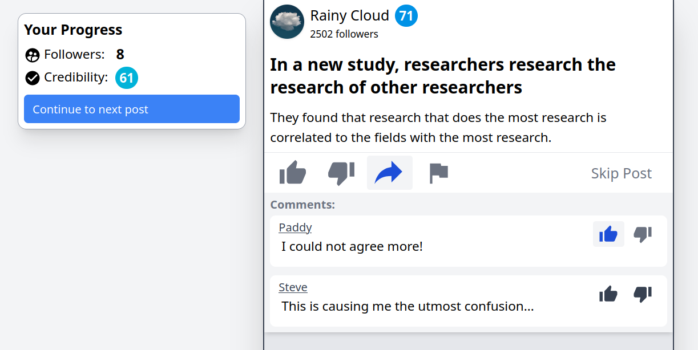
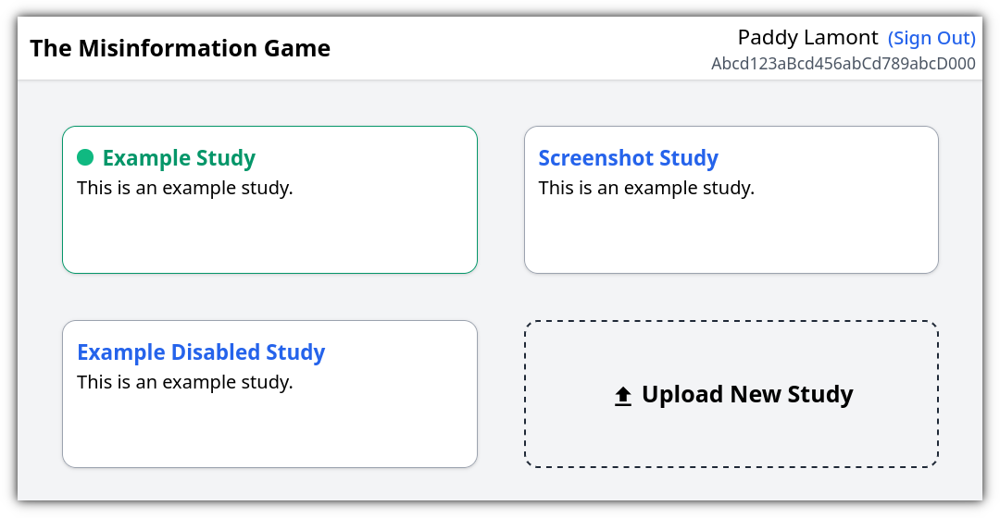
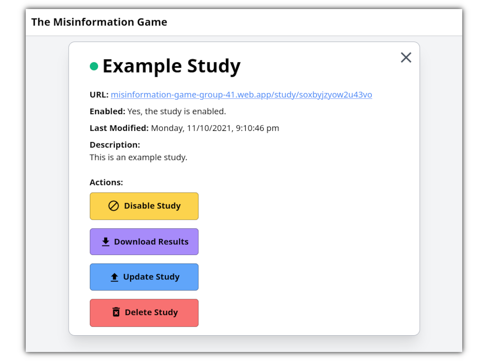
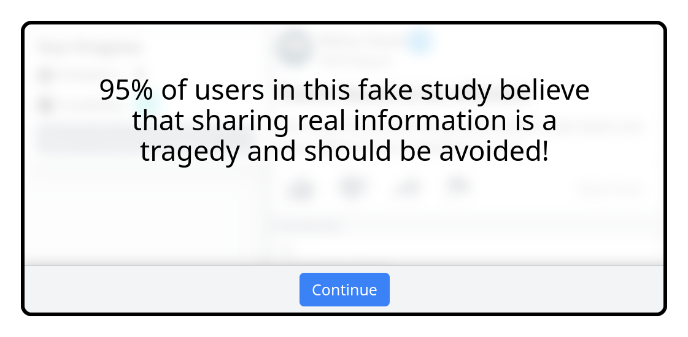

# The Misinformation Game
The Misinformation Game is a social media simulator built to study
people's behaviour when they interact with social media. To achieve
this, The Misinformation Game simulates a social media feed for
research participants. Participants will be shown one fake social
media post at a time, and they may then react to the post and its
comments. The Misinformation Game has been designed to be highly
customisable so that tightly controlled experiences can be created
for participants. This customisability is a core focus of The
Misinformation Game, to facilitate the research of a wide array of
social media related questions.

**Preprint Paper:** [PsyArXiv](https://psyarxiv.com/628wc/)

### Example Game
If you would like to try a study created using
The Misinformation Game, you can access an example game from
[here](https://themisinformationgame.github.io/link/ExampleGame).
You may enter any ID to access the example game.

### Features

- Social media simulator with dynamically updating follower numbers and
  credibility scores based on participants' interactions with posts.
- Several options for the dynamic selection of sources and posts
  to show to participants.
- Customisable engagement metric information.
- Configurable prompt to be shown to participants before they
  begin participating in a study.
- Configurable introduction, game rules, and debriefing screens to be shown
  to participants before and after they complete a study.
- Ability to generate unique completion codes for participants.
- Rich recording of participants' interactions to allow analysis of their behavior.
- Security to restrict access to the results of studies, and to
  stop unauthorised users from uploading their own studies.
- Ability to completely delete old studies and their results to
  ensure privacy of participants is maintained.

# 🛠️ Documentation
Information regarding how The Misinformation Game works, the system architecture, and guides to conducting studies
can all be found at https://themisinformationgame.github.io/.
This documentation is also available under /docs in this
repository.

# 📝 License
The Misinformation Game is licensed under the
[CC BY 4.0 License](LICENSE.txt).

# 🖥️ Screenshots
**Admin Dashboard:**

**Admin Study View:**

**Configurable prompt shown to participants before they
start a study:**

**Configurable debriefing given to participants after
they complete a study:**

