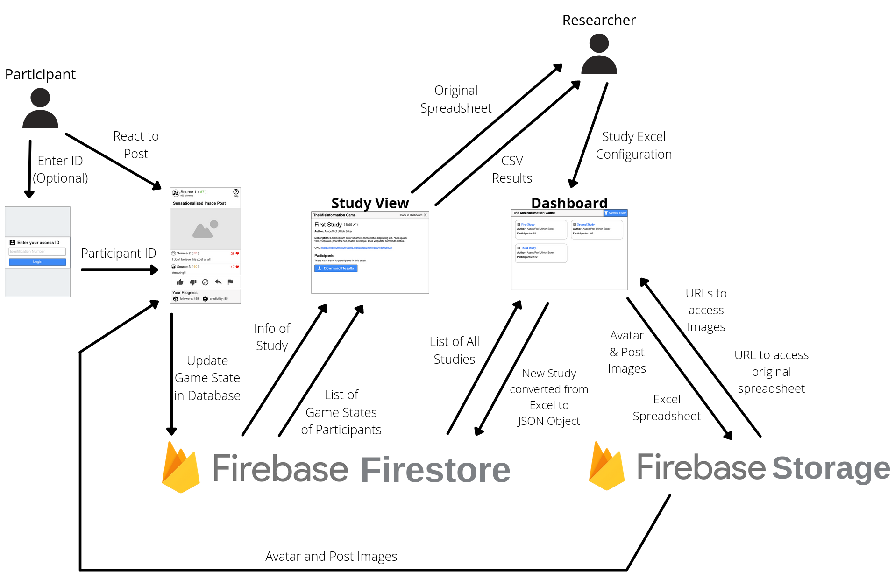

# The Misinformation Game

The Misinformation Game is a social media simulator built to test
the spread of misinformation through social media. This game was
built as part of the CITS3200 unit at UWA, in collaboration with
Assoc/Prof Ullrich Ecker.

### Example Game

### Features

- Social media simulator with dynamically updating followers and
  credibility based upon participant's interactions with posts.
- Several options for the dynamic selection of sources and posts
  to show to participants.
- Configurable prompt to be shown to participants before they
  begin participating in a study.
- Configurable introduction and debriefing screens to be shown
  to participants before and after they complete a study.
- Ability to generate completion codes for participants that
  they can use to prove they completed the study.
- Participants can access the study from desktop, tablet,
  or mobile devices.
- Rich recording of participant's interactions throughout
  their game, to allow analysis of their behavior.
- Security to restrict access to the results of studies, and to
  stop unauthorised users from uploading their own studies.
- Ability to completely delete old studies and their results to
  ensure privacy of participants is maintained.

# System Architecture

The Misinformation Game was built using
[Google Firebase](https://firebase.google.com/) to provide
its hosting and backend. The following diagram gives an overview
of our system architecture by displaying the data flows through
the application,

# Screenshots
**Admin Dashboard:**

**Admin Study View:**

**Configurable prompt shown to participants before they
start a study:**

**Configurable debriefing given to participants after
they complete their study:**

