# Registering Administrators
{:#intro .no_toc}

In order for users to upload their own studies, they must first
be registered as administrators. This document outlines the
process for a user to be granted administrator privileges.

## Table of Contents
{:#toc .no_toc}
* toc
{:toc}

## 1. User Registration
{:#user-registration}

Users must register with your instance of The Misinformation Game
before they can be registered as administrators. This must be
done using a Google account. The process to register as a user
is described below.

**Step 1:** First, the admin dashboard must be accessed from the homepage
of your instance of The Misinformation Game. The button to access
the dashboard from the homepage is highlighted in [Figure 1](#fig1).

<figure id="fig1">
    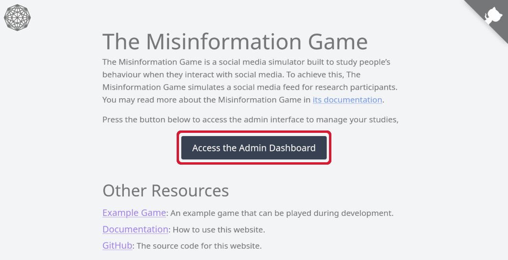
    <figcaption>
        <a href="#fig1">Figure 1.</a> Diagram demonstrating how to access the
        admin dashboard from the homepage.
    </figcaption>
</figure>

**Step 2:** You will then be prompted to sign in using a Google account. You should click
the **Sign In with Google** button. A screenshot of the sign-in page is shown in [Figure 2](#fig2).

<figure id="fig2">
    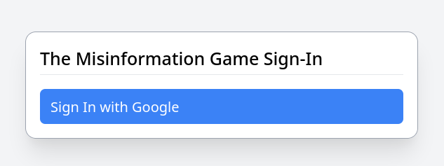
    <figcaption>
        <a href="#fig2">Figure 2.</a> Screenshot of the administrator sign-in page.
    </figcaption>
</figure>

**Step 3:** You should be prompted to select a Google account to authenticate with.
You should select the Google account that you wish to create studies with. You should
then be redirected to the admin dashboard page. This page should display a permissions
error similar to the one shown in [Figure 3](#fig3). If it does not, then you have
already been granted administrator privileges.

<figure id="fig3">
    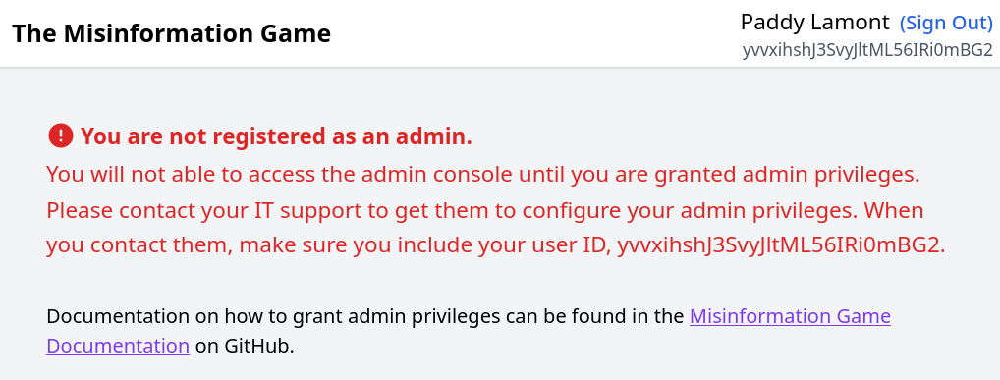
    <figcaption>
        <a href="#fig3">Figure 3.</a> Screenshot of the admin dashboard with a permissions error.
    </figcaption>
</figure>

**Step 4:** You have now been registered as a user, but not an administrator. The process
to register users as administrators is described under [Admin Registration](#admin-registration) below.

## 2. Finding User IDs
{:#find-user-id}

Administrators are registered by adding their User ID to a collection in the
Firestore Database of your instance of The Misinformation Game. Therefore, before
a user can be registered as an administrator, you will need to find their User ID.
If you are finding your own User ID, then you may refer to the process in the
[Finding your own User ID section](#find-own-user-id). If you are finding the
User ID of another user, then you may refer to the process in the
[Finding another user's User ID section](#find-other-user-id).

### 2.1. Finding your own User ID
{:#find-own-user-id}

Your User ID is displayed in the top-right
of the admin dashboard underneath your name, as highlighted
in [Figure 4](#fig4). It should be a long string of letters
and numbers that looks similar to `rdp1zSjlgiMTAj4t42ve4sE84CvL`.

<figure id="fig4">
    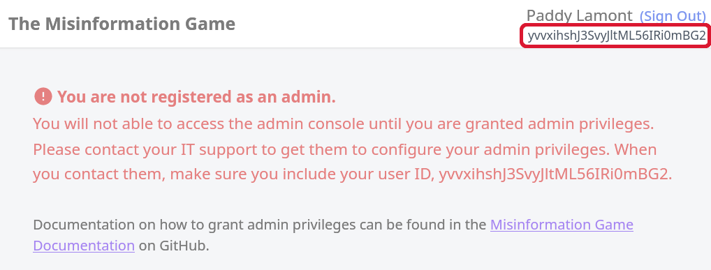
    <figcaption>
        <a href="#fig4">Figure 4.</a> Diagram demonstrating where to access your user ID.
    </figcaption>
</figure>

### 2.2. Finding User IDs through the Firebase Console
{:#find-other-user-id}

If you are registering another user as an administrator, then it may be easier
to obtain their User ID manually through the Firebase Console. This can be done
by accessing the **Build -> Authentication** tab on the left of the Firebase Console.
The users that have registered will be listed in a table, with their emails given
in the "Identifier" column. You should find the row with the email of the user that
you wish to register as an admin. If they do not appear in this table, then you may
ask them to register as described in the [User Registration section](#user-registration).
Once you have found their row, then you can click the "Copy UID" button to the right
of the table to copy their User ID into your clipboard. This User ID should look similar
to `rdp1zSjlgiMTAj4t42ve4sE84CvL`. It will be used in later sections to register the
user as an admin. This process to find User IDs through the Firebase Console is shown
in [Figure 5](#fig5).

<figure id="fig5">
    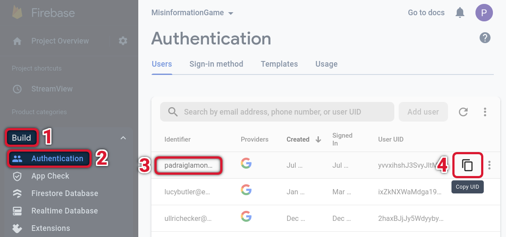
    <figcaption>
        <a href="#fig5">Figure 5.</a> Diagram demonstrating how to copy the User ID of another user.
    </figcaption>
</figure>

## 3. Admin Registration
{:#admin-registration}

Administrators must be manually registered through the
[Firebase Console](https://console.firebase.google.com)
for your instance of The Misinformation Game. The process
to do this is described in the sections below.

### 3.1. Accessing the Firestore Database
{:#access-firestore}

Administrators are registered by manually adding entries to the Firestore
database. The Firestore database can be accessed through the **Build ->
Firestore Database** tab on the left. The process to access this tab is
shown in [Figure 6](#fig6).

<figure id="fig6">
    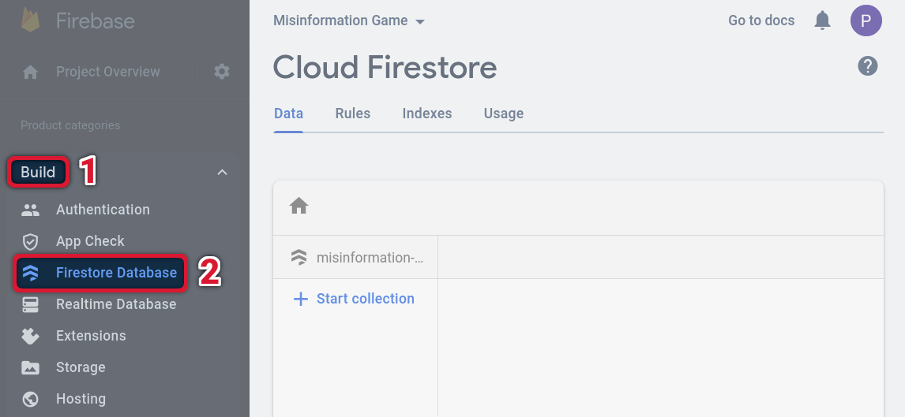
    <figcaption>
        <a href="#fig6">Figure 6.</a> Diagram demonstrating how to access the Firestore database.
    </figcaption>
</figure>

### 3.2. Registering the First Administrator
{:#admin-registration-first}

When you register your first administrator, you must create the "Admins"
collection within your Firestore database. The process to do this is
described below. If you already have an "Admins" collection, then you should
follow the process in the [Registering Additional Administrators](#admin-registration-additional)
section instead.

**Step 1:** Press the "+ Start collection" button to create your first
Firestore collection. This button is highlighted in [Figure 7](#fig7).
This should open a dialog prompting you to "Start a collection".

<figure id="fig7">
    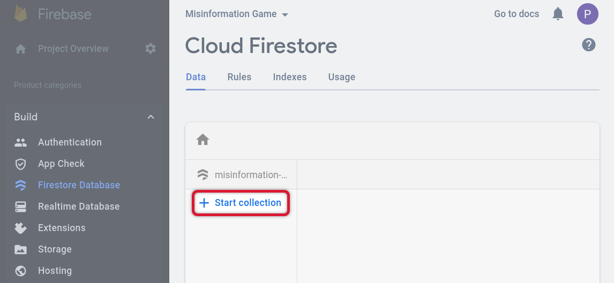
    <figcaption>
        <a href="#fig7">Figure 7.</a> Diagram demonstrating how to create
        your first Firestore collection.
    </figcaption>
</figure>

**Step 2:** You will be prompted to enter an ID for the new collection.
You should enter `Admins` for the Collection ID, as shown in [Figure 8](#fig8).
The case of the letters in the Collection ID is important. You may now
press "Next" to advance to adding the first administrator.

<figure id="fig8">
    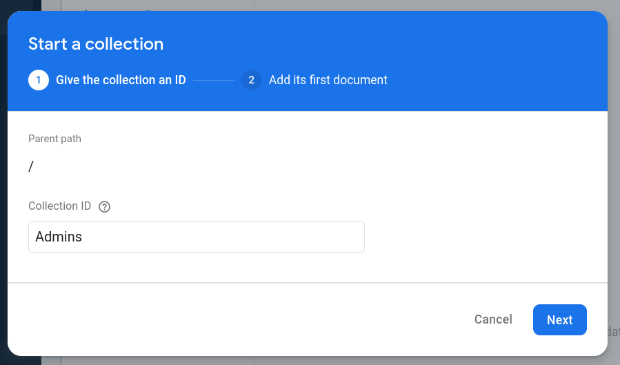
    <figcaption>
        <a href="#fig8">Figure 8.</a> Screenshot of the first step
        in creating the Admins Firestore collection.
    </figcaption>
</figure>

**Step 3:** You will now be prompted to add the first document to the Admins collection.
The first document that we will add is the first administrator of your instance of
The Misinformation Game. An example of this form as it is filled in is shown
in [Figure 9](#fig9).

* You should enter your User ID as the "Document ID". Your User ID can be found using the
process described under the [Finding your User ID](#find-user-id) section. This will
allow The Misinformation Game to verify that you are an administrator.

* Next, you should enter `Name` under "Field", and your name under "Value". The "Type"
field should be set to `string`. This name will later help to keep track of who has been
granted administrator privileges.

<figure id="fig9">
    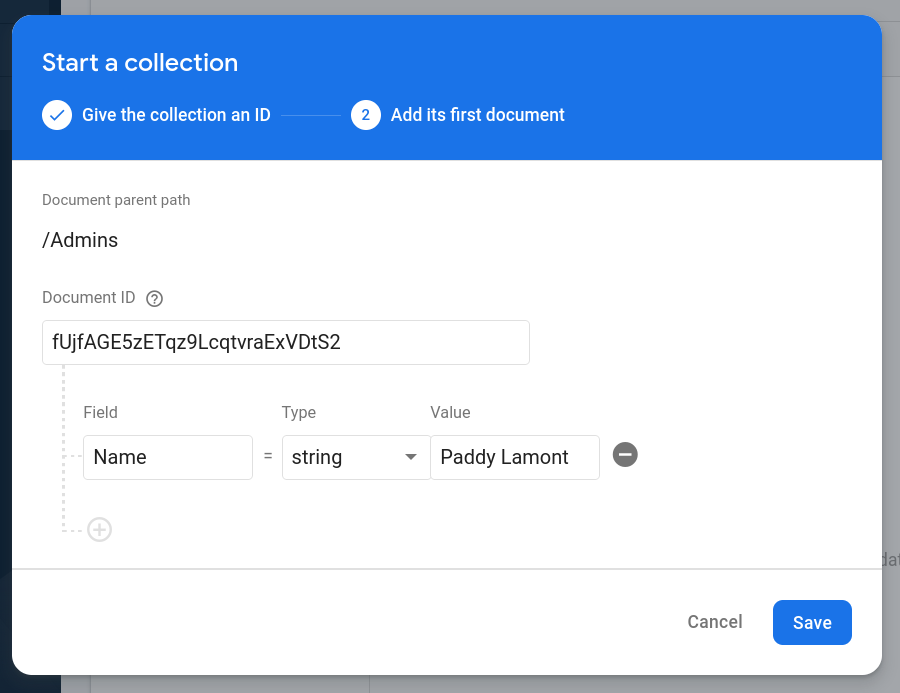
    <figcaption>
        <a href="#fig9">Figure 9.</a> Screenshot of the second step
        in creating the Admins Firestore collection.
    </figcaption>
</figure>

**Step 4:** You should now be able to reload the admin dashboard and the permission
error should be gone. You may now upload and manage your studies as described under
the [Managing Studies documentation](ManagingStudies)!

### 3.3. Registering Additional Administrators
{:#admin-registration-additional}

When existing administrators have already been added to your instance of The
Misinformation Game, the Admins collection will have already been created in
your Firestore database. This section will describe how to add a new document
to that collection to register a new user as an administrator. If you
do not see an Admins collection in your Firestore Database as shown in
[Figure 10](#fig10), then you should follow the process in the
[Registering the First Administrator section](#admin-registration-first)
instead.

**Step 1:** Select the Admins collection in the Firestore database and click "Add document",
as shown in [Figure 10](#fig10).

<figure id="fig10">
    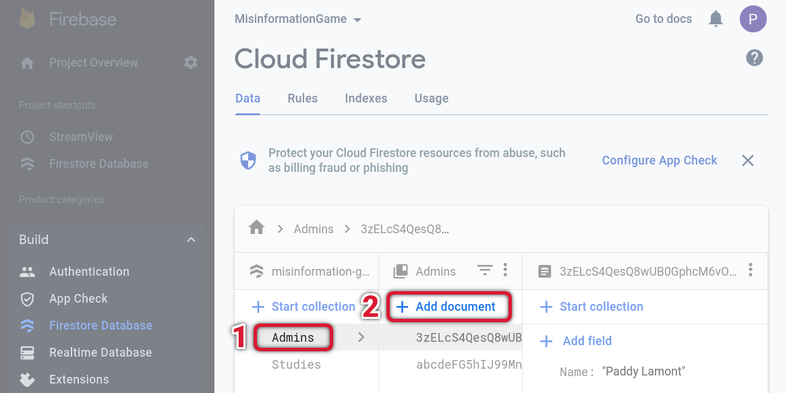
    <figcaption>
        <a href="#fig10">Figure 10.</a> Diagram demonstrating how to open
        dialog to add a new administrator.
    </figcaption>
</figure>

**Step 2:** You must now fill in a form with the information about the administrator
you are registering. An example of this form as it is filled in is shown
in [Figure 11](#fig11).

* You should enter the admin's User ID as the "Document ID". Their User ID can be found using the
  process described under the [Finding your User ID](#find-user-id) section.

* Next, you should enter `Name` under "Field", and the admin's name under "Value". The "Type"
  field should be set to `string`. This name will later help to keep track of who has been
  granted administrator privileges.

<figure id="fig11">
    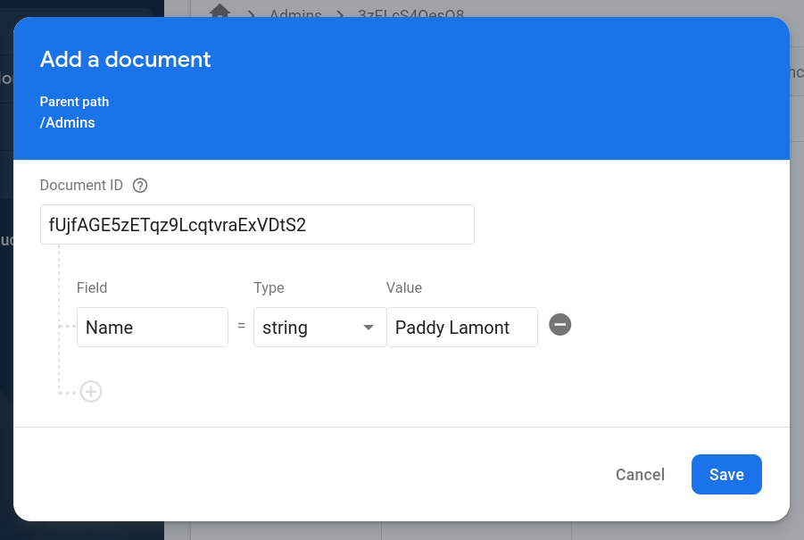
    <figcaption>
        <a href="#fig11">Figure 11.</a> Screenshot of the dialog
        used to add a new administrator, filled in with example data.
    </figcaption>
</figure>

**Step 3:** The admin that you registered should now be able to reload the admin dashboard
and the admin permission error should be gone. They may now upload and manage studies as
described under the [Managing Studies documentation](ManagingStudies)!
