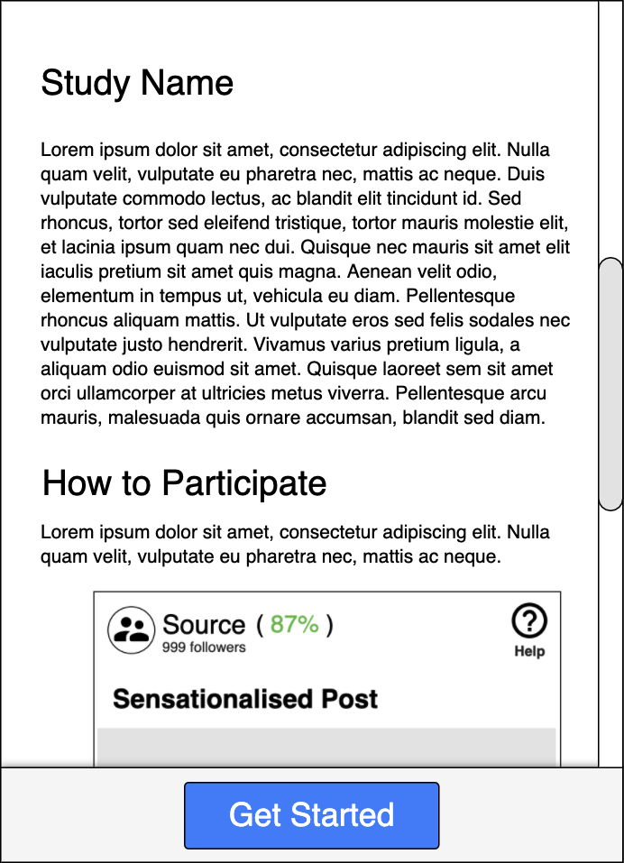
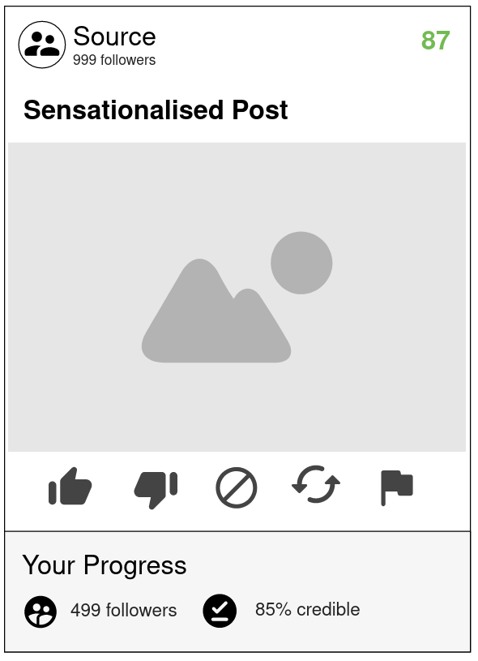
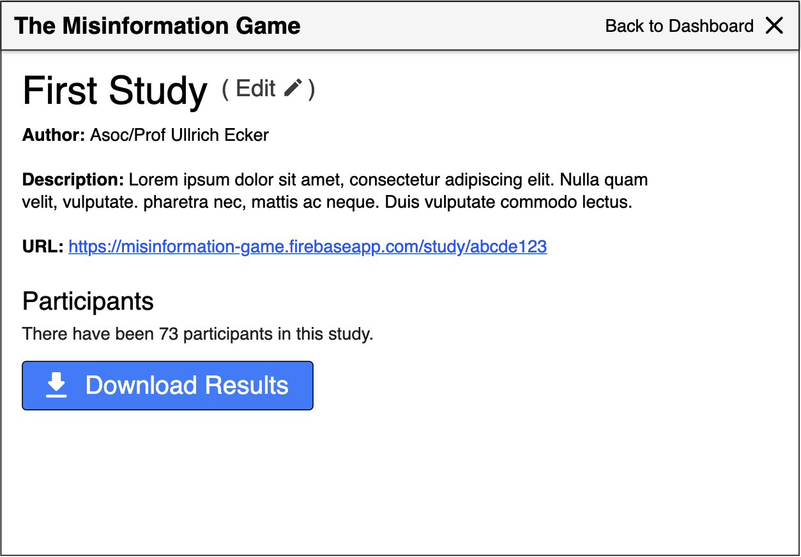

# Overview

The Misinformation Game will be built as a web app so that it can be
accessed from desktop and mobile devices. Users will access a game URL
where they will be prompted with instructions for participating in a
social media simulation game. The game will show the users a mixture
of true and false social media posts, and the users will be prompted
to like, share, skip, dislike, or flag each post. Every interaction
of the user with these posts (except skipping) will influence their
own followers and credibility rating. For example, sharing true
posts may slowly grow the users followers and improve their
credibility, whereas sharing false posts may grow the users
followers very quickly, but reduce their credibility. The changes to
user's followers and credibility when they like, share, dislike, or
flag each post can be controlled by the researchers. Similarly, the
sources of each social media post will be randomised, and thei
followers and credibility rating will also be changed throughout
the experiment. 

Every game that is played by users is independent, and therefore users
interactions with the game will not affect one another. As users play
the game, their progress will be saved so that it can be later
downloaded as a CSV file by the researchers. This CSV file will
include the following information for every post that the user is
shown:
- The action that the user chose.
- The post that the user was shown, including its source, headline,
  text, and image.
- The current followers and credibility rating of the source.
- The current followers and credibility rating of the user before
  they interacted with the post.

The researchers will access these CSV files through an admin
interface. There will need to be a method of authenticating
researchers to restrict access to the admin page, and another
way to grant new researchers access. The admin page will display a
list of all studies that have been uploaded to the system. The
researchers will then be able to open any study, which will take
them to a separate page where they can download the results
from participants in the study. These results will be formatted
as a ZIP archive containing a folder with a CSV file for every
participant.

The admin page will also provide functionality for researchers to
upload new studies, and update existing studies. This will be
achieved through an Excel template that researchers can edit with
the details of the study, which can then be uploaded through the
admin page. This Excel template will contain the following
information:
- A name for the study.
- A description for the study.
- The prompt that the user will be shown before they start the game.
- The sources to be included in the game, including:
  - Name.
  - Avatar Image.
  - Ratio of true and false posts.
  - Initial followers mean and std. deviation.
  - Initial credibility rating mean and std. deviation.
- The posts to be included in the game, including:
  - Headline.
  - Content image or text.
  - Changes to followers for liking, disliking, sharing, or
    flagging the post.
  - Changes to credibility for liking, disliking, sharing, or
    flagging the post.
- Whether an exact order of sources and posts should be used.
- The exact order of source/post pairs to display to the user.
  These could either reference the sources and posts that were
  included previously via some ID (e.g. row number), or else it
  could include all of their properties directly
  (e.g. source name, post headline, post image, etc...).

# UI Design

The web app must be designed to be accessible from both desktop and
mobile devices, and therefore it should follow a responsive design.

### Help / Introduction Screen Mockup

### Prompt Screen Mockup

### Game Screen Mockup

### Admin Dashboard Mockup

### Admin Study Mockup

