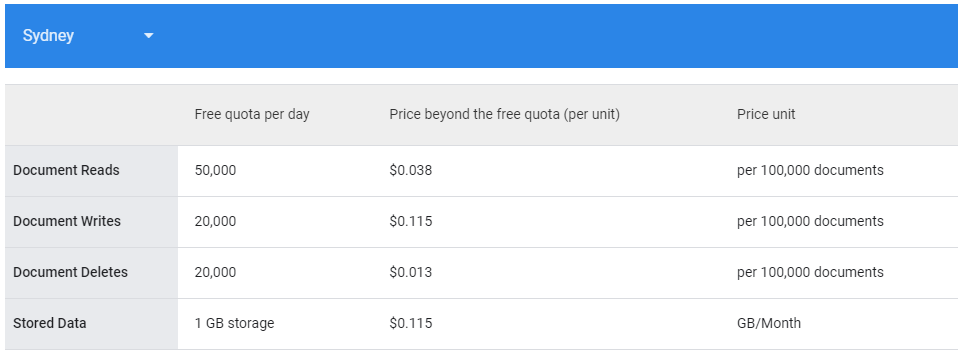

# Firebase Pricing
This application is hosted using firebase. This document analyses the pricing of Firebase for hosting this application in particular. More information regarding this in general can be found [here](https://cloud.google.com/firestore/pricing).

## 1. How the pricing works
Firebase charges you for what you read from and write to the Firestore database. The **Free Tier** is for when there is at most 50k reads and 20k writes per day, as well as 1GB of storage (for post images etc). The **Paid Tier** applies to any reads, writes or stored data above these limits.

Note - the pricing values could be changed by Firebase at any time.

## 2. Rough example estimate for a study
Consider a study with 100 posts and 30 sources. Each source will have an avatar (which is a small image, maybe 50kB), and if every post has an image associated that's about 250kB, there's 26GB stored per participant. 

The free tier will cover 36 games like this, and 1$ into paid tier will cover 313 more games.

In a study with no images and only text (still assuming there are source avatars), free tier will cover 36 games like this and 1$ into paid tier will cover 5791 more games.

## 3. A note about images in a study
Most of this cost will come from storing images for the posts, so it's good to consider using relatively small image sizes if you wish to run some trials without going into the paid tier.