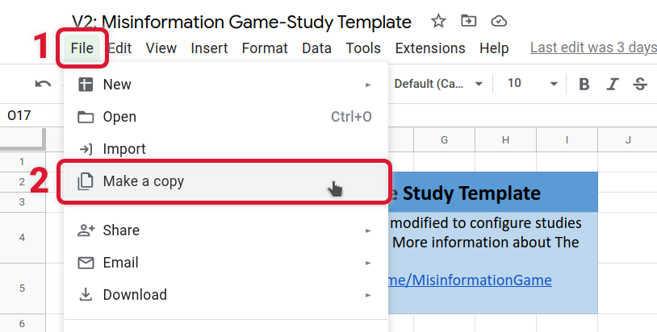
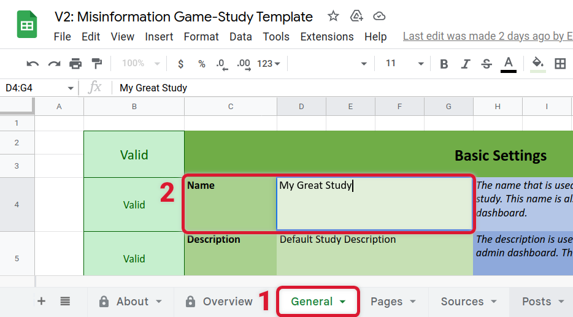
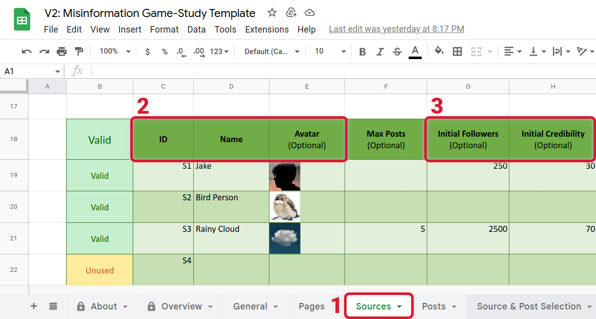
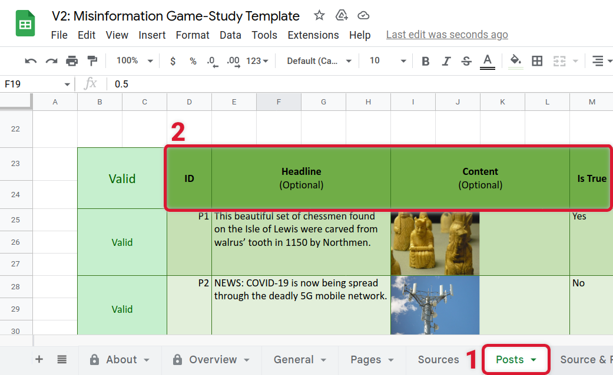
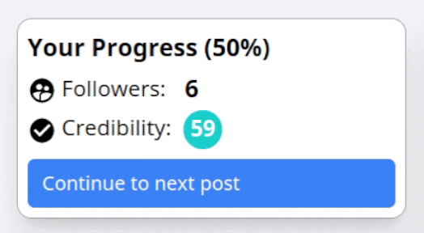
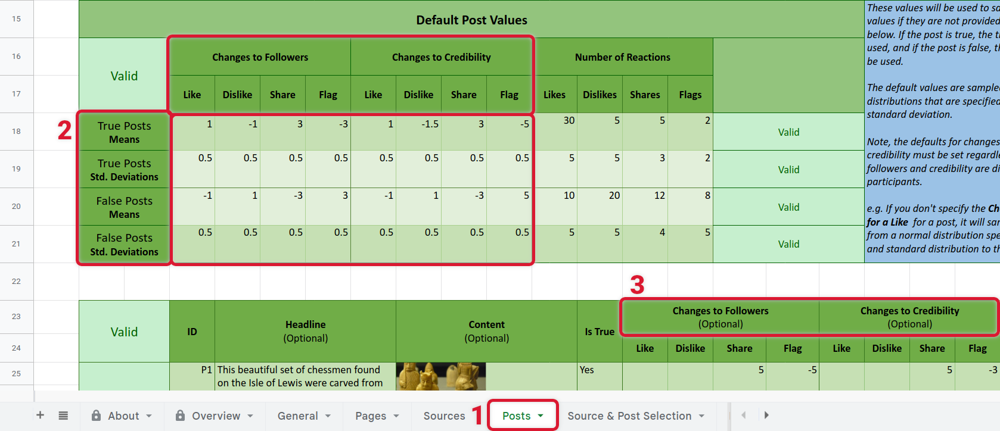

# Getting Started with The Misinformation Game
{:#intro .no_toc}

When you're first getting started with the Misinformation
Game, the number of configuration options may be intimidating.
Therefore, we have written this guide in the hopes that we
can highlight the major features and uses of the Misinformation
Game at a high level, to help you get started!


# Table of Contents
{:#toc .no_toc}
* toc
{:toc}


## 1. Try an Example Game
{:#try}

It will be easier to understand the configuration options that
we will introduce to you here if you have tried the Misinformation
Game yourself. To try the Misinformation Game out, you can access
an example game from [the example games page](/link/ExampleGame). You
can enter any random text as your ID to access an example game.

<figure id="fig1">
    
    <figcaption>
        <a href="#fig1">Figure 1.</a> Screenshot of the user interface within a game.
    </figcaption>
</figure>

<p class="spacer"></p>


## 2. Copy the Study Configuration Spreadsheet
{:#copy}

Before you can start configuring your study, you must first create
your own copy of the Study Configuration Template in Google Sheets.
This spreadsheet will be used to configure your own study. You can
access the template from
[the study configuration template page](/link/StudyTemplate). On
this page, you should follow the latest recommended Google Sheets
link. Once opened, select **_File -> Make a copy_** to clone the
spreadsheet so that you can make your own study, as shown in
[Figure 2](#fig2). More information about this process can be
found [here](/StudyConfiguration#create).

<figure id="fig2">
    
    <figcaption>
        <a href="#fig2">Figure 2.</a> A diagram showing the process to copy the study configuration template.
    </figcaption>
</figure>


## 3. Create a Study
{:#create}

Studies in the Misinformation Game are created by editing the
configuration spreadsheet in Google Sheets that you created in
[section 2](#copy-the-configuration). All settings for your study
will be kept in this spreadsheet, and this spreadsheet can be
shared with others so that they can test or edit your study.
Your study configurations may also be shared alongside your
published works to aid with reproducibility.

### 3.1. Give your Study a Name
{:#create-name}

The first step to editing your configuration will be to give
your study a name under the **General** sheet. This can be done
by first accessing the **General** sheet at the bottom of the
page, and then by editing the **Name** value, as shown in
[Figure 3](#fig3). You should edit the cell to the right of
the **Name** cell. The value that you enter will be used as
the name of your study. This may be used to identify your
study, and will be visible to participants. We will use this
same procedure for modifying all configuration options
needed to create your study.

<figure id="fig3">
    
    <figcaption>
        <a href="#fig3">Figure 3.</a> A diagram highlighting where to enter the name of your study.
    </figcaption>
</figure>

### 3.2. Add Sources and Posts
{:#create-posts}

The information presented to participants can take the form of
sources, and text or image posts. The sources may be used for
many posts, but each post will only be used once. An example source
and post are highlighted in [Figure 4](#fig4). These sources and
posts will form the primary information that is presented to
participants.

<figure id="fig4">
    <div class="figure-side-by-side">
        
        
    </div>
    <figcaption>
        <a href="#fig4">Figure 4.</a> Screenshots with a source and post highlighted.
    </figcaption>
</figure>

Sources are presented as an identity that published a post. Only the
name of each source is required, but you may also choose each source's
avatar image, follower count, and credibility number. Sources for your
study may be added by entering new rows into the table in the **Sources**
sheet in your study configuration. The columns to enter values in are
highlighted in [Figure 5](#fig5). Additional documentation about the
available configuration options for sources can be found
[here](/StudyConfiguration#sources).

<figure id="fig5">
    
    <figcaption>
        <a href="#fig5">Figure 5.</a> A diagram highlighting where to enter new sources.
    </figcaption>
</figure>

The posts that you add may include a headline, and either text or image content.
Posts must include at least a headline or content, but both are not required.
Additionally, you must specify whether the post is true or false. This value
is used for selecting default values for posts and for associating posts with
sources. Therefore, it is only used internally, and may be used to represent
information other than truth for your study. For example, if you are creating
a study to test whether including people in posts affects the reactions of
participants, you may use this field to store whether a person is included.

The posts for your study may be added by entering new rows into the table in the
**Posts** sheet in your study configuration. The columns to enter values in are
highlighted in [Figure 6](#fig6). Images may be included for the content of
posts by selecting **Insert -> Image -> Insert image in cell** in the top menu.
However, it is important that any images that you add are optimised to reduce
your hosting costs. A guide for including images can be found [here](/Images).
Additional documentation on the available configuration options for posts
can also be found [here](/StudyConfiguration#posts). For example, you may
include additional comments on each post, which is described there.

<figure id="fig6">
    
    <figcaption>
        <a href="#fig6">Figure 6.</a> A diagram highlighting where to enter new posts.
    </figcaption>
</figure>


### 3.2. Configure Reactions and Comments
{:#create-responses}

The responses from participants can take the form of reactions to posts,
or comments on them. Examples of reacting to, and commenting on, a post are
shown in [Figure 7](#fig7). There are many options to configure the
available responses for your participants. You should select the options
that are most applicable for your research. The major available options are
listed below:

- You may enable or disable the available reactions for posts and comments.
  [Link](/StudyConfiguration#general-post-likes-enabled).
- You may set reactions to be required or optional.
  [Link](/StudyConfiguration#general-require-reactions).
- You may set comments to be required, optional, or disabled.
  [Link](/StudyConfiguration#general-enable-user-comments).
- You may set whether multiple reactions to posts and comments is possible.
  [Link](/StudyConfiguration#general-allow-multiple-reactions).
- You may set whether reaction counts should be displayed below the reactions.
  [Link](/StudyConfiguration#general-display-reaction-counts).

<figure id="fig7">
    <div class="figure-side-by-side">
        
        
    </div>
    <figcaption>
        <a href="#fig7">Figure 7.</a> Videos showing reactions and comments on a post (click to play).
    </figcaption>
</figure>


### 3.3. Control Dynamic Feedback
{:#create-dynamic-feedback}

The dynamic feedback changes the follower count and credibility number
of participants based upon their reactions to a post. These changes
can be chosen by you for each post. An example of the follower count
and credibility number of a participant changing is shown in
[Figure 8](#fig8). If you wish, you may also disable followers and/or
credibility from being shown to participants at all (see
[here](/StudyConfiguration#general-display-followers)).

<figure id="fig8">
    
    <figcaption>
        <a href="#fig8">Figure 8.</a> Video showing the dynamic feedback that participants receive (click to play).
    </figcaption>
</figure>

There are two major options to configure the dynamic feedback that
participants receive: you can specify default normal distributions
to sample the changes from, or you can override these distributions
to specify exact changes for each post. These changes are configured
for each reaction separately (e.g., like, dislike, share, or flag).
Additionally, they only apply when reacting to a post, not its
comments. If a participant selects multiple reactions, then the
changes for each reaction will be added together.

The dynamic feedback is controlled within the **Posts** sheet, as shown
in [Figure 9](#fig9). The default normal distributions are specified for
true and false posts separately, with one distribution for each reaction.
The mean and standard deviation of these distributions can be specified
under the **Default Post Values** section at the top of the sheet.
Additionally, exact changes to followers and credibility for reactions
can be specified for each post individually in the posts table.
Additional documentation about configuring the default post values can
be found [here](/StudyConfiguration#posts-default-values), and
documentation about configuring the exact changes for a post can be
found [here](/StudyConfiguration#posts-changes-to-followers).

<figure id="fig9">
    
    <figcaption>
        <a href="#fig9">Figure 9.</a> A diagram highlighting where to configure the dynamic
        feedback from reactions to posts.
    </figcaption>
</figure>


### 3.4. Configure how Sources and Posts are Paired
{:#create-source-post-selection}

The sources that are shown for each post is dynamically selected when
each participant starts the study. This can be fine-tuned a lot (see
[here](/StudyConfiguration#selection)). However, if you don't wish to
dive into the details, the "Credibility" mode is a good default pick.
It selects true or false posts to pair with a source based upon the
credibility of that source. If the source has a high credibility, it
will be shown with more true posts, and if the source has a low
credibility, it will be shown with more false posts. Additionally, if
you want more control, then you can also define the pairings of sources
and posts manually, by selecting the "Pre-Defined" mode and adding
the pairings in the **Pre-Defined Source/Post Pairs** sheet. Additional
detail on the available source/post selection modes can be found
[here](/Simulation).


### 3.5. Update your Study's Introduction and Debriefing Pages
{:#create-pages}

The Misinformation Game supports showing several pages of information
to participants before _and_ after they play through a study. The
content of these pages can be entered within the **Pages** sheet, as
shown in [Figure 10](#fig10). These pages support formatting using the
Google Sheets text editor (e.g., font size, style, or colour), and
support the use of HTML for additional control if needed. Additionally,
there are several placeholders that may be used to include richer
components within pages (e.g., icons or completion codes). The
introduction pages may also be disabled by deleting their content.
Additional documentation on these pages can be found
[here](/StudyConfiguration#pages).

<figure id="fig10">
    
    <figcaption>
        <a href="#fig10">Figure 10.</a> A diagram showing the pages sheet.
    </figcaption>
</figure>


### 3.6. Other Considerations
{:#create-other}

There are many other small considerations that you should make when
configuring your study using the Misinformation Game. Several of the
considerations that we consider important are listed below:

- Select whether you wish your study to use a feed, or whether only
  a single post should be shown at a time. This option will have
  a significant impact on the experience of your participants.
  The option to use a feed is documented [here](/StudyConfiguration#general-display-feed).

- Enter the prompt to display to participants before they start a study.
  This can be used to test hypotheses about participant's actions after
  different prompts, or it can just be used to encourage your
  participant's to have a good time. This option is documented
  [here](/StudyConfiguration#general-prompt).

- Select whether you wish to enforce participant identification through
  a text identifier. This is vital if you wish to identify participants
  as they move from other platforms (e.g., Qualtrics or Prolific).
  This participant identifier can be provided through URL parameters,
  as discussed [here](/ManagingStudies#access-study-url). Documentation for this
  option is also provided
  [here](/StudyConfiguration#general-require-identification).

- Select whether you wish to generate completion codes for participants.
  These completion codes are only shown to participants after they have
  completed the study, and they are saved in the results. This can be
  used to verify that a participant has completed the study, by
  requiring that they enter the completion code into another platform
  such as Qualtrics. Documentation for this option is provided
  [here](/StudyConfiguration#general-generate-completion-code).


## 4. Install The Misinformation Game
{:#install}

You must host your own version of the Misinformation Game to use it for
your studies. The installation process can take a few hours, but you only
have to follow it once. This process is described [here](/Installation).


## 5. Test your Study
{:#test}

Once you have deployed your own instance of the Misinformation Game, you
may upload your study to test it! The process to download your study,
upload it, and test it, is described [here](/StudyConfiguration#upload).
You may also use the **Update Study** button to introduce changes to your
study, as you fine-tune it for your research.

## 6. Run your Study!
{:#run}

When you are happy with your study, you can
[enable the it](/ManagingStudies#enable-disable-studies) so that other
people can access it. You may then share the URL of your study with your
participants, so that they can play through it. If you are using the
Firebase free tier, and are expecting
a lot of participants, or if your study has many images, you should
reference the [Firebase Pricing documentation](/FirebasePricing) to make
sure that you don't hit the free tier's limits. Additional documentation on
the results that are provided by the Misinformation Game are also given in
the [Results documentation](/Results). We hope that the results you gather
using the Misinformation Game are valuable!

If you publish your research, we would also really appreciate it if you
cited [The (Mis)Information Game paper](https://psyarxiv.com/628wc/) in
your work! The BibTex for this citation is included below:

```bibtex
@misc{butler_lamont_wan_prike_nasim_walker_fay_ecker_2022,
 title={The (Mis)Information Game: A Social Media Simulator},
 url={psyarxiv.com/628wc},
 DOI={10.31234/osf.io/628wc},
 publisher={PsyArXiv},
 author={Butler, Lucy and Lamont, Padraig and Wan, Dean L Y and Prike, Toby and Nasim, Mehwish and Walker, Bradley and Fay, Nicolas and Ecker, Ullrich K H},
 year={2022},
 month={Jul}
}
```
