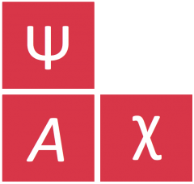

<style>
figure img {
    max-width: 85%;
}
</style>

<div id="logo-banner">
    <div class="logo">
        
    </div>
    <div class="titles">
        <h1>The Misinformation Game</h1>
        <h2>A social-media simulator for research.</h2>
    </div>
</div>

----

The Misinformation Game is a
[free and open-source](https://github.com/TheMisinformationGame/MisinformationGame)
social-media simulator
built to study how people interact with information on social-media. To
achieve this, The Misinformation Game simulates a social-media feed for
research participants. Participants are shown fake social-media posts,
either one at a time or in a feed format. Participants may then react to the
posts and their comments. The Misinformation Game has been designed to
be highly customisable so that a broad range of tightly controlled
experiences can be created for participants. This customisability is
a core focus of The Misinformation Game, to facilitate the research of
a wide array of social-media related questions.

<div id="link-icons" class="icons-list">
    <a href="https://github.com/TheMisinformationGame/MisinformationGame">
        
    </a>
    <a href="https://www.producthunt.com/posts/the-misinformation-game">
        
    </a>
    <a href="https://psyarxiv.com/628wc/">
        
    </a>
    <a class="left" href="https://www.producthunt.com/posts/the-misinformation-game?utm_source=badge-featured&utm_medium=badge&utm_souce=badge-the&#0045;misinformation&#0045;game" target="_blank">
        
    </a>
</div>

## Try it Out!
{:#example-game}

If you would like to experience participating in a study created using
The Misinformation Game, you can access an example game from
[the example game page](/link/ExampleGame).

<figure id="fig1" class="blue-figure-border">
    
    <figcaption>
        <a href="#fig1">Figure 1.</a> Screenshot from an example game.
    </figcaption>
</figure>

<p class="spacer"></p>


## What is Recorded?
{:#example-results}

The Misinformation Game records a wealth of information about how each
participant acts within studies. If you would like to view example results
that were recorded, we provide results from a user experience study on
[the example results page](/link/ExampleResults).
Additionally, all information recorded by The Misinformation Game
is described in detail in [the Results documentation](/Results). The results
that are recorded for your study will depend upon how your study
is configured.

<figure id="fig2" class="blue-figure-border">
    
    <figcaption>
        <a href="#fig2">Figure 2.</a> Screenshot from the example results.
    </figcaption>
</figure>

<p class="spacer"></p>


## Watch
{:#watch}

The following video shows the experience of participants taking part in
a study made using the Misinformation Game. If you'd like to experience
this study yourself, you can access it through
[the example game page](/link/ExampleGame). In fact, we recommend you
try it yourself, to get the full experience!

<figure id="fig3" class="black-figure-border">
    <iframe width="560" height="315" src="https://www.youtube.com/embed/QygfV2fhWRY" title="YouTube video player" frameborder="0" allow="accelerometer; autoplay; clipboard-write; encrypted-media; gyroscope; picture-in-picture; web-share" allowfullscreen></iframe>
    <figcaption>
        <a href="#fig3">Figure 3.</a> Video of playing through the example study.
    </figcaption>
</figure>

<p class="spacer"></p>
<p class="spacer"></p>


## Getting Started 🚀
{:#getting-started}

If you are new to the tool, or you would like a refresher on its use, we recommend
that you read our [Getting Started Guide](/GettingStarted). This guide is a great
place to learn the most important concepts for using The Misinformation Game
effectively for your research.

The paper
[The (Mis)Information Game: A Social Media Simulator](https://psyarxiv.com/628wc/)
also provides an in-depth introduction to the Misinformation Game, alongside
results from two validation studies that were conducted to test it. If you use
The Misinformation Game for your research, we would really appreciate it if
you [cited this paper](#cite)!

<div class="call-to-action-container big">
    <a href="/GettingStarted" class="call-to-action-button">
        Get Started!
    </a>
</div>


## Documentation
{:#docs}

The Misinformation Game has extensive documentation to help you use the tool.
This documentation ranges from high-level guides on the use of The
Misinformation Game, to reference guides for configuring studies and
interpreting their results.

Some highlights from the documentation:

- [Our Paper](https://psyarxiv.com/628wc/) - An in-depth introduction to the tool,
  alongside results from two validation studies.
- [Getting Started Guide](/GettingStarted) - A guide to create your first study
  using The Misinformation Game.
- [Results](/Results) - A reference guide on the results that are recorded by
  The Misinformation Game.
- [About](/About) - A description of the history behind the development of
  this tool.

<div class="call-to-action-container">
    <a href="/DocumentationIndex" class="call-to-action-button">
        Read the Docs
    </a>
</div>


## Cite Our Work!
{:#cite}

We would appreciate it greatly 😊

```bibtex
@misc{butler_lamont_wan_prike_nasim_walker_fay_ecker_2022,
 title={The (Mis)Information Game: A Social Media Simulator},
 url={psyarxiv.com/628wc},
 DOI={10.31234/osf.io/628wc},
 publisher={PsyArXiv},
 author={Butler, Lucy and Lamont, Padraig and Wan, Dean L Y and Prike, Toby and Nasim, Mehwish and Walker, Bradley and Fay, Nicolas and Ecker, Ullrich K H},
 year={2022},
 month={Jul}
}
```
