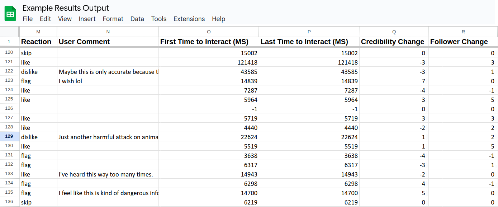

<div id="logo-banner">
    <div class="logo">
        
    </div>
    <div class="titles">
        <h1>The Misinformation Game</h1>
        <h2>A social-media simulator for research.</h2>
    </div>
</div>

--------

The Misinformation Game is a social-media simulator built to study
how people interact with information on social-media. To achieve
this, The Misinformation Game simulates a social-media feed for
research participants. Participants are shown fake social-media
posts, either one at a time or in a feed format. They may then
react to the posts and their comments. The Misinformation Game has
been designed to be highly customisable so that a range of tightly
controlled experiences can be created for participants. This
customisability is a core focus of The Misinformation Game, to
facilitate the research of a wide array of social-media related
questions.

**Preprint Paper:** [The (Mis)Information Game: A Social Media Simulator](https://psyarxiv.com/628wc/)

**Source Code:** [MisinformationGame Repository on GitHub](https://github.com/TheMisinformationGame/MisinformationGame)


## Example Game
{:#example-game}

If you would like to experience participating in a study created using
The Misinformation Game, you can access an example game from
[the example game page](/link/ExampleGame).

<figure id="fig1" class="blue-figure-border">
    
    <figcaption>
        <a href="#fig1">Figure 1.</a> Screenshot of the user interface within a game.
    </figcaption>
</figure>

<p class="spacer"></p>


## Example Results
{:#example-results}

If you would like to view an example of the results output by a study
run using The Misinformation Game, the results of a user experience
study are available from [the example results page](/link/ExampleResults).
Additional information about the results that are made available for your
analysis are described in the [Results documentation](/Results). The
results that are recorded for your study will depend upon the configuration
of your study.

<figure id="fig2" class="blue-figure-border">
    
    <figcaption>
        <a href="#fig2">Figure 2.</a> Screenshot from the example results.
    </figcaption>
</figure>

<p class="spacer"></p>


## Getting Started
{:#getting-started}

If you are new to the tool, or you would like a refresher on its use, we recommend
that you read our [Getting Started Guide](/GettingStarted). This guide is a great
place to learn the most important concepts for using the Misinformation Game
effectively for your research.

The paper
[The (Mis)Information Game: A Social Media Simulator](https://psyarxiv.com/628wc/)
also provides an in-depth introduction to the Misinformation Game, alongside
results from two validation studies that were conducted to test it. If you use
the Misinformation Game for your research, we would really appreciate it if
you [cited this paper](#cite).

<div class="call-to-action-container big">
    <a href="/GettingStarted" class="call-to-action-button">
        Get Started!
    </a>
</div>


## Documentation
{:#docs}

The Misinformation Game has extensive documentation to help you use the tool.
This documentation ranges from high-level guides on the use of the
Misinformation Game, to reference guides for configuring studies and using
their results.

Some highlights from our documentation:

- [Getting Started Guide](/GettingStarted) - A guide to create your first study
  using the Misinformation Game.
- [Study Configuration](/StudyConfiguration) - A reference guide for creating your own study.
- [Results](/Results) - A reference guide on the results that are recorded by the game.
- [About](/About) - A description of the history behind the development of this tool.

<div class="call-to-action-container">
    <a href="/DocumentationIndex" class="call-to-action-button">
        Read the Docs
    </a>
</div>


## Cite the Misinformation Game
{:#cite}

```bibtex
@misc{butler_lamont_wan_prike_nasim_walker_fay_ecker_2022,
 title={The (Mis)Information Game: A Social Media Simulator},
 url={psyarxiv.com/628wc},
 DOI={10.31234/osf.io/628wc},
 publisher={PsyArXiv},
 author={Butler, Lucy and Lamont, Padraig and Wan, Dean L Y and Prike, Toby and Nasim, Mehwish and Walker, Bradley and Fay, Nicolas and Ecker, Ullrich K H},
 year={2022},
 month={Jul}
}
```
