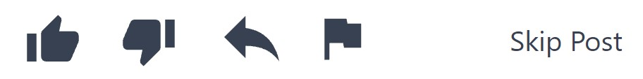
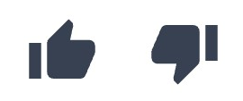
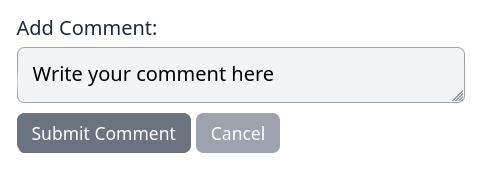
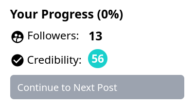

# How to Play The Misinformation Game
{:#intro .no_toc}

**This is a copy of the default rules page that will be shown to
participants before they start participating in a study.**
The content of this page can be edited for your own studies.

This document contains slight modifications from the actual default rules page
to make it readable within this documentation website. If you wish to view the actual
default rules page from the game, then you can try the example game
that can be accessed from [the example game page](/link/ExampleGame).

## How to Participate
{:#rules}

You will be shown a series of posts, which you are encouraged to interact with.

When you are shown a post, you may choose one of the following reactions:

- The **like** button (thumbs up icon) will indicate to others that you like the content
  of this post.

- The **dislike** button (thumbs down icon) will indicate to others that you dislike the
  content of this post.

- The **share** button (leftwards-facing arrow) will show this post to your followers.

- The **flag** button (flag icon) will report this post as harmful or misleading.

- The **skip post** button indicate that you do not wish to interact with this post.

If there are any comments beneath the post, you may also choose one of the following reactions for each comment:

- The **like** button (thumbs up icon) will indicate to others that you like the content
  of the comment.

- The **dislike** button (thumbs down icon) will indicate to others that you dislike the
  content of the comment.

You may also write your own comments by typing your comment in the comment entry box
below the post and clicking the **submit comment** button.

To move on to the next post, you can press the **_continue to next post_** button underneath
**Your Progress**. Your follower count and credibility rating are also shown under **Your Progress**,

Your **follower count** is the number of other users following you on this network.

Your **credibility rating** indicates how credible you are perceived to be on a scale
from 0 to 100. Credibility ratings will also be colour coded from
dark red
for the 0-10 range to
dark blue
for the 90-100 range.

You will start with 0 followers and a credibility rating of 50. As you interact with posts,
these values may change based upon your interactions.
