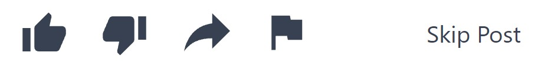
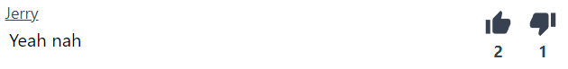
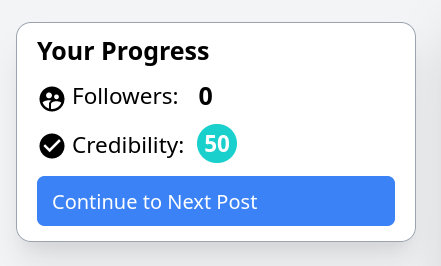

# How to Play The Misinformation Game

**This is a copy of the page that will be shown to
participants before they start participating in a study.**

This document has only slight modifications to make the content
readable within GitHub. If you wish to view the actual
rules page from the game, then try the example game that can be
accessed from [the example game page](/link/ExampleGame).

## How to Participate

### Posts
You will be shown a series of posts, which you are encouraged
to interact with. To begin with, you will start with 0 followers
and a credibility rating of 50. As you interact with posts, these
values may change based upon your interactions.

When you are shown a post, you may choose one of the following
reactions:

- The **like** button (thumbs up icon) will indicate to others
  that you like the content of this post.

- The **dislike** button (thumbs down icon) will indicate to
  others that you dislike the content of this post.

- The **share** button (rightwards-facing arrow) will show
  this post to your followers.

- The **flag** button (flag icon) will report this post as
  harmful or misleading.

- The **skip post** button will allow you to not interact with
  the post at all.

To move on to the next post, you must first select to like,
dislike, share, flag, or skip the post, which can be done
underneath the content of the post. Once you have reacted
to the post, you will be able to press the Continue to
Next Post button underneath Your Progress.

_Note: You may not be shown all of these reactions. This 
is normal and depends on what reactions have been enabled._

### Comments 
Under the posts, you may see a series of comments. These comments
may also allow you to interact with them individually.

You may be able to react to a comment in the following ways:

- The **like** button (thumbs up icon) will indicate to others
  that you like the content of this post.

- The **dislike** button (thumbs down icon) will indicate to
  others that you dislike the content of this post.
  
_Note: You may not be shown all of these reactions. This 
is normal and depends on what reactions have been enabled._

### Progress
Your own followers and credibility rating will also be shown
under Your Progress,

Your follower count is the number of other users following
you on this network.

Your credibility rating is an indication of how credible
you are perceived to be on a scale from 0 to 100. Credibility
ratings will also be colour coded from dark red
()
for the 0-10 range to dark blue
()
for the 90-100 range.
