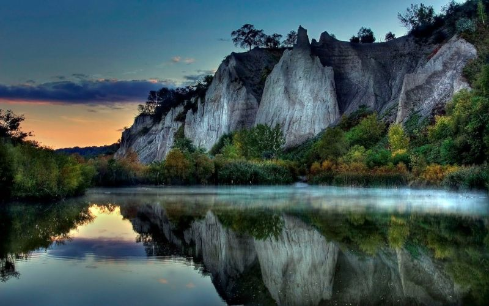
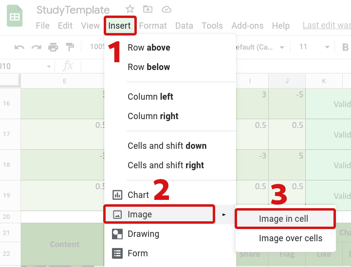

# Recommendations for Including Images in Studies
{:#intro .no_toc}

The transfer of images from Firebase to your participants can
incur a large cost due to the bandwidth required. Therefore,
reducing the size of the images in your study can reduce the
cost of running the study, and increase the participants
that can be served under the free tier of Firebase.

## Table of Contents
{:#toc .no_toc}
* toc
{:toc}

## 1. Choice of Image File Formats
{:#image-format-choice}

Recommendation
Use JPEG (`.jpg`) image files where possible.

The most effective image file formats for compression are the modern
image file formats such as
[AVIF](https://developer.mozilla.org/en-US/docs/Web/Media/Formats/Image_types#avif_image)
or
[WEBP](https://developer.mozilla.org/en-US/docs/Web/Media/Formats/Image_types#webp_image).
These formats allow better compression of images. However, older and cheaper computers,
tablets, and phones may not support them. Therefore, it is recommended that
you use either the PNG (`.png`) or JPEG (`.jpg`) file formats for
images. These file formats are very widely supported.

Additionally, JPEG files can be compressed further than PNG files,
and therefore JPEG images will often be smaller. Therefore, the use
of JPEG images is recommended. However, sometimes JPEG files can
introduce visual artifacts to some images. If you observe this, then
using PNG files instead will avoid those at the cost of additional
file size.

### 1.1. Format to use for Animated Images
{:#animated-image-formats}

If you wish to include animated images in your study, you may use the
GIF (`.gif`) image file format. However, these images can be very large,
and The Misinformation Game does not support more efficient video formats.

## 2. Scale-Down your Images
{:#scale-down-images}

Recommendation
Downscale your images to the dimensions recommended in the
[Study Configuration](/StudyConfiguration) documentation using a tool
such as [https://www.iloveimg.com/resize-image](https://www.iloveimg.com/resize-image#resize-options,pixels).

The easiest way to reduce the size of images is to downscale them to
smaller dimensions. This reduces the number of pixels that must be stored
for the image, which reduces their file size. However, if images are
downscaled too far, then they will look pixelated. The
[Study Configuration](/StudyConfiguration) documentation contains
recommendations for the dimensions to downscale avatar and post images
to. You can then use the tool
[https://www.iloveimg.com/resize-image](https://www.iloveimg.com/resize-image#resize-options,pixels)
to resize your study images to the recommended sizes before adding
them to your study configuration spreadsheet.

As an example, the two images below in [Figure 1](#fig1) and [Figure 2](#fig2)
should appear very similar. However, the image in Figure 2 is half the width and
height of the image in Figure 1, and therefore also only 30% of the size. This
demonstrates that downscaling images can save a lot of bandwidth without
affecting the quality of the images very much.

**Original Image:**
<figure id="fig1">
    
    <figcaption>
        <a href="#fig1">Figure 1.</a> Photo with a resolution of 1600x1000, and a file size of 295KB.
    </figcaption>
</figure>

**Scaled-Down Image:**
<figure id="fig2">
    
    <figcaption>
        <a href="#fig2">Figure 2.</a> Photo with a resolution of 800x500, and a file size of 88KB.
    </figcaption>
</figure>

## 3. Compress your Images
{:#compress-images}

Recommendation
Use a tool such as [https://imagecompressor.com/](https://imagecompressor.com/)
to compress your images.

Images can also be compressed without reducing their dimensions by reducing
their quality. This compression can be done by automated tools such as
[https://imagecompressor.com/](https://imagecompressor.com/). The output
of these tools is often imperceptibly different from the original image,
especially when the image is a photo. However, it is recommended that
you compare the image to the original after compression to make sure it
hasn't lost too much quality.

As an example, the two images below in [Figure 3](#fig3) and [Figure 4](#fig4)
should appear very similar. However, the image in Figure 4 has been compressed,
and is 16% smaller than the image in Figure 3. This demonstrates that compressing
images can save some bandwidth without affecting the quality of the images very much.

**Original Image:**
<figure id="fig3">
    
    <figcaption>
        <a href="#fig3">Figure 3.</a> Photo with a resolution of 800x500, and a file size of 88KB.
    </figcaption>
</figure>

**Compressed Image:**
<figure id="fig4">
    
    <figcaption>
        <a href="#fig4">Figure 4.</a> Compressed photo with a resolution of 800x500, and a file size of 74KB.
    </figcaption>
</figure>

## 4. Inserting Images into your Study Configuration
{:#inserting-images-into-study}

Images must be inserted into the configuration spreadsheet using the **Insert**
menu at the top of the page in Google Sheets. You must first select the cell
where you want to insert the image, and then select **Insert** -> **Image**
-> **Image in cell**. This process is demonstrated in [Figure 5](#fig5).
If you do not use this process, then The Misinformation Game may not be
able to find the image.

<figure id="fig5">
    
    <figcaption>
        <a href="#fig5">Figure 5.</a> Diagram demonstrating how to insert an
        image into a study configuration spreadsheet.
    </figcaption>
</figure>
