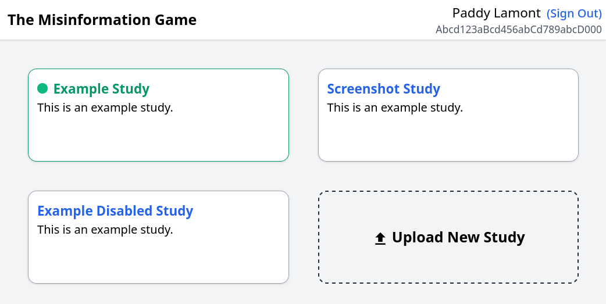
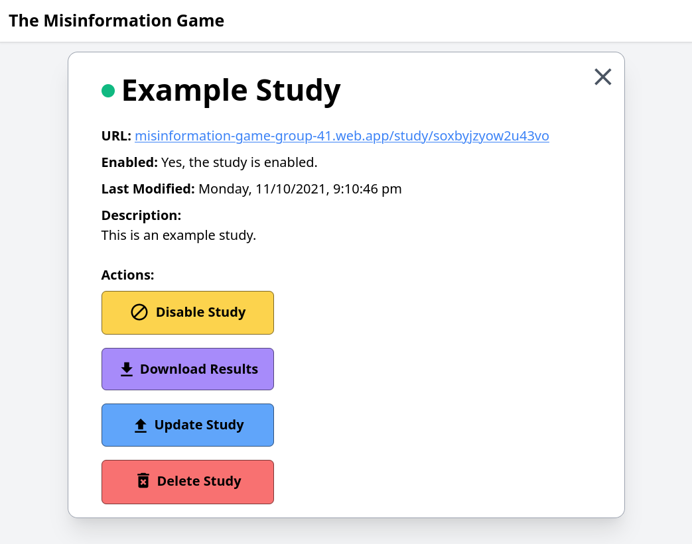

# Managing Studies
{:#intro .no_toc}

This document outlines the general processes to manage
your studies using The Misinformation Game after you
have uploaded them.

## Table of Contents
{:#toc .no_toc}
* toc
{:toc}

## 1. Accessing a Study's Admin View
{:#accessing-study-admin-view}

To manage your study, you must first navigate to the
admin dashboard page, as shown in [Figure 1](#fig1).

<figure id="fig1">
    
    <figcaption>
        <a href="#fig1">Figure 1.</a> Screenshot of an example admin dashboard.
    </figcaption>
</figure>

From this screen, you can then select the study that
you wish to manage. This will open another view where
you can manage your study, as shown in [Figure 2](#fig2).

<figure id="fig2">
    
    <figcaption>
        <a href="#fig2">Figure 2.</a> Screenshot of an example study's admin view.
    </figcaption>
</figure>

## 2. Enabling and Disabling your Study
{:#enable-disable-studies}

In a Study's _Admin View_, there will be either
a button to **Enable Study** in green, or a button to
**Disable Study** in orange. Pressing these buttons will ask
you to confirm whether you wish to enable or disable your study.

Studies that are enabled will be accessible to participants
with the URL of the study. Once the study is disabled however,
participants will no longer be able to access the study.

Enabling or disabling your study will also update its **Last
Study Modification Time**, which is saved into the results.
This timestamp will allow you to distinguish between your
test runs through the study while it was disabled, and the
participant's runs through the study after you enabled it.

## 3. Downloading Results
{:#download-results}

You can download the results of your study from its
_Admin View_ by clicking the **Download Results** button.
This will download the results of your study as an Excel
spreadsheet. More information on the format of these results
can be found in the [Results](/Results) documentation.

## 4. Updating your Study
{:#update-study}

If you have found changes you wish to make to your
study after you tested playing through it, you may
wish to upload a new version of your study. This
can be done by pressing the **Update Study** button
and selecting the new version of your configuration
spreadsheet that you wish to upload.

Note, this updating should not be done while
participants are taking part in your study, as it
is possible that it will break their game.

## 5. Deleting your Study
{:#delete-study}

Once you have finished conducting your study and you
have downloaded the results of your study, you may
wish to delete your study from The Misinformation Game.
This can be done by pressing the **Delete Study** button
for your study in its _Admin View_. This deletion
will delete everything to do with your study, including
its settings, all its images, and all its results. The
results will not be recoverable after the study has been
deleted.

## 6. Accessing the Study URL for Participants
{:#access-study-url}

The URL to send to participants is shown below the name
of the study at the top of its _Admin View_. This
URL can also be used for you to access your game to test
it before you enable the study.

If you are using another system to redirect participants
to your game, some of them may also support automatically
passing the ID of participants to the game. This can be
done by including `?id=<PARTICIPANT ID>` at the end of
the URL, where `<PARTICIPANT ID>` should be replaced by
the ID of the participant.
