<h1 id="intro">
    Installation (Non-Technical Guide)
</h1>
This document outlines a step-by-step process to install and host your own instance of the Misinformation
Game. At the end of this guide, you will have your own website to use to run studies using the Misinformation
Game software.

This guide is aimed to require less technical knowledge than the
[technical installation guide](/TechnicalInstallation), and as such it requires more time and has a few
limitations. One major limitation of this process is that it does not allow easily updating the Misinformation
Game as explained in the [updating guide](/Updating). Instead, this same process will need to be followed
again to update your instance. If you are comfortable installing software and using the command line,
then the technical installation guide will likely be easier and quicker to follow.

<h2 id="toc">
    Table of Contents
</h2>
TODO

## 1. Download the Codebase From GitHub
The Misinformation Game must be deployed using its source code. To download and save the codebase onto your
device, you can access it from [GitHub](https://github.com/TheMisinformationGame/MisinformationGame).

On this page you will need to click on the green _“Code”_ button and then on the _“Download Zip”_ button as
seen in Figure 1 below. This will then prompt you to download a zip file of the code, which you can save
anywhere on your computer. The Zip archive should then be extracted into a folder on your device, which
will contain the source code of the Misinformation Game to use in future steps.

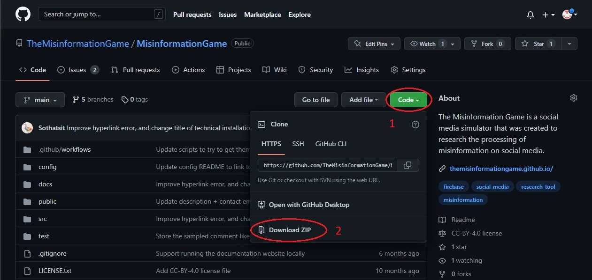

## 2. Install Visual Studio Code
_If you already have Visual Studio Code installed, then you may skip this step._

This installation guide demonstrates the installation process of downloading the Visual Studio Code on
Windows. Should you be using a Mac, the installation process should be similar, but in case you encounter
any difficulties, you can follow the
[Visual Studio Code installation guide for Mac](https://code.visualstudio.com/docs/setup/mac).

**Step 1:** Download Visual Studio Code from [the Visual Studio Code website](https://code.visualstudio.com/download).

**Step 2:** Open the downloaded file to begin the installation process.

**Step 3:** Read the license agreement and click **Next** if you agree.

**Step 4:** On the _'Select Destination Location'_ page, click **Next**.

**Step 5:** On the _'Select Start Menu Folder'_ page, click **Next**.

**Step 6:** On the _'Additional Tasks'_ page, select **"Add to PATH (requires shell restart)"**,
and then click **Next**.

**Step 7:** On the _'Ready to Install'_ page, click **Install**. Once the installation has
been completed, you may progress to section 3 of this guide.

## 3. Install Node.js and NPM
The next step in the process is to download [Node.js](https://nodejs.org) and [NPM](https://www.npmjs.com/).
The former is required to run the installation code, and the latter is required to install dependencies of
the Misinformation Game.

**Step 1:** Download the installer for both of these tools from
[https://nodejs.org/en/download/](https://nodejs.org/en/download/).
Select the platform-specific installer you require by clicking the **"Windows Installer"**
or the **"macOS Installer"** buttons on the download page. The **"Windows Installer"** button
is highlighted in Figure 2 below.

**Step 1:** Once the installer has downloaded, run it.

**Step 2:** If you are asked whether you wish to run the software, then accept by clicking **“Run”**.

**Step 3:** Begin the installation by clicking **Next**.

**Step 4:** Read the license agreement and click **Next** if you agree.

**Step 5:** On the _'Installation Location'_ page, click **Next**.

**Step 6:** The next page will ask you to select the components that you wish to install.
The default selections include all the components we require, so click **Next**.

**Step 7:** Click **Install**. Once the installation finishes, click **Finish**.

### 3.1 Verify that Node.js and NPM were successfully installed
To verify your install, in Windows, open the application “Command Prompt” or "Terminal". In the window, you
will need to type commands `node -v` and `npm -v`. You can see the commands and their expected outputs below
in Figure 3. The versions that you have installed may differ from these versions. The guide should continue
to work, but in case it does not, it may be good to install these specific versions if you can.

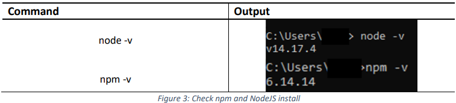

## 4. Create your Firebase Project
Firebase is a technology platform made by Google, which provides a platform to host websites. The
Misinformation Game makes use of Firebase for its hosting, authentication, and data storage.
Therefore, to host your instance of the Misinformation Game, your own Firebase instance will
be required. A Google account is required in order to use Firebase. If you do not have a Google
account, you can create one at
[https://accounts.google.com/signup/v2/webcreateaccount](https://accounts.google.com/signup/v2/webcreateaccount).

**Step 1:** Sign in to your Google account in [Firebase Console](https://console.firebase.google.com/).

**Step 2:** Once you have signed in, you should see a similar page as shown in Figure 4. Click
**Create a project**. You will now be prompted for information related to your instance of
the Misinformation Game.

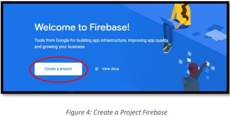

**Step 3:** Enter a name for your project. The name of your project will be used to determine the URL that
your study participants will access. Once you have selected a name, click **Continue**.

**Step 4:** In the next step you can choose to disable Google Analytics. We recommend that you
disable it, as it doesn't provide any functionality that is used by the Misinformation Game.

**Step 5:** Click **Create project**. You have now created a Firebase project that can be used to
host the Misinformation Game. However, some additional set-up is still required to get it ready.

### 4.1 Enable the Firestore Database
The Misinformation Game uses the Firestore Database to store users, studies, and study results. Therefore,
you will need to enable it.

**Step 1:** Select **Firestore Database** under the **Build** tab on the left of the project page.
The option to select is shown in Figure 5 below.

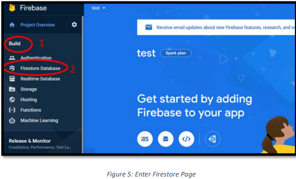

**Step 2:** On the _'Firestore'_ page, click **Create database**. This button is shown below in Figure 6.

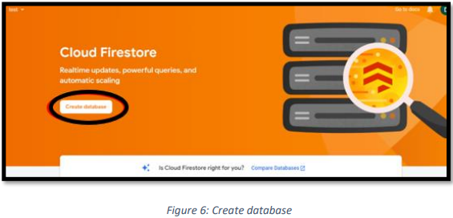

**Step 3:** You will be asked what rules you would like to set for the project’s database. These will be
configured later in the installation process, so select **Start in production mode** and click **Next**.

**Step 4:** You will be asked to select the geographical location for where your database should be hosted.
Select the geographical location that is closest to you and your participants. This selection does not restrict
who can access your instance, but instead just helps to speed up access to the site by hosting it closer to you.
Once you have selected a location, click **Enable**.

**Step 5:** Your database should now be ready to go. You should now see a page similar to Figure 7 below.

### 4.2 Enable Storage
Any images that are embedded within studies will be stored within Firebase Storage. Therefore, Storage
should be enabled.

**Step 1:** Select **Storage** under the **Build** tab on the left of the project page.
The option to select is shown in Figure 8 below.

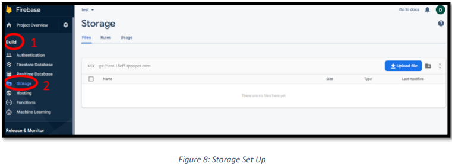

**Step 2:** Your storage should now be set up. If you see a page that looks like Figure 8 above, then
this has been successful. However, if you see the **Get started** page shown in **Figure 9**, then you
will need to first enable the Firestore Database as explained in an earlier section of this guide.

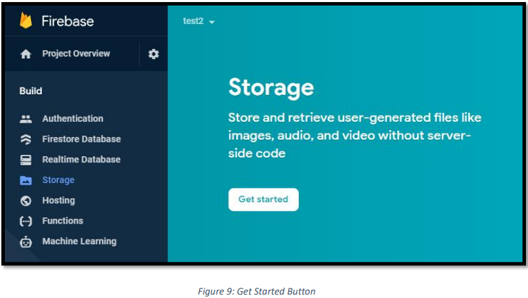

### 4.3 Enable Authentication
The Misinformation Game uses Firebase Authentication to authenticate administrators. Administrators
are the users that are given access to upload studies and download their results. This authentication
is not used for participants in your studies.

**Step 1:** Select **Authentication** under the **Build** tab on the left of the project page.
The option to select is shown in Figure 10 below.

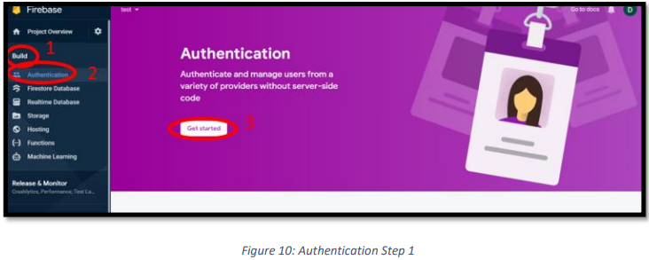

**Step 2:** Click **Get started**.

**Step 3:** You will be asked to select the Sign-In method that you would look to enable. Click on the _'Google'_
icon, as we will be making use of Google accounts for authentication.

**Step 4:** After you click on the Google icon, you will be shown more options. First, click **Enable**,
as shown in Figure 11 below.

**Step 5:** You may now enter your own email under the **Project Support Email** field shown in
Figure 11 below. This contact email is required by Google's authentication service.

**Step 6:** Click the **Save** button, as shown in Figure 11 below.

**Step 7:** The next stage of authentication is to give yourself administrator rights. This step
will be explained later in this guide, as it requires additional set-up to be performed first.

### 4.4 Configure the project as a Web-App
Firebase supports mobile apps as well as websites. We must configure the project as a web-app.

**Step 1:** Click **Project Overview** on the left of the project page, as shown in Figure 12 below.

**Step 2:** Click the **Web** icon, which is highlighted in Figure 12 below.
The icon should resemble &lt;/&gt;.

**Step 3:** Register your app by giving the app a name. Any name is okay. The **“Hosting”** settings
can be ignored, as we will configure those separately later in this guide.

**Step 4:** Click **Register App**.

**Step 5:** You will be shown the Firebase SDK (software development kit) settings.
Select **"Use npm"**.

**Step 6:** Copy the larger block of code to a text file on your computer. This configuration
will be required to link the Misinformation Game to your project later. When it is required later,
this code will be referred to as the **"Configuration Information File"**. There is a button in the
bottom-right of this code block that can be pressed to copy it, as shown in Figure 13 below.

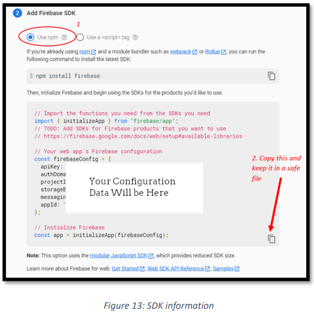

**Step 7:** Once you have saved the configuration information file, click **Continue to console**.

## 5. Deploying the Website
The next part of the set-up process is to have the game website running on your own computer. For this step
we will need to use Visual Studio Code, NodeJS, npm, and the Firebase Project that we have set up.

### 5.1	OPENING AND SETTING UP THE CODE
Step 1: Open the Visual Studio Code app.  
Step 2: Click on File > Open Folder and find the extracted project folder that you saved in section 2.1.  
Step 3: Once the folder is open, you will see a screen similar to Figure 14. On the left of the screen, you
will notice the “Explorer” area. We will be using this section of the screen quite often.

Step 4: In the “Explorer” section, click the “config” toggle and find and click on the “firebase-config.js”
file. You will see something like Figure 14.  
Step 5: Replace the firebaseConfig information with your own information. This information is in the
Configuration Information File, which was saved in section 5.4 of this guide. The area that you need to
replace is circled in Figure 15.  
Step 6: Finally, save the file by pressing _Ctrl + S_ on your keyboard.

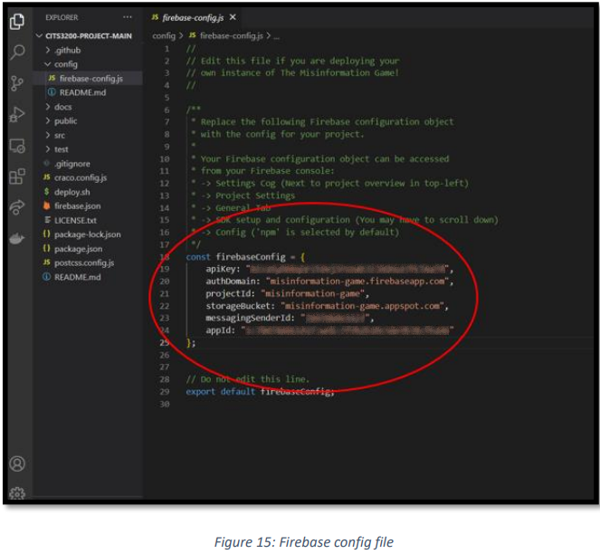

### 5.2 Install Git Bash (For Windows)
Windows users will also need to install Git Bash. You can download it from the below link, by clicking
the Windows icon, as seen in Figure 16.
https://git-scm.com/download/win

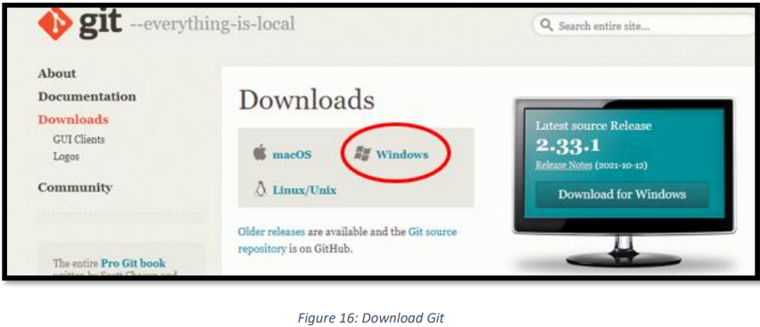

After downloading, double-click on the executable. Follow the installation process and do not change any
of the default settings. After this you should have a working Git for Windows instance running on your
computer.

### 5.3	RUNNING THE APP
Now the environment is completely set up and ready for you to edit and to deploy. To deploy a version of
this application on the internet, follow the below steps.

Step 1:  In the top toolbar of Visual Studio Code, click on Terminal > New Terminal. This will open at the
bottom of the application and look like Figure 17.

Step 1.5: If you are on Windows, you will also need to change to the Git Bash terminal. As seen in Figure 18,
first click on the down arrow and then select “Git Bash”.

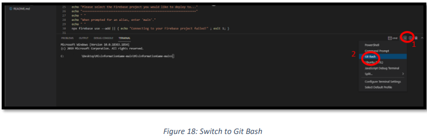

This will open a terminal that looks like Figure 19.

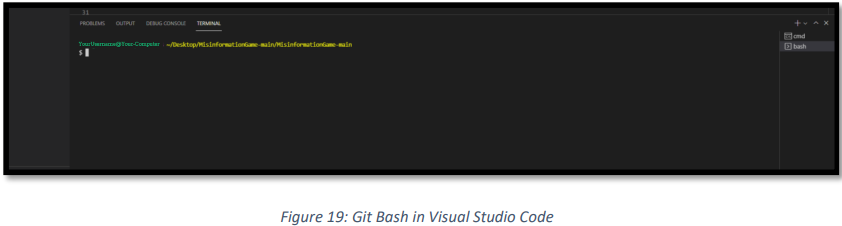

Step 2: In the terminal at the bottom of the screen run the following command: `./deploy.sh`

You will now see text beginning to be displayed at the bottom of the terminal screen. This will be installing
all the necessary packages and deploy the app. Please note that this process may take a while. See Figure 20
for an example.

During this deployment process you will be asked many questions which require a response. These questions
are as follows:  
Question 1: You will then be asked to login to your Google Firebase account. This will open a browser window.
Please login to your Google Firebase account and return to Visual Studio Code.  
Question 2: You will be asked to select a Firebase Project. Select the relevant Firebase project made earlier
and then press Enter to continue. This is seen in Figure 21.

Question 3: You will then be asked to give an alias to this project. This can be whatever you would like.
For example, “test”. Press Enter to continue.  
Question 4: You will then be asked to sign in to Google Cloud. Press Y and then Enter. This will open a
login page in your browser, please login with the same Google Account you are using for Firebase. After
this return to Visual Studio Code.  
Question 5: You will then be asked to select the cloud project. Press the number next to your project and
then press Enter to continue. This is seen in Figure 22.

Question 6: Next you will be asked to make a domain name.  
Before entering the URL, please note that the domain name must be your Firebase Project ID. You can get
the Project ID from Firebase by clicking on the “Gear” icon on the left and then on “Project Settings”.
Figure 23 and 24 below demonstrates this.

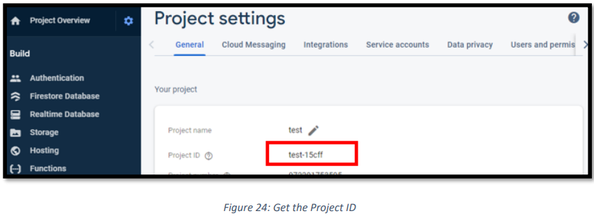

The URL must be in the format of “<projectID>. appspot.com.” For example, “test-15cff.appspot.com” is
a valid domain. See Figure 25 for an example. After entering the URL, press Enter to continue.

Step 4: The site is now fully deployed and ready to be accessed. You will see something similar to Figure 26.

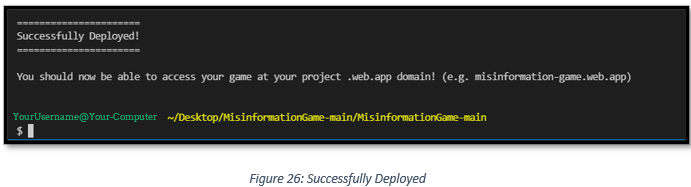

You can access the website on your browser at the domain \[Your Project ID\].web.app.
\[Your Project ID\]” is the project ID obtained for question 6 above.

## 6. Giving Yourself Admin Rights

In order to give yourself Administrator permissions you will need to follow the below steps:  
Step 1: Access your deployed website at \[Your Project ID\].web.app. This will take you to the page in Figure 27.
 
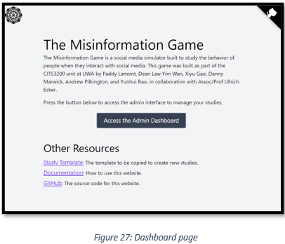

Step 2: Then click on “Access the Admin Dashboard” and this will take you to the Admin Sign In page as
seen in Figure 28. On the sign in page, click on “Sign in with Google” and sign in with your Google account.

Step 3: After signing in you will see that you do not have permissions yet. This is seen in Figure 29.

Step 4: You will now need to get to your Google Firebase project at:
https://console.firebase.google.com/
In your Firebase project, click on “Build” and then click on “Authentication” as seen in Figure 30.

Step 5: In the Authentication screen, make sure you are in the Users tab.
Find yourself, in the identifier column and then copy your User UID. This can be seen in Figure 31.

Step 6: Now that we have the User UID, we now need to add this to the database.
Click on “Build” and then click on “Firestore Database”.
Make sure you are on the “Data” tab and then click on “Start Collection”.
This is all seen in Figure 32.

Step 7: You will then be asked to name the collection. The collection must be called “Admins”.
Then click “Next” to continue. This is seen in Figure 33.

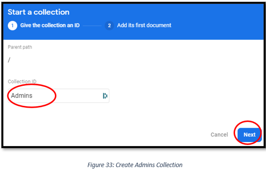

Step 8: You will then be asked to create a document in the collection.
For the Document ID, paste in your “User UID” that you copied earlier in step 5.
Next in Field type “Name” and then in value insert the user’s name. Then click “Save.”
This is seen in Figure 34.

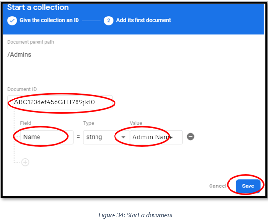

Step 9: You will now have added your user as an Admin. You can test this by returning to the admin
page on your website. You will see a page like Figure 34.

_NOTE: Other administrators will be able to set up their own administrator account on the same website
domain. The entire installation and hosting process only needs to be followed by one administrator._

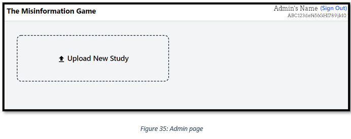

## 7. Conclusion
You should now have a fully deployed instance of the Misinformation Game. You may now upload your studies
through the admin interface. Additional information on configuring your own studies can be found within
the [study configuration documentation](/StudyConfiguration).
