# Installation (Non-Technical Guide)

{:#intro .no_toc}

This document outlines a step-by-step process to install and host your own instance of The Misinformation
Game. At the end of this guide, you will have hosted your own instance of The Misinformation
Game to run studies.

This guide is aimed to require less technical knowledge than the
[technical installation guide](/TechnicalInstallation), and as such it requires more time. If you are
comfortable installing software and using the command line, then the technical installation guide will
likely be easier and quicker to follow.

## Table of Contents

{:#toc .no_toc}

* toc
  {:toc}

## 1. Download the Codebase From GitHub

{:#download-codebase}

The Misinformation Game must be deployed using its source code. To download and save the codebase onto your
device, you can access it from [GitHub](https://github.com/TheMisinformationGame/MisinformationGame). The
buttons you need to click to download the source code are highlighted in [Figure 1](#fig1).

**Step 1:** Open the [MisinformationGame repository](https://github.com/TheMisinformationGame/MisinformationGame)
on GitHub.

**Step 2:** Click the green **Code** button at the top right. This should open a _'Clone'_ menu, as shown in
[Figure 1](#fig1).

**Step 3:** Click the **Download ZIP** button from the _'Clone'_ menu. This should start a download of the
source code of The Misinformation Game.

**Step 4:** Extract the ZIP archive to a directory on your computer (the specific directory does not matter).

**Step 5:** You should now have a directory in your file system that contains the source code of The
Misinformation Game! This will be used in later steps to configure and deploy your own Misinformation Game
instance.

<figure id="fig1">
    
    <figcaption>
        <a href="#fig1">Figure 1.</a> Diagram demonstrating the process of downloading the source code
        from GitHub.
    </figcaption>
</figure>

## 2. Install Visual Studio Code

{:#install-vscode}

_If you already have Visual Studio Code installed, then you may skip this step._

This guide uses Visual Studio Code (VSCode) to allow you to access and modify the source code, and to allow
you to run command-line scripts in a cross-platform way. This section
describes the process to install VSCode on Windows, although the process should be similar on Mac or Linux.
In-depth guides to install VSCode can also be found for most operating systems in the official
[VSCode documentation](https://code.visualstudio.com/docs/setup/setup-overview).

**Step 1:** Download Visual Studio Code from the [VSCode downloads page](https://code.visualstudio.com/download).

**Step 2:** Open the downloaded file to begin the installation process.

**Step 3:** Read the license agreement and click **Next** if you agree.

**Step 4:** On the _Select Destination Location_ page, click **Next**.

**Step 5:** On the _Select Start Menu Folder_ page, click **Next**.

**Step 6:** On the _Additional Tasks_ page, select **Add to PATH (requires shell restart)**,
and then click **Next**.

**Step 7:** On the _Ready to Install_ page, click **Install**.

**Step 8:** Wait for the installation to complete. If no errors are displayed, then
you have successfully installed VSCode!

## 3. Install Node.js and NPM

{:#install-nodejs}

The next step in the process is to download [Node.js](https://nodejs.org) and [NPM](https://www.npmjs.com/).
Node.js is required to run the installation code, and NPM is required to install the dependencies of
The Misinformation Game. These tools can both be installed at once using the Node.js installer.

**Step 1:** Download the Node.js installer from [https://nodejs.org/en/download/](https://nodejs.org/en/download/).
Select the platform-specific installer you require by clicking the **Windows Installer** or the
**macOS Installer** buttons on the download page. Additional operating system installers are listed
further down the page.

**Step 2:** Open the downloaded file to begin the installation process. If you are asked whether you wish
to run the software, accept by clicking **Run**.

**Step 3:** On the _Introduction_ page, begin the installation by clicking **Next**.

**Step 4:** Read the license agreement and click **Next** if you agree.

**Step 5:** On the _Installation Location_ page, click **Next**.

**Step 6:** The next page will ask you to select the components that you wish to install.
The default selections include all the components we require, so click **Next**.

**Step 7:** Click **Install**. Once the installation finishes, click **Finish**.

### 3.1. Verify that Node.js and NPM were installed correctly (Optional)

{:#verify-nodejs-install}

You may verify that Node.js and NPM were successfully installed through the
command line.

**Step 1:** Open a command-line program,

- **On Windows:** Open the application _Command Prompt_.
- **On Mac:** Open the application _Terminal_.

**Step 2:** Verify that Node.js installed correctly by typing the command `node -v` followed
by pressing enter. This command should output the version of Node.js that was installed
(e.g. `v14.17.4`). If it displays an error, then Node.js may not have been installed correctly.

**Step 3:** Verify that NPM installed correctly by typing the command `npm -v` followed
by pressing enter. This command should output the version of NPM that was installed
(e.g. `6.14.14`). If it displays an error, then NPM may not have been installed correctly.

## 4. Create your Firebase Project

{:#create-firebase-project}

Firebase is a technology platform made by Google, which provides a platform to host websites. The
Misinformation Game makes use of Firebase for its hosting, authentication, and data storage.
Therefore, to host your instance of The Misinformation Game, you will need to create your own
Firebase instance to host the game. A Google account is required in order to use Firebase. If
you do not have a Google account, you can create one at
[https://accounts.google.com/signup/v2/webcreateaccount](https://accounts.google.com/signup/v2/webcreateaccount).

**Step 1:** Sign in to the [Firebase Console](https://console.firebase.google.com/) using your Google account.

**Step 2:** Once you have signed in, you should see a similar page as shown in [Figure 2](#fig2).
If you do not see this page, then you should be able to access it at
[https://console.firebase.google.com](https://console.firebase.google.com). On this page, click
**Create a project**. If you have previously created a Firebase project, then you will need to
click **Add project** instead.

<figure id="fig2">
    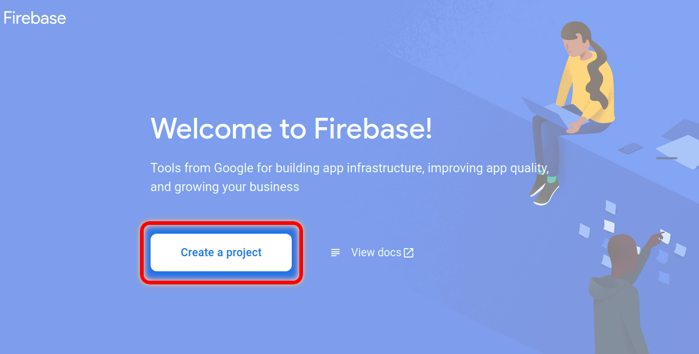
    <figcaption>
        <a href="#fig2">Figure 2.</a> Diagram highlighting how to create a new Firebase project.
    </figcaption>
</figure>

**Step 3:** You should now be shown a form asking you to enter the name for your new project.
Enter a name for your project. The name of your project will be used to determine the URL that
your study participants will access. Therefore, you may wish to choose an ambiguous name, so that
participants are not influenced by the URL. The name and ID fields are highlighted in [Figure 3](#fig3).
Once you have selected a name, click **Continue**.

<figure id="fig3">
    
    <figcaption>
        <a href="#fig3">Figure 3.</a> Diagram labelling the fields in the Firebase project creation form.
    </figcaption>
</figure>

**Step 4:** In the next step you can choose to disable Google Analytics. We recommend that you
disable it, as it doesn't provide any functionality that is used by The Misinformation Game. The
toggle to disable Google Analytics is highlighted in [Figure 4](#fig4).

You may also be asked if you wish to enable Gemini for Firebase, as well as join the Google Developer program. We recommend that you **disable** Gemini, and **do not** join the develop program as these are not needed for this project.

<figure id="fig4">
    
    <figcaption>
        <a href="#fig4">Figure 4.</a> Disable analytics in your Firebase project.
    </figcaption>
</figure>

**Step 5:** Click **Create project**. You have now created a Firebase project that can be used to
host The Misinformation Game. However, some additional set-up is still required to deploy the
source code of The Misinformation Game to your new project.

### 4.1. Enable Firebase Firestore

{:#enable-firebase-firestore}

The Misinformation Game uses Firebase's Firestore Database to store users, studies, and study results.
Therefore, you will need to enable it.

**Step 1:** Select **Firestore Database** under the **Build** tab on the left of the project page.
The buttons to click are highlighted in [Figure 5](#fig5).

<figure id="fig5">
    
    <figcaption>
        <a href="#fig5">Figure 5.</a> Diagram highlighting the buttons to click to
        access the Firestore Database.
    </figcaption>
</figure>

**Step 2:** On the _Cloud Firestore_ page, click the **Create database** button. This button is
shown in [Figure 6](#fig6). If a table is shown instead (as in [Figure 7](#fig7)), then the
Firestore database has already been enabled.

<figure id="fig6">
    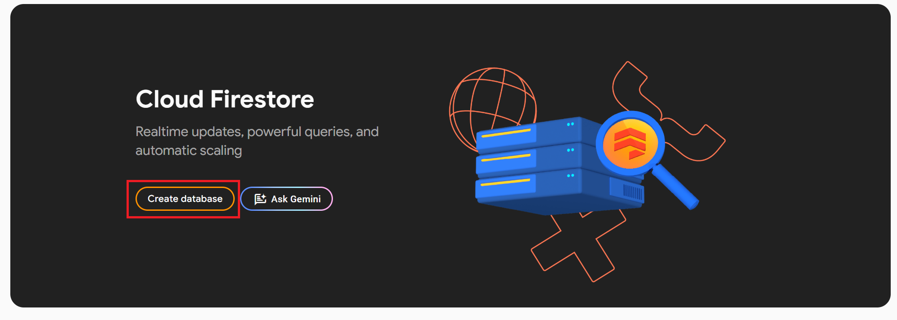
    <figcaption>
        <a href="#fig6">Figure 6.</a> Diagram highlighting the button to click to enable
        Firestore database for your Firebase instance.
    </figcaption>
</figure>

**Step 3:** You will be asked to select the geographical location for where your database should be hosted.
Select the geographical location that is closest to you and your participants. This selection does not restrict
who can access your instance, but instead just helps to speed up access to the site by hosting it closer to you.
Once you have selected a location, click **Enable**.

**Step 4:** You will be asked what rules you would like to set for the project’s database. These will be
configured later in the installation process, so select **Start in production mode** and click **Next**.

**Step 5:** Your database should now be ready to go. You should now see a page similar to the page
shown in [Figure 7](#fig7).

<figure id="fig7">
    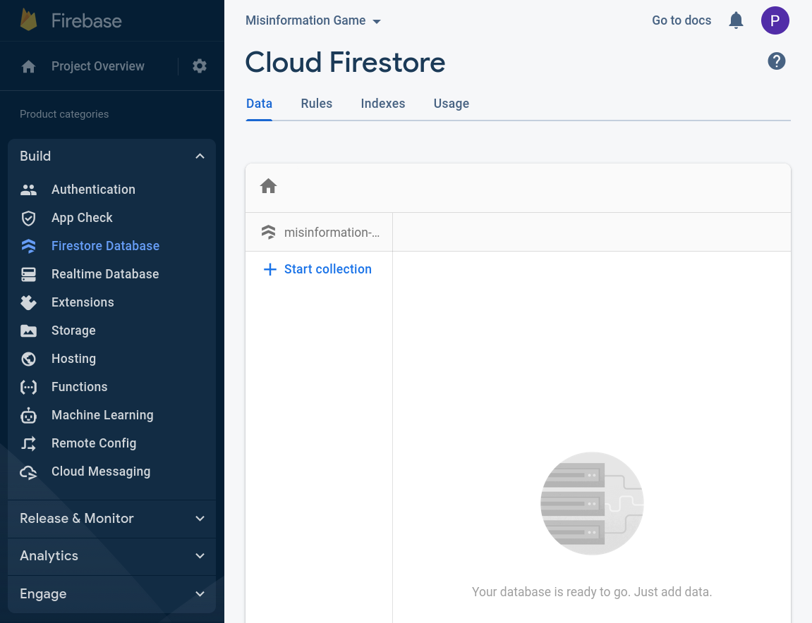
    <figcaption>
        <a href="#fig7">Figure 7.</a> Screenshot of an empty Firestore database.
    </figcaption>
</figure>

### 4.2. Enable Firebase Storage

{:#enable-firebase-storage}

Any images that are embedded within studies will be stored within Firebase Storage. Therefore, Firebase Storage
will need to be enabled for your Firebase project.

**Step 1:** Select **Storage** under the **Build** tab on the left of the project page.
The buttons to click are highlighted in [Figure 8](#fig8).

<figure id="fig8">
    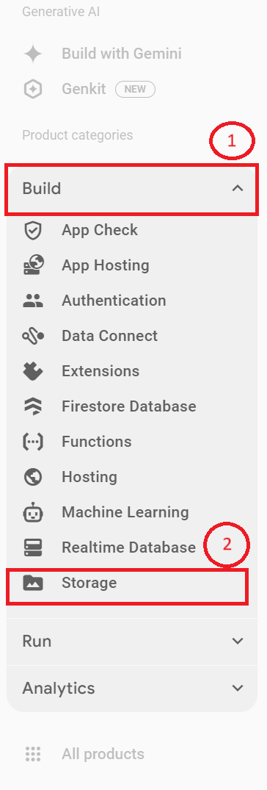
    <figcaption>
        <a href="#fig8">Figure 8.</a> Diagram highlighting the buttons to click to
        access the Firestore Storage.
    </figcaption>
</figure>

**Step 2:** As of **September 2024** you will need to ensure that you have a **Blaze account** to set up storage. If you have not set up a blaze account you will be informed that you need to update your account here (see [Figure 9](#fig9)).

<figure id="fig9">
    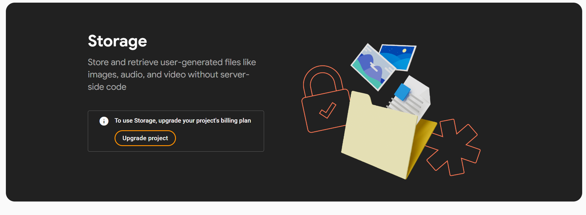
    <figcaption>
        <a href="#fig9">Figure 9.</a> Screenshot of the Firebase Storage page before Blaze account has been set up
    </figcaption>
</figure>

Due to this you will now need to set up a **Pay-as-you-go Blaze account** before continuing. To do so select the **Upgrade** button and follow the steps to set up an account. This will require you linking a payment method. The card will only be charged if you go over the free tier. More information about pricing is available in the [Firebase Pricing Documentation](/FirebasePricing).

**Step 3:** If you see the **Get started** page as shown in [Figure 10](#fig10), then you have sucessfully set up your Blaze account. Now. you will need to enable Firebase storage. To do so first select "get started".

<figure id="fig10">
    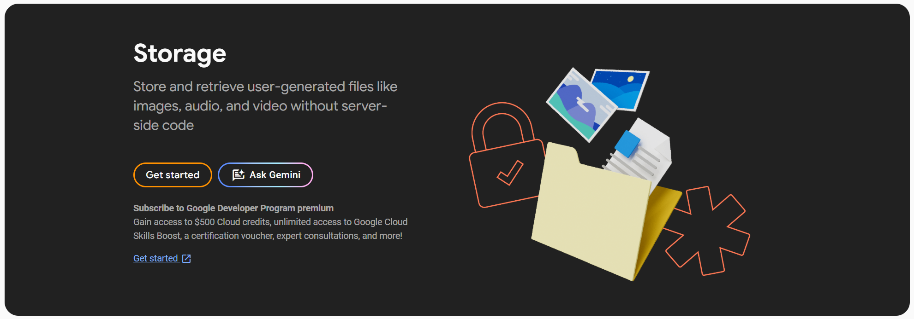
    <figcaption>
        <a href="#fig10">Figure 10.</a> Screenshot of the Firebase Storage page before it is enabled.
    </figcaption>
</figure>

**Step 4:** You will now be asked to set up default budget. Here, select "All locations" as shown in [Figure 11](#fig11), before continuing. You will be then asked again to set up security rules. Here, again select **Production Mode** before selecting create.

<figure id="fig11">
    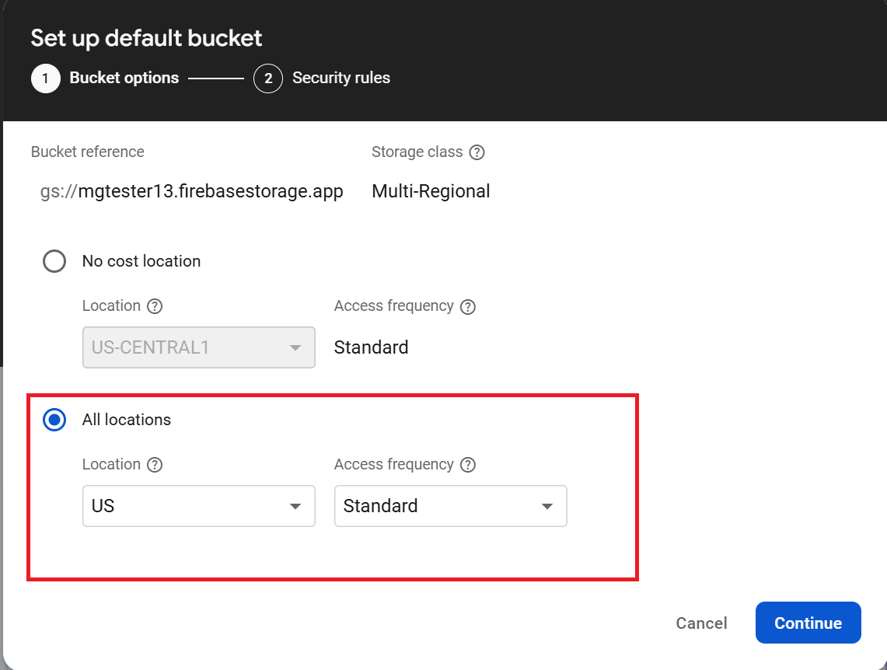
    <figcaption>
        <a href="#fig11">Figure 11.</a> Diagram of storage default bucket setup.
    </figcaption>
</figure>

**Step 5:** Your storage should now be ready to go. You should now see a page similar to the page shown in [Figure 12](#fig12).

<figure id="fig12">
    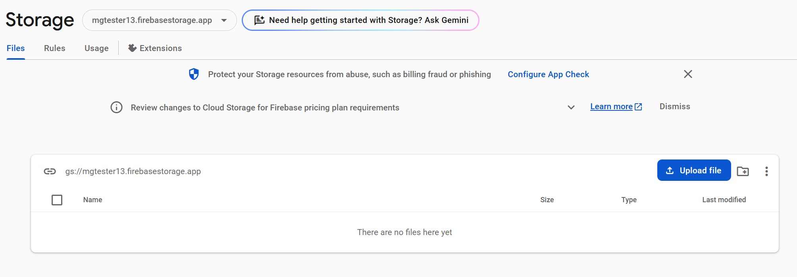
    <figcaption>
        <a href="#fig12">Figure 12.</a> Screenshot of Firebase storage.
    </figcaption>
</figure>

### 4.3. Enable Firebase Authentication

{:#enable-firebase-auth}

The Misinformation Game uses Firebase Authentication to authenticate administrators. Administrators
are the users that are given access to upload studies and download their results. This authentication
is not used for participants in your studies.

**Step 1:** Select **Authentication** under the **Build** tab on the left of the project page.
The option to select is shown in [Figure 13](#fig13) below.

<figure id="fig13">
    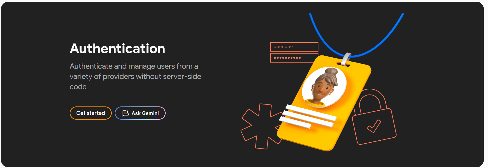
    <figcaption>
        <a href="#fig13">Figure 13.</a> Accessing Firebase authentication to enable it.
    </figcaption>
</figure>

**Step 2:** Click **Get started**.

**Step 3:** You will be asked to select the Sign-In method that you would look to enable. Click on the _'Google'_
icon, as we will be making use of Google accounts for authentication.

**Step 4:** After you click on the Google icon, you will be shown more options. First, click **Enable**,
as shown in [Figure 14](#fig14) below.

**Step 5:** You may now enter your own email under the **Project Support Email** field shown in
Figure 11 below. This contact email is required by Google's authentication service.

**Step 6:** Click the **Save** button, as shown in [Figure 14](#fig14) below.

<figure id="fig14">
    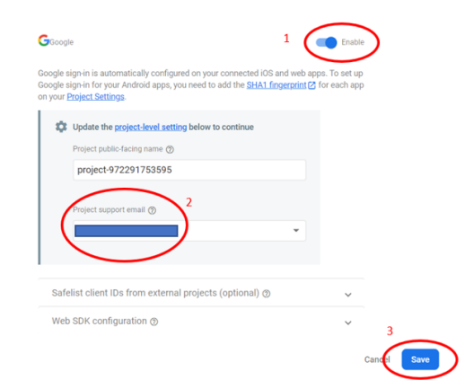
    <figcaption>
        <a href="#fig14">Figure 14.</a> Enabling Firebase Google authentication.
    </figcaption>
</figure>

**Step 7:** The next stage of authentication is to give yourself administrator rights. This step
will be explained later in this guide, as it requires additional set-up to be performed first.

### 4.4. Configure your Firebase Project as a Web-App

{:#enable-firebase-webapp}

Firebase supports mobile apps as well as websites. We must configure the project as a web-app.

**Step 1:** Click **Project Overview** on the left of the project page. This should look similar to what is shown in [Figure 15](#fig15).

**Step 2:** Click the **Web** icon, which is highlighted in [Figure 15](#fig15).
The icon should resemble &lt;/&gt;.

<figure id="fig15">
    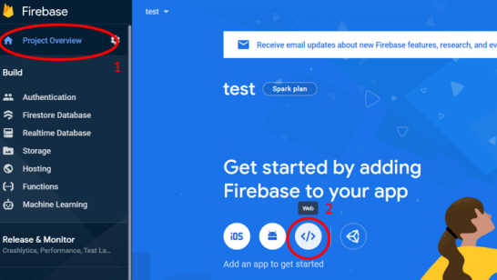
    <figcaption>
        <a href="#fig15">Figure 15.</a> Accessing Firebase web-app setup.
    </figcaption>
</figure>

**Step 3:** Register your app by giving the app a name. Any name is okay. The **“Hosting”** settings
can be ignored, as we will configure those separately later in this guide.

**Step 4:** Click **Register App**.

**Step 5:** You will be shown the Firebase SDK (software development kit) settings.
Select **"Use npm"**.

**Step 6:** Copy the larger block of code to a text file on your computer. This configuration
will be required to link The Misinformation Game to your project later. When it is required later,
this code will be referred to as the **"Configuration Information File"**. There is a button in the
bottom-right of this code block that can be pressed to copy it, as shown in [Figure 16](#fig16).

<figure id="fig16">
    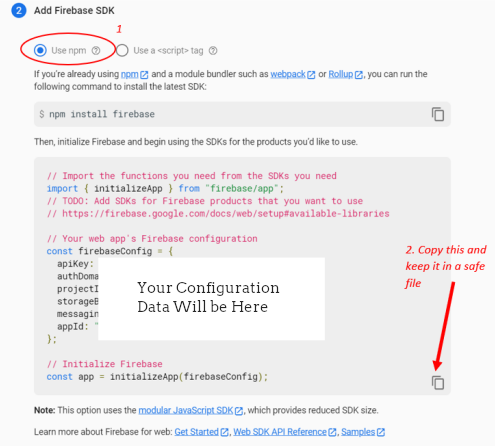
    <figcaption>
        <a href="#fig16">Figure 16.</a> Accessing your Firebase web-app config.
    </figcaption>
</figure>

**Step 7:** Once you have saved the configuration information file, click **Continue to console**.

## 5. Deploying the Website

{:#deploying}

The next step of the process is to deploy The Misinformation Game to your Firebase project.
This step will require the software that we installed earlier (Visual Studio Code, Node.js, and NPM).

### 5.1. Opening and Setting Up the Code

{:#opening-codebase}

Step 1: Open the Visual Studio Code app. ` `
Step 2: Click on File > Open Folder and find the extracted project folder that you saved in section 2.1. ` `
Step 3: Once the folder is open, you should see a screen similar to [Figure 17](#fig17). On the left
of the screen, you will notice the “Explorer” area. We will be using this section of the screen quite often.

<figure id="fig17">
    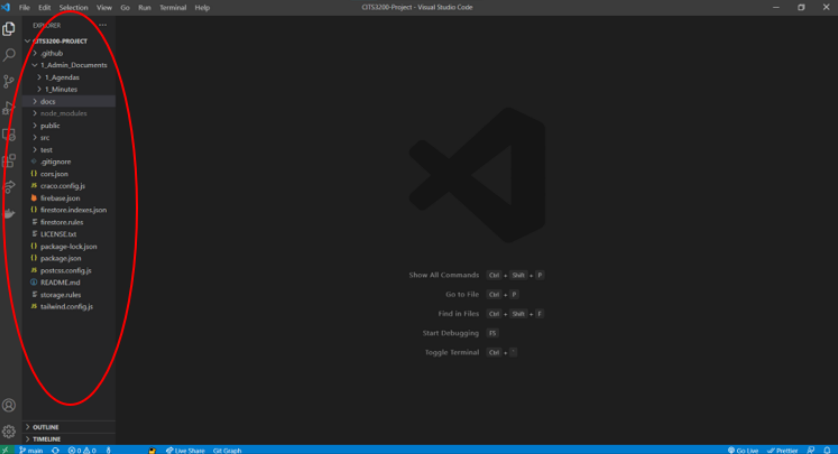
    <figcaption>
        <a href="#fig17">Figure 17.</a> Default Visual Studio View.
    </figcaption>
</figure>

Step 4: In the “Explorer” section, click the “config” toggle and find and click on the “firebase-config.js”
file. You should see a page like [Figure 17](#fig17).

Step 5: Replace the firebaseConfig information with your own information. This information is in the
Configuration Information File, which was saved in section 5.4 of this guide. The area that you need to
replace is circled in [Figure 18](#fig18).

Step 6: Finally, save the file by pressing _Ctrl + S_ on your keyboard.

<figure id="fig18">
    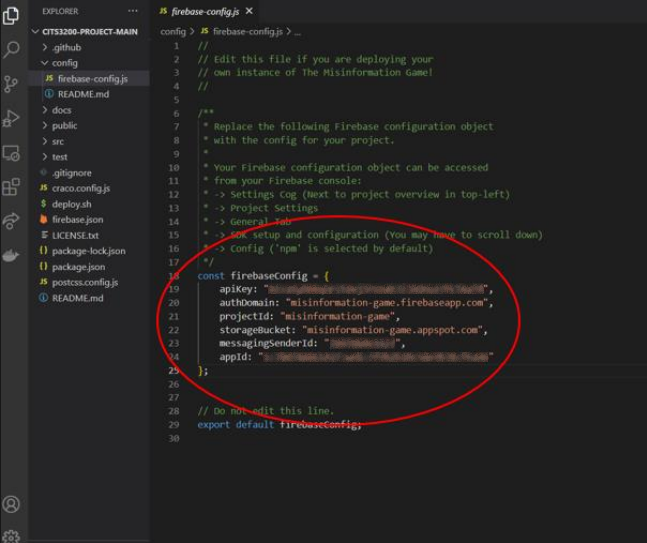
    <figcaption>
        <a href="#fig18">Figure 18.</a> Firebase configuration file in the source code.
    </figcaption>
</figure>

### 5.2. Install Git Bash

{:#install-git-bash}

Windows users will also need to install Git Bash. You can download it from the below link, by clicking
the Windows icon, as shown in [Figure 19](#fig19).
https://git-scm.com/download/win

<figure id="fig19">
    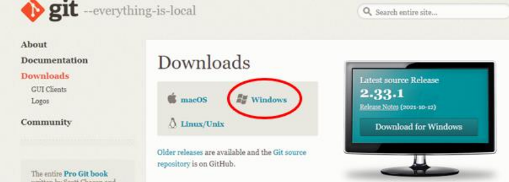
    <figcaption>
        <a href="#fig19">Figure 19.</a> Downloading the git installer.
    </figcaption>
</figure>

After downloading, double-click on the executable. Follow the installation process and do not change any
of the default settings. After this you should have a working Git for Windows instance running on your
computer.

### 5.3. Running the Deployment Script

{:#running-deployment-script}

Now the environment is completely set up and ready for you to edit and to deploy. To deploy a version of
this application on the internet, follow the below steps.

Step 1:  In the top toolbar of Visual Studio Code, click on Terminal > New Terminal. This will open at the
bottom of the application and look like [Figure 20](#fig20).

<figure id="fig20">
    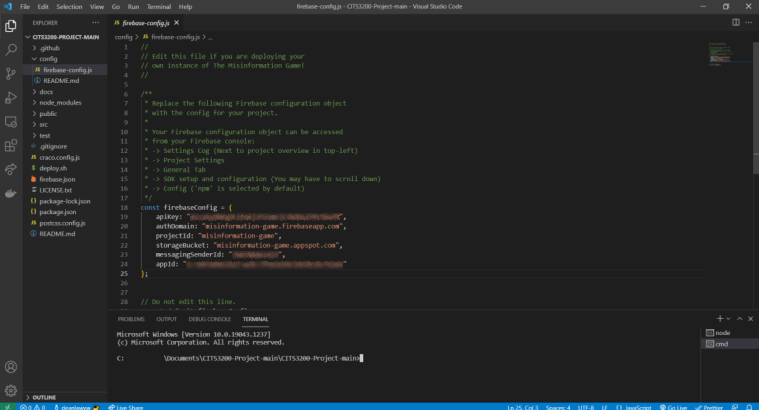
    <figcaption>
        <a href="#fig20">Figure 20.</a> Opening the Visual Studio command prompt.
    </figcaption>
</figure>

Step 1.5: If you are on Windows, you will also need to change to the Git Bash terminal. As shown in
[Figure 21](#fig21), first click on the down arrow and then select “Git Bash”.

<figure id="fig21">
    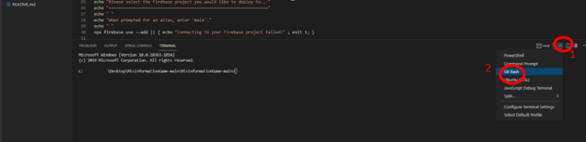
    <figcaption>
        <a href="#fig21">Figure 21.</a> Switching the command prompt to Git Bash.
    </figcaption>
</figure>

This will open a terminal that looks like [Figure 22](#fig22).

<figure id="fig22">
    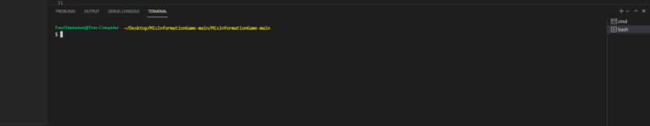
    <figcaption>
        <a href="#fig22">Figure 22.</a> Visual Studio command prompt in Git Bash mode.
    </figcaption>
</figure>

Step 2: In the terminal at the bottom of the screen run the following command: `./deploy.sh`

You will now see text beginning to be displayed at the bottom of the terminal screen. This will be installing
all the necessary packages and deploy the app. Please note that this process may take a while. See
[Figure 23](#fig23) for an example.

<figure id="fig23">
    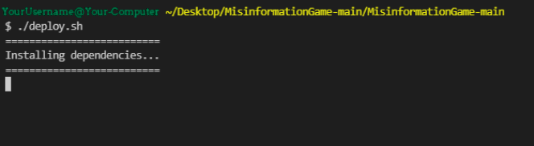
    <figcaption>
        <a href="#fig23">Figure 23.</a> Beginning the deployment process.
    </figcaption>
</figure>

During this deployment process you will be asked many questions which require a response. These questions
are as follows: ` `
Question 1: You will be asked to login to your Google Firebase account. If you are not already logged
in, this will open a browser window. Please sign in to your Google Firebase account and return to Visual
Studio Code. ` `
Question 2: You will be asked to select a Firebase Project. Select the relevant Firebase project made earlier
and then press Enter to continue. This is shown in [Figure 24](#fig24).

<figure id="fig24">
    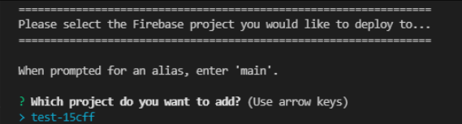
    <figcaption>
        <a href="#fig24">Figure 24.</a> Selecting the Firebase project in the deployment process.
    </figcaption>
</figure>

Question 3: You will be asked to give an alias to this project. This can be whatever you would like.
For example, “test”. Press Enter to continue. ` `
Question 4: You will be asked to sign in to Google Cloud. Press Y and then Enter. This will open a
login page in your browser, please login with the same Google Account you are using for Firebase. After
this return to Visual Studio Code. ` `
Question 5: You will be asked to select the cloud project. Press the number next to your project and
then press Enter to continue. This is shown in [Figure 25](#fig25).

<figure id="fig25">
    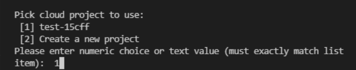
    <figcaption>
        <a href="#fig25">Figure 25.</a> Selecting the cloud project in the deployment process.
    </figcaption>
</figure>

Question 6: Next you will be asked to make a domain name. ` `
Before entering the URL, please note that the domain name **must** be your Firebase Project ID. You can get
the Project ID from Firebase by clicking on the “Gear” icon on the left and then on “Project Settings”.
[Figure 26](#fig26) and [Figure 27](#fig27) below demonstrates this.

<figure id="fig26">
    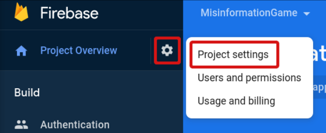
    <figcaption>
        <a href="#fig26">Figure 26.</a> Accessing the Firebase project settings.
    </figcaption>
</figure>

<figure id="fig27">
    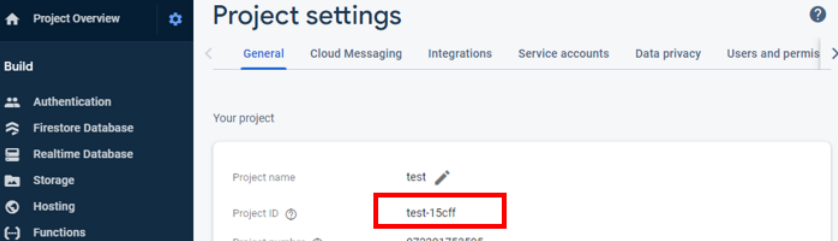
    <figcaption>
        <a href="#fig27">Figure 27.</a> The Project ID on the project settings page.
    </figcaption>
</figure>

The URL must be in the format of “`<projectID>`. firebasestorage.app.” For example, “test-15cff.firebasestorage.app” is
a valid domain. See [Figure 28](#fig28) for an example. After entering the URL, press Enter to continue.

<figure id="fig28">
    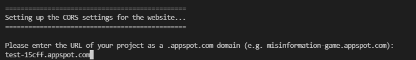
    <figcaption>
        <a href="#fig28">Figure 28.</a> Entering a Firebase project's domain name. <i>Note that the domain name here is outdated as of September 2024, and your domain name will be in a .firebasestorage.app format. </i>
    </figcaption>
</figure>

Step 4: The site is now fully deployed and ready to be accessed. You will see something similar to
[Figure 29](#fig29).

<figure id="fig29">
    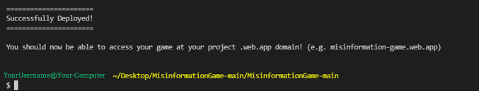
    <figcaption>
        <a href="#fig29">Figure 29.</a> Command prompt after a successful deployment.
    </figcaption>
</figure>

You can now access the website on your browser at the domain \[Your Project ID\].web.app.
\[Your Project ID\]” is the project ID obtained for question 6 above.

## 6. Run your Studies!

{:#conclusion}

You should now have a fully deployed instance of The Misinformation Game! You may now sign in to your
instance of The Misinformation Game, and register yourself as an administrator, through the process
described in the [Registering Administrators documentation](/Administrators).

Once you have registered yourself as an admin, then you can read more about uploading and managing your
studies in the [Managing Studies documentation](ManagingStudies). Additionally, information on configuring
your studies can be found in the [Study Configuration documentation](/StudyConfiguration). I hope The
Misinformation Game proves useful for your research!

## 7. Learn about Future Updates 🚀

{:#stay-updated}

We share updates about the Misinformation Game in our Slack channel. If you wish to stay up-to-date,
or if you'd like to share what you're working on in relation to the Misinformation Game, please join
our community on Slack!

    <a href="https://join.slack.com/t/themisinformationgame/shared_invite/zt-1oruoc0s2-OLscp581nAJ2hxpDYGnvJQ" class="call-to-action-button">
        Join our Slack Community
    </a>

