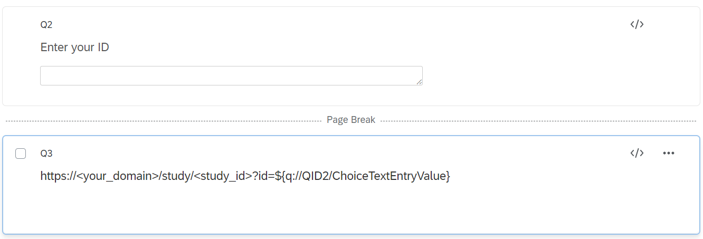

# Qualtrics Integration
{:#intro .no_toc}

If you are using the Qualtrics Online Survey Platform to direct
users to your Misinformation Game site, then you can directly input
information such as the user's ID through The Misinformation
Game URL. This allows users to not have to enter their ID manually.

This guide only shows one method to include The Misinformation Game
in Qualtrics surveys, but several more options are discussed in
[The (Mis)information Game paper on PsyArXiv](https://psyarxiv.com/628wc/).

## 1. Setting up the survey
{:#setting-up-survey}

In Qualtrics you will need to set up the survey as follows:
- First, create a question which asks for the user's ID
- Second, create a page break
- Thirdly, create a question which is used to display the URL

Once you have completed this you will need to set up "Piped Text"
on the question that displays the url.

To do this click on the question's displayed text. After this you
will see a blue tab with "Piped Text..." written. Click on this tab.

After clicking on the tab you will see a dropdown. Select the "Survey
Question" option, which will then open another drop down. Select the
question where the user inputs their ID, and then select the option
which is not "Question Text."
(The name of the item will change depending on your own survey.)

The final text in the question will be in the following format:
<b><your_domain>.web.app/study/<your_study_id>?id=<user_id_inputted></b>

After this your survey will contain the following questions in the
following format:

