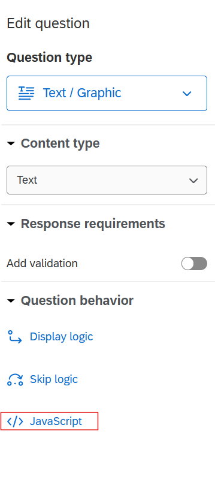
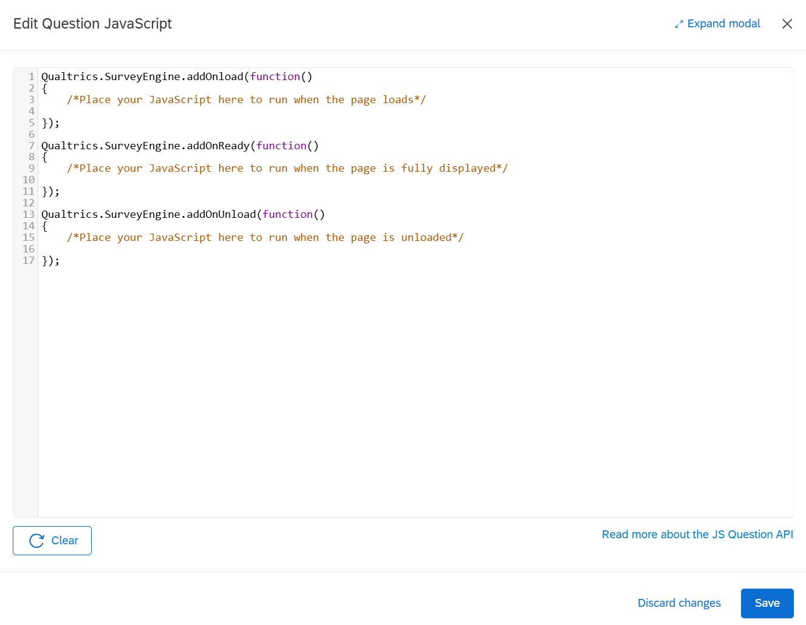

# Qualtrics Integration

{:#intro .no_toc}

<p class="update">
    <span span style="font-weight: bold">Updated Qualtrics Integration Capacity</span><br>
    <span>Below we present an option for more streamline Qualtrics integration. This has been updated since the publication of <a href="https://doi.org/10.3758/s13428-023-02153-x">
        The (Mis)information Game paper</a>.</span>
    </p>

<p class="error">
    <span style="font-weight: bold">This page is incomplete.</span>
    This guide only shows one method to include The Misinformation Game
    in Qualtrics surveys, but several more options are discussed in
    <a href="https://doi.org/10.3758/s13428-023-02153-x">
        The (Mis)information Game paper</a>.
</p>

If you are using the Qualtrics Online Survey Platform to direct
users to your Misinformation Game site, then you can directly input
information such as the user's ID through The Misinformation
Game URL. This allows users to not have to enter their ID manually.

## Embedding iframe in Qualtrics (updated)

{:#embedding-iframe-in-qualtrics}

<p class="error">
    <span style="font-weight: bold">Important note.</span>
    Due to browser settings, iframe integrations may <b>fail</b> if a participant is using Safari. Because of this, we recommend preventing people on Safari from completing your survey if using an iframe integration option.
</p>

We have now updated the debrief page within the misinfo game (v2.4.0) to allow for basic communication with a parent page (e.g., Qualtrics survey) when the tool is embedded as an iframe. This allows the game to 'tell' Qualtrics that the participant has reached the debrief page of the misinfo game study that you have embedded, which you can then use to trigger the next button. This integration is based on a paper by Benjamin Carter & Alessandro Del Ponte which can be found [here](https://doi.org/10.3758/s13428-022-01792-w), and we strongly recommend that you cite their paper (along with our paper) if you use this integration method.

Before you insert the misinfo game, you will need to ensure that the formatting in your qualtrics survey is appropriate. To do so, navigate to the look and feel tab of your Qualtrics survey.

* First, navigate to the "Theme" tab and select the "blank" theme - this will avoid any headers used in your university's Qualtrics theme overlaying the iframe.
* Then, navigate to the "Style" tab, navigate to "Custom CSS", and select "edit". Enter the following and then hit save:

  ```
  .resp-container {
   position: relative;
   overflow: hidden;
   padding-top: 50%;
  }
  .resp-iframe {
   position: absolute;
   top: 0;
   left: 0;
   width: 100%;
   height: 100%;
   border: 0;
  }

  #SkinContent{width:100%;}
  .Skin .SkinInner {width:100% !important;}
  .Skin .QuestionOuter.Matrix{width:100% !important;}

  body .Skin #Plug a {
      display: none !important;
      height: 0 !important;
      padding: 0 !important;
      overflow: hidden !important;
  }
  ```
* This should force the iframe to take up the full screen, and will remove the Qualtrics popup which may impede participants' ability to interact with the iframe.

Now that you have set the appropriate formating, return to the builder tab to begin setting up the iframe.

* In the qualtrics block that you wish to embed the iframe create a text/graphic question. You should remove any default text so that the textbox is empty.
* Click on the question that you have just created, and in the lefthand side panel titled "Edit question" select JavaScript (see [Figure 1](#fig1)). This should open to look like the JavaScript editor shown in [Figure 2](#fig2).

<figure id="fig1">
    
    <figcaption>
        <a href="#fig1">Figure 1.</a> Qualtrics Edit Question panel with JavaScript button highlighted.
    </figcaption>
</figure>

<figure id="fig2">
    
    <figcaption>
        <a href="#fig2">Figure 2.</a> Qualtrics JavaSript Editor
    </figcaption>
</figure>

* You should now replace the text in the Javascript editor with the following. Note you will have to change the src to match the corresponding URL. If you wish to pipe the participant ID, you will need to add ?id=<user_id_inputted> to the end of the URL, which we recommend to set using embedded data (more information can be found in our paper):

  ```
  Qualtrics.SurveyEngine.addOnload(function() { 
      // Insert the game iframe
      jQuery("#Header").html('<iframe allowfullscreen src="https://<your_domain>.web.app/study/<your_study_id>" class="resp-iframe"></iframe>');

      // Adjust page layout
      jQuery("#SkinContent").css("width", "0px");
      console.log("Listening for game completion message...");

      // Get the Next button
      var nextButton = document.getElementById("NextButton");
      if (nextButton) {
          nextButton.style.opacity = "0";  // Make it fully transparent
          nextButton.style.pointerEvents = "none"; // Disable interaction
          nextButton.style.position = "absolute"; // Prevent it from affecting layout
          nextButton.style.visibility = "hidden"; // Ensures it doesn't take up space
      }

      // Listen for postMessage events
      window.addEventListener("message", function(event) {
          console.log("Received message from iframe:", event);

          // Check for game completion message
          if (event.data && event.data.type === "gamecomplete") {
              console.log("Game complete message received. Showing Next button immediately.");

              // Show and enable the Next button immediately
              if (nextButton) {
                  nextButton.style.opacity = "1"; // Make it fully visible
                  nextButton.style.pointerEvents = "auto"; // Enable interaction
                  nextButton.style.position = "fixed"; // Position it properly
                  nextButton.style.bottom = "20px";
                  nextButton.style.right = "40px";
                  nextButton.style.visibility = "visible"; // Ensure it's now visible
                  console.log("Next button is now visible and enabled.");
              }
          }
      }, false);  
  });
  ```
* This forces the Qualtrics next question button to appear when the participant has reached the debriefing page in the misinfo game. This is done by the game sending the "gamecomplete" message to the parent frame.
* You may wish to delay the next button appearing for a set amount of time before the participant continues (e.g., to increase the chance of them reading the information presented). To do so, you will need to edit everything from the "Check for game completion message" to. You will need to change `<insert timing in milliseconds>` to the amount of time you want to delay the next button appearing for (e.g., if you want to add a 3 second delay add 3000 here):

  ```
      // Check for game completion message
          if (event.data && event.data.type === "gamecomplete") {
              console.log("Game complete message received. Delaying Next button appearance by X seconds.");

              // Hide and disable the Next button completely
              if (nextButton) {
                  nextButton.style.opacity = "0";
                  nextButton.style.pointerEvents = "none";
                  nextButton.style.position = "absolute";
                  nextButton.style.visibility = "hidden";
              }

              // After X amount of time, show and enable the Next button
              setTimeout(function() {
                  if (nextButton) {
                      nextButton.style.opacity = "1"; // Make it fully visible
                      nextButton.style.pointerEvents = "auto"; // Enable interaction
                      nextButton.style.position = "fixed"; // Position it properly
                      nextButton.style.bottom = "20px";
                      nextButton.style.right = "40px";
                      nextButton.style.visibility = "visible"; // Ensure it's now visible
                      console.log("Next button is now visible and enabled.");
                  }
              }, <insert timing in milliseconds>);
          }
      }, false);  
  });
  ```

## Inserting a link to redirect to misinfo game

### Setting up the survey

{:#setting-up-survey}

In Qualtrics you will need to set up the survey as follows:

- First, create a question which asks for the user's ID
- Second, create a page break
- Thirdly, create a question which is used to display the URL

Once you have completed this you will need to set up "Piped Text"
on the question that displays the url.

To do this click on the question's displayed text. After this you
will see a blue tab with "Piped Text..." written. Click on this tab.

After clicking on the tab you will see a dropdown. Select the "Survey
Question" option, which will then open another drop down. Select the
question where the user inputs their ID, and then select the option
which is not "Question Text."
(The name of the item will change depending on your own survey.)

The final text in the question will be in the following format:
`<b>`<your_domain>.web.app/study/<your_study_id>?id=<user_id_inputted>`</b>`

After this your survey will contain the following questions in the
following format:
``
