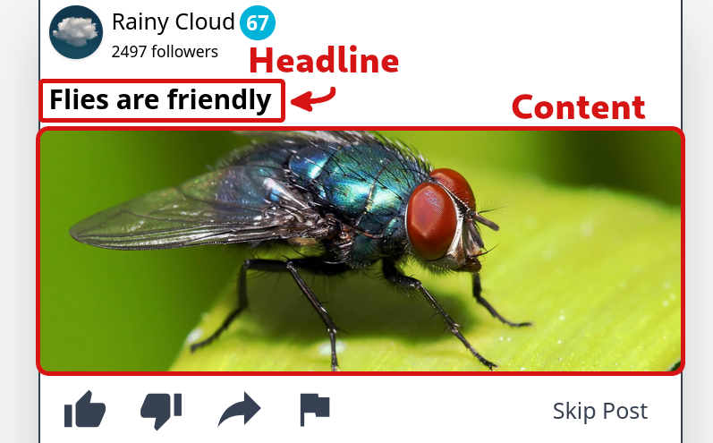

# Creating your own studies
Studies in The Misinformation Game are configured through the
use of Google Sheets spreadsheets. These spreadsheets contain
all settings for your study in one place, including all images
to be included in your study.

**The configuration spreadsheet cannot be opened in Microsoft
Excel.** It is built specifically for use in Google Sheets,
and uses functionality that is not available in Microsoft
Excel.

# Table of Contents
* [1. ✏ Create a new Spreadsheet](#1--create-a-new-spreadsheet)
    + [Method 1: Copy the Template](#method-1-copy-the-template)
    + [Method 2: Upload the Template](#method-2-upload-the-template)
* [2. 📜 Enter your study settings into the Spreadsheet](#2--enter-your-study-settings-into-the-spreadsheet)
    + [📄 About Sheet](#-about-sheet)
    + [📄 Overview Sheet](#-overview-sheet)
        - [Status](#status)
        - [Opened in Google Sheets](#opened-in-google-sheets)
        - [General Settings](#general-settings)
        - [Sources](#sources)
        - [Posts](#posts)
    + [📄 General Sheet](#-general-sheet)
    + [📄 Pages Sheet](#-pages-sheet)
        - [Formatting](#formatting)
        - [Introduction before game rules](#introduction-before-game-rules)
        - [Introduction after game rules](#introduction-after-game-rules)
        - [Debriefing](#debriefing)
    + [📄 Source & Post Selection Sheet](#-source--post-selection-sheet)
        - [Selecting a Method](#selecting-a-method)
        - [Method 1: Overall-Ratio](#method-1-overall-ratio)
        - [Method 2: Source-Ratios](#method-2-source-ratios)
        - [Method 3: Credibility](#method-3-credibility)
        - [Method 4: Pre-Defined](#method-4-pre-defined)
    + [📄 Sources Sheet](#-sources-sheet)
        - [Default Source Values](#default-source-values)
        - [Sources Table](#sources-table)
    + [📄 Posts Sheet](#-posts-sheet)
        - [Default Post Values](#default-post-values)
        - [Posts Table](#posts-table)
* [3. 📤 Uploading your Study](#3--uploading-your-study)

# 1. ✏ Create a new Spreadsheet
Before you can start configuring your study, you will first
need to create a new spreadsheet for the study in Google
Sheets. You can create a new spreadsheet by either copying
the Study Template spreadsheet that is already on Google
Sheets, or by uploading the Study Template document from
this directory.

## Method 1: Copy the Template
You can access the Study Template spreadsheet on Google Sheets
[here](https://docs.google.com/spreadsheets/d/1JP_3kHtcJC6m4PzwyTixMb8R0gu76tRIbdGcffGsTu0/edit?usp=sharing).
After you have loaded the template spreadsheet, you can select
**File** -> **Make a copy** to clone the spreadsheet so that
you can make changes.

## Method 2: Upload the Template
If you are not able to access the study template from the URL
in section 1.1, you can also upload
[StudyTemplate.xlsx](StudyTemplate.xlsx) to your Google Sheets.

**Step 1:** Access Google Sheets at https://sheets.google.com.

**Step 2:** Select the *Blank* option to start a new spreadsheet.

**Step 3:** Select *File* -> *Import* -> *Upload*
-> *Select a file from your device*.

**Step 4:** Use the file chooser to select the
[StudyTemplate.xlsx](StudyTemplate.xlsx) file to upload.

**Step 5:** Select the *Import Location* to be
*Replace spreadsheet*.

**Step 6:** Click *Import Data.*

Your spreadsheet should now contain everything you need
to create a new study.

# 2. 📜 Enter your study settings into the Spreadsheet
The configuration spreadsheet may look intimidating at
first glance, and so this section will try to break
down the configuration spreadsheet sheet-by-sheet.
The sheets are roughly ordered in the same order as
you may want to fill in the data for your study,
however you are free to jump back and forth as you
configure your study.

## 📄 About Sheet
The About sheet gives an overview of the structure of
the spreadsheet, with a short description of each sheet in
the spreadsheet. It also contains a legend for what the
different colour codes mean throughout the spreadsheet.
The colour codes for cells are used to signify cells that
should be edited, cells that are generated, and cells that
you should read for help. Taking a look through the legend
will help when reading the rest of the configuration
spreadsheet.

---------------
## 📄 Overview Sheet
The Overview sheet provides a summary of all the settings
that have been entered. It also collates all the errors
between all the sheets into one place, so that you can
easily identify if there are any errors in your
configuration.

### Status
The status of the spreadsheet gives an indication of
whether there are any errors in the spreadsheet. If
there are any errors in any of the sheets, an error
will be shown here.

### Opened in Google Sheets
This attempts to detect whether the spreadsheet was
opened in Google Sheets, and will error if it can
detect that it was opened in Microsoft Excel. This
detection uses a bug when converting between Google
Sheets and Microsoft Excel, and it therefore may not
be 100% accurate.

### General Settings
This section gives an overview of the general settings
of your study, as well as their validity in the top-left.
The **Pages** value will show the exact order of pages
that participants will be shown when they participate
in your study.

### Sources
This will show the validity of all sources, as well as
the number of sources that have been included in the
_Sources_ sheet.

### Posts
This will show the validity of all posts, as well as the
number of true and false posts that have been included
in the _Posts_ sheet.

If there are less true or false posts than the length of
the study, a warning will be shown. This warning is shown
as it is possible that the post selection will try to select
a true post but fail due to having already shown all the
true posts. The post selection will instead have to display
a false post in this case. This could lead to a false post
being shown, even if the true post percentage is 100%.

---------------
## 📄 General Sheet
The General sheet is the best place to start when creating
a study. It contains all the general settings of
the study including its name, description, and length.

**Name:** The name of your study is used to identify it in
your admin dashboard. This name is not shown to participants.

**Description:** The description of your study is used
to include information about the study in your admin
dashboard. This description is not shown to participants.

**Prompt:** The prompt text to be shown to participants
before they start the study. An example prompt is shown
below.

**Prompt Continue Delay (Seconds):** This value represents
the number of seconds that the participant will have to
wait before they are allowed to continue past the prompt.
The continue button will be disabled for this number of
seconds.

**Require Participant Identification:** This value
represents whether participants will be required to
provide a participant ID before starting the study.
If this value is true, then participants will be shown
an identification screen for them to manually enter their
ID unless the ID is auto-populated from the URL they have
been given.

**Length of Game:** This value represents the exact number
of posts that participants will be shown before they have
completed the study. The participant must react to this
number of posts before their results are saved and they
are shown the debriefing.

**Reaction Delay (Seconds):** The number of seconds that
participants must wait before they are able to react to
a post. During this number of seconds after they are shown
the post, the reaction buttons will be disabled.

**Generate Completion Code:** Whether a completion code
should be generated for participants to be displayed
below their debriefing. The completion code is a random
number that is not guaranteed to be unique for each
participant.

**Completion Code Digits:** The number of digits that
should be included in the completion code. For example,
if the number of digits is set to 4, then numbers between
1000 and 9999 will be generated.

---------------
## 📄 Pages Sheet
The pages sheet allows you to edit the content of the
introductions and debriefing that the users may be
shown. It also allows you to edit the amount of time
that participants should be prevented from continuing
past these pages.

### Formatting
These page values can be formatted to include **bold**,
_italic_, larger text, smaller text, coloured text, or
any other formatting that is available in Google Sheets.
This formatting will be converted to HTML to be shown to
participants. To include newlines in this text, Google
Sheets requires you to type _Alt + Enter_ instead of just
Enter like most text editors.

If there are not as many formatting options as you need,
then you can also include HTML markup in these pages
that will be included in the pages that participants
are shown.

### Introduction before game rules
This page will be shown to participants after they have
identified themselves, and before they are shown the
rules of the game. This page is _optional_, if you do
not wish to show participants an introduction before
they are shown the game rules, then leave this page
blank.

### Introduction after game rules
This page will be shown to participants after they have
been shown the rules of the game. This page is _optional_,
if you do not wish to show participants an introduction
after they are shown the game rules, then leave this page
blank.

### Debriefing
This page will be shown to participants after they have
completed the study. This page is not optional.

---------------
## 📄 Source & Post Selection Sheet
The Source & Post Selection sheet allows you to edit the
method that is used to select the source/post pairs that
will be shown to participants in their games. There are
four options for source/post selection: **Overall-Ratio**,
**Source-Ratios**, **Credibility**, and **Pre-Defined**.

If you would like to read detailed explanations of the
exact method that is used to select source/post pairs
using each method, then check out the
[Simulation Documentation](Simulation.md).

### Selecting a Method
The **Source & Post Selection Method** value at the top of
this sheet should be changed to the name of the method that
you want to use. This should be one of _Overall-Ratio_,
_Source-Ratios_, _Credibility_, or _Pre-Defined_. Once you
have entered your desired source/post selection method, the
settings for all the other selection methods will be
disabled.

### Method 1: Overall-Ratio
Sources will be selected randomly, and the associated
post will be chosen to match an overall ratio of
true:false posts.

The **True Post Percentage** value can be set underneath
the **Overall-Ratio Settings** section below.

### Method 2: Source-Ratios
Sources will be selected randomly, and the associated
post will be chosen to match a true:false ratio defined
for that specific source (as defined in the Sources
tab: **True Post Percentage**).

### Method 3: Credibility
Sources will be selected randomly, and then a true:false
ratio to use to sample the associated post will be
calculated from the credibility of the source. The
relationship between the source's credibility and the
true post percentage to be used is a linear relationship
that can be defined under **Credibility Settings** below.

The linear relationship is defined by defining the two
co-efficients **m** and **c** for the linear relationship
**y = mx + c**.

**Linear Slope:** The linear slope represents the increase
in True Post Percentage for every unit increase in a
Source's credibility. It is the **m** value in the equation
**y = mx + c**.

**Linear Intercept:** The linear intercept represents the
True Post Percentage when a Source's credibility is zero.
It is the **c** value in the equation **y = mx + c**.

### Method 4: Pre-Defined
The exact order of source/post pairs to be shown to
participants is defined, with no randomness at all.
The exact order to use for this method can be
configured in the **Pre-Defined Source & Post Order**
sheet in this spreadsheet.

Within the **Pre-Defined Source & Post Order** sheet,
the exact order is represented by entering the ID of
the source and the ID of the post to use for each
post that is shown to the participant. The participants
will be shown these source/post pairs from top to
bottom. You must define the same number of source/post
pairs here as the length of the study.

---------------
## 📄 Sources Sheet
The Sources sheet allows you to add all the sources that
can be shown to participants during your study. Each source
contains several settings to define their appearance and
behavior.

The top of the sheet contains documentation about all
the settings that can be defined for each source. To
the right there is also a widget that can be used to
preview the settings for your sources.

### Default Source Values
This section defines defaults for a lot of the common
columns for sources. If one of these values is not included
for a source, the defaults here will be used instead.

The Default Source Values also allow you to define Normal
distributions for the initial followers and credibility of
sources. This functionality is not provided on a per-source
basis. The Normal distributions for the initial credibility
and followers is configured by setting the mean and standard
deviation of the distributions. These values are then used
to sample the initial credibility and followers of sources
when a new game is started.

The sampling of initial credibility values is truncated to
between 0 and 100 credibility. The sampling of initial
follower values is also truncated so that the followers
sampled is always greater than zero, and always within 5
standard deviations of the mean. The 5 standard deviations
value is used to avoid random huge deviations from the
expected distribution. The chances of a value being
selected outside 5 standard deviations of the mean is
tiny (0.00006%), and therefore this should not affect
the shape of the distributions noticeably.

### Sources Table
The table below the Default Source Values is where you can
add all of your sources. Each row in this table represents
one source. The **ID**, **Name**, and **Avatar** of each
source is required to be entered (the **ID** should be
filled in for you already). The remaining settings are
optional, and if they are omitted the default settings
will be used instead.

**ID:** The ID of each source is used to uniquely identify
the source. This ID should be of the form `Sx` where x is
an increasing integer (e.g. S1, S2, S3, etc...). This ID
will be used in the results to refer to this specific source.
In the template sheet, all the IDs are already filled in,
and you should not have to edit them.

**Name:** The name of the source is the name that will be
shown to participants when this source is used alongside
a post.

**Avatar:** The avatar of the source is an image that is
displayed in a circle alongside the source. This image
must be inserted into the spreadsheet using the
**Insert** menu at the top of the page on Google Sheets.
You must first select the cell where you want to insert
the avatar image, and then select **Insert** -> **Image**
-> **Image in cell**. If you do not use this procedure,
then the application will not be able to find the image
to use for the avatar.

**Max Posts:** The maximum posts for a source allows you
to set a hard limit on the number of times a source is
shown to the participant. This value can either be an
integer greater than or equal to zero, or the text
"Unlimited" to represent that there is no maximum number
of posts for this source.

The Max Posts value is also used to weight the random
selection of sources to be shown to participants. Sources
with a higher Max Posts will have a higher chance to be
selected than sources with a low Max Posts. Sources with
a Max Posts of "Unlimited" will be weighted with the mean
weighting of all sources with a Max Posts. Therefore, if
you wish one post to show up more than others, but do not
wish to limit the number of times other sources can be
selected, you can use really high values of Max Posts as
weighting values (e.g. a source with a Max Posts of 100
will be selected 10x less than a source with a Max Posts
of 1000).

**Initial Followers:** This value lets you set an exact
follower number for this source to start with.

**Initial Credibility:** This value lets you set an exact
credibility number for this source to start with.

**True Post Percentage:** When using the _Source-Ratios_
source/post selection method, this value is used to define
the percentage of true posts that this post should show.
After this source is selected, this will be the percentage
chance of it choosing a true post to show instead of a
false post.

---------------
## 📄 Posts Sheet
The Posts sheet allows you to add all the posts that could
be shown to participants during their games. Each post can
only be shown to a participant once, and will never be
repeated.

The top of the sheet contains documentation about all
the settings that can be defined for each post. To
the right there is also a table to display the total
number of true and false posts that you have entered.

### Default Post Values
This section defines separate post defaults for true posts
and false posts. This is done so that consistent behavior
can be configured for true posts increasing your credibility
and false posts decreasing your credibility (if that behavior
is desired). The default values allow you to specify Normal
distributions for the changes to participant's followers and
credibility after they Like, Dislike, Share, or Flag a post.

### Posts Table
The table below the Default Post Values allows you to enter
all the posts that may be shown to participants during your
study. Each row in the table represents one post. The
**ID**, and the **Is True** columns are the only required
columns for each post. However, one of **Headline**
_and/or_ **Content** must also be included. The remaining
settings for changes to followers and credibility, and
comments, are optional. If the changes to followers and
credibility are omitted, the default settings will be
used instead.

**ID:** The ID of each post is used to uniquely identify
the post. This ID should be of the form `Px` where x is
an increasing integer (e.g. P1, P2, P3, etc...). This ID
will be used in the results to refer to this specific post.
In the template sheet, all the IDs are already filled in,
and you should not have to edit them.

**Headline:** The headline of the post is used to provide
a title above the content of the post. This headline is
optional, and if it is not included then only the content
of the post will be shown.

**Content:** The content of the post is used to provide a
more substantial piece of text, or an image, to a post. The
content is optional, and if it is not included then only
the headline of the post will be shown. The content can
be either a piece of text _or_ an image, and it cannot
contain both.

If an image is used, it must be inserted using the same
procedure as inserting Avatar images into the spreadsheet.
The content image must be inserted into the spreadsheet
using the **Insert** menu at the top of the page on Google
Sheets. You must first select the cell where you want to
insert the content image, and then select **Insert** ->
**Image** -> **Image in cell**. If you do not use this
procedure, then the application will not be able to find
the image to use for the content.

**Changes to Followers:** These settings allow you to
set the exact change to a participant's followers after
they _like_, _dislike_, _share_, or _flag_ a post. If
these values are left blank, the changes to a participant's
followers will be sampled from the default distributions
instead.

**Changes to Credibility:** These settings allow you to
set the exact change to a participant's credibility after
they _like_, _dislike_, _share_, or _flag_ a post. If
these values are left blank, the changes to a participant's
credibility will be sampled from the default distributions
instead.

**Comments:** Up to three optional comments can be configured
for each post. Each comment must include both a _Source Name_
and a _Message_, which are described below.

**Comment Source Name:** This value is the name to use as
the source of the comment.

**Comment Message:** This value is the text of the comment
to display.

**Comment Likes:** This value is not used. In the future,
there are plans to add likes to posts and comments,
however this feature is not fully implemented yet.

# 3. 📤 Uploading your Study
Once you have completed configuring your study, I recommend
you first check the **Overview** sheet to make sure that
everything looks correct, and doesn't contain any errors.

Once you have done this, you can download your configuration
spreadsheet as an XLSX file to upload to The Misinformation
Game. This can be done by selecting **File** -> **Download**
-> **Microsoft Excel (.xlsx)**. The name suggests that this
spreadsheet is only meant for Microsoft Excel, but .xlsx is
a general-purpose spreadsheet file format.

Once you have downloaded your study configuration as a
.xlsx file, you can then upload it through The Misinformation
Game admin dashboard by clicking the **Upload New Study**
button. This will open a dialog where you can click
**Upload Spreadsheet** to select the .xlsx file you just
downloaded to upload.

If there are any errors that could be found with your study,
then an error will be displayed in this dialog. Otherwise,
a success message will be displayed, and you will be redirected
to the admin view of your new study.
