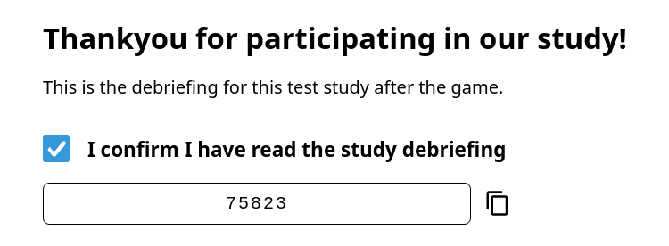
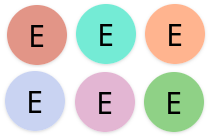
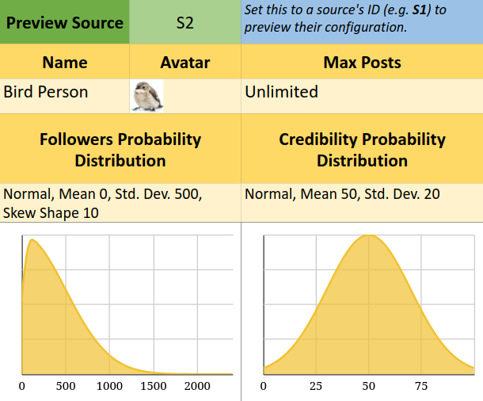
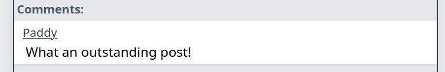
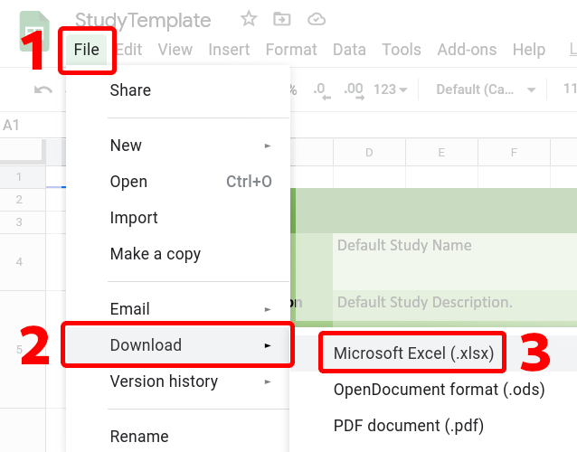

<h1 id="intro">
    Study Configuration Guide
</h1>

Studies in The Misinformation Game are configured through the
use of Google Sheets spreadsheets. These spreadsheets contain
all settings for your study in one place, including all images
to be included in your study. This document aims to act as a
reference for the [configuration spreadsheet](/link/StudyTemplate),
to help with the configuration of your studies.

**Important: The configuration spreadsheet cannot be opened in Microsoft
Excel.** It is built specifically for use in Google Sheets,
and uses functionality that is not available in Microsoft
Excel.


<h1 id="toc">
    Table of Contents
</h1>
* [1. ✏ Create a new Spreadsheet](#create)
* [2. 📜 Enter your study settings into the Spreadsheet](#configure)
    - [📄 About Sheet](#about)
    - [📄 Overview Sheet](#overview)
    - [📄 General Sheet](#general)
    - [📄 Pages Sheet](#pages)
    - [📄 Source & Post Selection Sheet](#selection)
    - [📄 Sources Sheet](#sources)
    - [📄 Posts Sheet](#posts)
* [3. 📤 Uploading your Study](#upload)


<h1 id="create">
    1. ✏ Create a new Spreadsheet
</h1>
Before you can start configuring your study, you will first
need to create a new spreadsheet for the study in Google
Sheets. You can create a new spreadsheet by either copying
the Study Template spreadsheet that is already on Google
Sheets, or by uploading the Study Template file.


<h2 id="create-copy">
    Method 1: Copy the Template (Recommended)
</h2>
You can access the Study Configuration Template Spreadsheet on Google Sheets
from [the study configuration template page](/link/StudyTemplate).
After you have loaded the template spreadsheet, you can select
**_File_** -> **_Make a copy_** to clone the spreadsheet so that
you can make changes.


<h2 id="create-upload">
    Method 2: Upload the Template
</h2>
You can download the Study Template file from
[StudyTemplate.xlsx](StudyTemplate.xlsx). This file can then
be uploaded to your Google Sheets using the following steps:

**Step 1:** Access Google Sheets at
[https://sheets.google.com](https://sheets.google.com).

**Step 2:** Select the **_Blank_** option to start a new
spreadsheet.

**Step 3:** Select **_File_** -> **_Import_** -> **_Upload_**
-> **_Select a file from your device_**.

**Step 4:** Use the file chooser to select the
[StudyTemplate.xlsx](StudyTemplate.xlsx) file that you
downloaded to upload.

**Step 5:** Select the **_Import Location_** to be
**_Replace spreadsheet_**.

**Step 6:** Click **_Import Data_**.

Your spreadsheet should now contain everything you need
to create your new study.


<h1 id="configure">
    2. 📜 Enter your study settings into the Spreadsheet
</h1>
The configuration spreadsheet may look intimidating at
first glance, and so this section will try to break
down the configuration spreadsheet sheet-by-sheet.
The sheets are roughly ordered in the same order as
you may want to fill in the data for your study,
however you are free to jump back and forth as you
configure your study.


<h2 id="about">
    2.1. 📄 About Sheet
</h2>
The _About_ sheet gives an overview of the structure of
the spreadsheet, with a short description of each sheet in
the spreadsheet. It also contains a legend for what the
different colour codes mean throughout the spreadsheet.
The colour codes for cells are used to signify cells that
should be edited, cells that are generated, and cells that
you should read for help. Taking a look through the legend
will help when reading the rest of the configuration
spreadsheet.


<h2 id="overview">
    2.2. 📄 Overview Sheet
</h2>
The _Overview_ sheet provides a summary of all the settings
that have been entered. It also collates all the errors
between all the sheets into one place, so that you can
easily identify if there are any errors in your
configuration.

<h3 id="overview-status">
    2.2.1. Status
</h3>
The status of the spreadsheet gives an indication of
whether there are any errors in the spreadsheet. If
there are any errors in any of the sheets, an error
will be shown here.

<h3 id="overview-opened-in-sheets">
    2.2.2. Opened in Google Sheets
</h3>
This attempts to detect whether the spreadsheet was
opened in Google Sheets, and will error if it can
detect that it was opened in Microsoft Excel. This
detection uses a bug when converting between Google
Sheets and Microsoft Excel, and it therefore may not
be 100% accurate.

<h3 id="overview-general">
    2.2.3. General Settings
</h3>
This section gives an overview of the general settings
of your study, as well as their validity in the top-left.
The **Pages** value will show the exact order of pages
that participants will be shown when they participate
in your study.

<h3 id="overview-sources">
    2.2.4. Sources
</h3>
This will show the validity of all the sources you have
entered, and includes the number of sources that have been
included in the _Sources_ sheet.

<h3 id="overview-posts">
    2.2.5. Posts
</h3>
This will show the validity of all posts, as well as the
number of true and false posts that have been included
in the _Posts_ sheet.

If there are fewer true or false posts than the length of
the study, a warning will be shown. This warning is shown
as it is possible that the post selection will try to select
a true post but fail due to having already shown all the
true posts (depending on settings; see the 
[Simulation](/Simulation) documentation for details). 
The post selection will instead have to display
a false post in this case. This could lead to a false post
being shown, even if the true post percentage is 100%.


<h2 id="general">
    2.3. 📄 General Sheet
</h2>
The General sheet is the best place to start when creating
a study. It contains all the most broad settings of
studies including their name, description, and length.


<h3 id="general-basic-settings">
    2.3.1. Basic Settings
</h3>
This section contains the most basic settings that likely
should be changed for each study.

<h6 id="general-name"><span class="param-name">Name</span></h6>
The name that is used for the browser tab title for
participants in this study. This name is also used to
identify the study in your admin dashboard.

<h6 id="general-description"><span class="param-name">Description</span></h6>
The description of your study is used to include
information about the study in your admin dashboard.
This description is not shown to participants.

<h6 id="general-prompt"><span class="param-name">Prompt</span></h6>
The prompt text to be shown to participants before they
start the study. An example prompt is shown below.


<h6 id="general-length"><span class="param-name">Length of Game</span></h6>
The exact number of posts to show to participants before
they complete the study. The length of studies must
be at least 1 post.

<h6 id="general-require-reactions"><span class="param-name">Require Reactions</span></h6>
Whether to require participants to react to every post.
Participants will still be able to skip posts, but to
do so they will have to explicitly select "Skip Post"
as their reaction.

<h6 id="general-require-comments"><span class="param-name">Require Comments</span></h6>
Whether comments made by the participants are required
for each post (enter "required"), optional for each post, or disabled
entirely.

<h6 id="general-require-identification"><span class="param-name">Require Participant Identification</span></h6>
Whether participants will be required to provide a
participant ID before starting the study. If this value
is true, then participants will be shown an identification
screen for them to manually enter their ID if it has not
already been automatically populated from the URL they
have been given.


<h3 id="general-ui-settings">
    2.3.2. User Interface Settings
</h3>
This section contains the settings that change the user
interface of The Misinformation Game for participants.
These options change the way that participants are able
to interact with your study.

<h6 id="general-display-followers"><span class="param-name">Display Followers</span></h6>
Whether to show followers to participants. This includes
the followers of both sources and participants.

<h6 id="general-display-credibility"><span class="param-name">Display Credibility</span></h6>
Whether to show credibility to participants. This includes
the credibility of both sources and participants.

<h6 id="general-display-progress"><span class="param-name">Display Progress</span></h6>
Whether to show participants the number of posts they
have reacted to, and how many they have remaining
(e.g. "Post 51 of 100").

<h6 id="general-display-reaction-counts"><span class="param-name">Display Number of Reactions</span></h6>
Whether to show the ostensible number of prior reactions
to posts and comments adjacent to the reaction buttons.

<h6 id="general-post-likes-enabled"><span class="param-name">Post Likes Enabled</span></h6>
Whether to allow participants to like posts.

<h6 id="general-post-dislikes-enabled"><span class="param-name">Post Dislikes Enabled</span></h6>
Whether to allow participants to dislike posts.

<h6 id="general-post-shares-enabled"><span class="param-name">Post Shares Enabled</span></h6>
Whether to allow participants to share posts.

<h6 id="general-post-flags-enabled"><span class="param-name">Post Flags Enabled</span></h6>
Whether to allow participants to flag posts.

<h6 id="general-comment-likes-enabled"><span class="param-name">Comment Likes Enabled</span></h6>
Whether to allow participants to like comments.

<h6 id="general-comment-dislikes-enabled"><span class="param-name">Comment Dislikes Enabled</span></h6>
Whether to allow participants to dislike comments.


<h3 id="general-advanced-settings">
    2.3.3. Advanced Settings
</h3>
These settings can be used to fine-tune your study.
It is unlikely that you will need to edit these settings.

<h6 id="general-minimum-comment-length"><span class="param-name">Minimum Comment Length</span></h6>
The minimum number of characters that participants must
enter for their comments. The minimum length of comments
must be at least 1 character.

<h6 id="general-prompt-continue-delay"><span class="param-name">Prompt Continue Delay (Seconds)</span></h6>
The period of time in which participants are not able
to continue past the prompt page to start the game.
This delay cannot be negative, but it can be zero.

<h6 id="general-next-post-delay"><span class="param-name">Next Post Delay (Seconds)</span></h6>
The period of time after the current post is shown
in which participants are not able to continue to
the next post. This delay cannot be negative, but
it can be zero.

<h6 id="general-generate-completion-code"><span class="param-name">Generate Completion Code</span></h6>
Whether to generate and display a completion code
to participants once they have completed the study.
An example debriefing page that includes a generated
completion code for a participant is shown below,



<h6 id="general-completion-code-digits"><span class="param-name">Completion Code Digits</span></h6>
The number of digits to generate for the completion
code (e.g. If this value is 4, then completion codes
from 1000 to 9999 will be generated). The number of
digits in completion codes must be at least 1.

<h6 id="general-generate-random-default-avatars"><span class="param-name">Generate Random Default Avatars</span></h6>
Whether to use a random background colour for the
default source avatars. If set to "No", the default
avatars of sources will all have a white background.
This setting does nothing if sources are given avatar
images. The possible background colours when the
background is randomised are shown below,




<h2 id="pages">
    2.4. 📄 Pages Sheet
</h2>
The _Pages_ sheet allows you to edit the content of
the instructions and debriefing that the users may be
shown. It also allows you to edit the enforced delays 
(with disabled continue button) on these pages.


<h3 id="pages-formatting">
    2.4.1. Formatting the Text
</h3>
The text on these pages can be formatted to include **bold**,
_italic_,
<span style="font-size: 1.2em">larger text</span>,
<span style="font-size: 0.8em">smaller text</span>,
<span style="color: purple">coloured text</span>,
or any other formatting that is available in Google Sheets.
This formatting will be converted to HTML to be shown to
participants. Your text can also be moved onto new lines by 
pressing **_Alt + Enter_**. This is equivalent to typing
**_Enter_** in most text editors.

If there are not as many formatting options as you need,
then you can also include HTML markup in the text.

If you include HTML in your pages, the formatting must be the same
from the beginning of the HTML element to its end. If the formatting is
inconsistent, then the formatting may interfere with the HTML you included.
If you include a link, and it turns blue, then you will need to remove that
link for the HTML to work as written. Links can be removed by placing your
cursor over the blue link text, and clicking the unlink button.

Unfortunately, the Excel library we are using does not support the detection
of these blue links within cells. Therefore, links must be included through
the use of HTML `<a>` tags. For example, the HTML below creates a link
[GitHub](https://github.com/TheMisinformationGame/MisinformationGame)
that links to The Misinformation Game's GitHub page,
```html
<a href="https://github.com/TheMisinformationGame/MisinformationGame">
  GitHub
</a>
```


<h3 id="pages-intro-before-rules">
    2.4.2. Introduction before game rules
</h3>
This page will be shown to participants after they have
identified themselves, and before they are shown the
rules of the game. This page can be used for instructions. 
It is _optional_, so if you do not wish to show participants 
an introduction before they are shown the game rules, then 
leave this page blank.

<h3 id="pages-rules">
    2.4.3. Game Rules
</h3>
This page will be shown to participants after they have
viewed the introduction before the game rules page. This
page is intended to be used to explain the rules of the game
to participants. This page is _optional_, so if you do not
wish to show participants any game rules, then leave this
page blank.

The **Game Rules** page also supports several placeholders
to include icons and example UI elements in the page. The
placeholders can be included anywhere in this page's content,
and they will be replaced by their corresponding UI elements
for participants. For example, if you type 
`{{LIKE}}`
anywhere in the content of the page, then it will be replaced
by the like icon.

The only limitation is that the entire placeholder should have
the same formatting (e.g. font size, colour, and bold). If the
placeholder has inconsistent formatting, then it may not be
detected and replaced with the UI elements. For example, if
`{{LI` is bold, and
`KE}}` is not, the placeholder will not
be replaced.

The available placeholders are:
- `{{LIKE}}`:
  The Like reaction icon.
- `{{DISLIKE}}`:
  The Dislike reaction icon.
- `{{SHARE}}`:
  The Share reaction icon.
- `{{Flag}}`:
  The Flag reaction icon.
- `{{ENABLED-POST-REACTIONS}}`:
  All the available reactions for posts displayed in a line,
  including Skip Post.
- `{{ENABLED-COMMENT-REACTIONS}}`:
  All the available reactions for comments displayed in a line.
- `{{COMMENT-ENTRY-EXAMPLE}}`:
  An example comment entry box for users submitting their
  own comments.
- `{{YOUR-PROGRESS-EXAMPLE}}`:
  An example Your Progress box with placeholder values.

<h3 id="pages-intro-after-rules">
    2.4.4. Introduction after game rules
</h3>
This page will be shown to participants after they have
been shown the rules of the game. This page can also be 
used for instructions. It is _optional_, so if you do not 
wish to show participants an introduction after they are 
shown the game rules, then leave this page blank.

<h3 id="pages-debriefing">
    2.4.5. Debriefing
</h3>
This page will be shown to participants after they have
completed the study. This page is not optional. An
example of this debriefing screen is shown below,

The **Debriefing** page also supports the placeholders
`{{COMPLETION-CODE}}` and
`{{COMPLETION-CODE-WITH-CONFIRMATION}}`
to include the completion code
of the participant in the page. Wherever one of the placeholders
is typed into the page's contents, it will be replaced
by the completion code reveal widget.

The only limitation is that the entire placeholder should have
the same formatting (e.g. font size, colour, and bold). If the
placeholder has inconsistent formatting, then it may not be
detected and replaced with the UI elements. For example, if
`{{COMPLETION` is bold, and
`-CODE}}` is not, the placeholder will not
be replaced.

The optional `-WITH-CONFIRMATION` suffix for the completion code
will add a checkbox that will require participants to confirm
that they have read the study debriefing before they can copy
their completion code.


<h2 id="selection">
    2.5. 📄 Source & Post Selection Sheet
</h2>
The Source & Post Selection sheet allows you to edit the
method that is used to select the source/post pairs that
will be shown to participants in their games. There are
four options for source/post selection: **Overall-Ratio**,
**Source-Ratios**, **Credibility**, and **Pre-Defined**.

In-depth descriptions of each selection method are available
in the [Simulation](/Simulation) documentation.


<h3 id="selection-selecting-method">
    2.5.1. Selecting a Method
</h3>
The **Source & Post Selection Method** value at the top of
this sheet should be changed manually to the name of the method 
to be used. This should be one of _Overall-Ratio_,
_Source-Ratios_, _Credibility_, or _Pre-Defined_. Once you
have entered your desired source/post selection method, the
settings for all the other selection methods will be
disabled.


<h3 id="selection-overall-ratio">
    2.5.2. Method 1: Overall-Ratio
</h3>
Sources will be selected randomly, and the associated
post will be chosen to match an overall ratio of
true:false posts. The settings for this method are
available in the **Overall-Ratio Settings** section.

<h6 id="selection-overall-ratio-tpp"><span class="param-name">True Post Percentage</span></h6>
The percentage of true posts to display to users. This
percentage is used to probabilistically sample posts.
Therefore, the actual percentage for each participant
will differ from this value. However, the percentage
of true posts shown to all participants collectively
should approach this value.


<h3 id="selection-source-ratios">
    2.5.3. Method 2: Source-Ratios
</h3>
Sources will be selected randomly, and the associated
post will be chosen to match the **True Post Percentage**
defined for each source.

Similarly to _Method 1_, this does not guarantee that
an exact percentage of true posts will be shown for each
source in one game. However, over all games played, the
actual percentage of true posts that a source is selected
to show should approach their defined **True Post Percentage**.


<h3 id="selection-credibility">
    2.5.4. Method 3: Credibility
</h3>
Sources will be selected randomly, and then a **True Post
Percentage** will be calculated from the credibility of
the source. The ratio will then be used to sample a true
or false post to display alongside the source. The
relationship between the source's credibility and the
true-post percentage to be used is a linear relationship.
The parameters of the linear relationship between the two
can be configured under the **Credibility Settings** section.

<h6 id="selection-credibility-slope"><span class="param-name">Linear Slope</span></h6>
The increase in the **True Post Percentage** for every unit
increase in a source's credibility.

<h6 id="selection-credibility-intercept"><span class="param-name">Linear Intercept</span></h6>
The **True Post Percentage** to use when a source's
credibility is zero.


<h3 id="selection-predefined">
    2.5.5. Method 4: Pre-Defined
</h3>
An exact set of source/post pairs is manually defined.
The source/post pairs can be manually defined in the
_Pre-Defined Source & Post Order_ sheet, alongside
other settings for this method.

<h6 id="selection-predefined-randomise"><span class="param-name">Randomise Order</span></h6>
Whether the presentation order of the pairs should
be randomised. Otherwise, the pairs will be shown
in the exact order specified.

<h6 id="selection-predefined-source-id"><span class="param-name">Source ID</span></h6>
The ID of the source to be used for the post (e.g. **S1**).
These IDs can be found in the _Sources_ sheet.

<h6 id="selection-predefined-post-id"><span class="param-name">Post ID</span></h6>
The ID of the post to display (e.g. **S1**).
These IDs can be found in the _Posts_ sheet.


<h2 id="sources">
    2.6. 📄 Sources Sheet
</h2>
The _Sources_ sheet allows you to add all the sources that
can be shown to participants during your study. Each source
contains several settings to define their appearance and
behaviour. An example source for a post is shown below,


The top of the _sources_ sheet contains documentation
about all the settings that can be defined for each source.
To the right there is also a widget that can be used to
preview the settings for your sources.


<h3 id="sources-defaults">
    2.6.1. Default Source Values
</h3>
This section defines defaults for some source parameters
to avoid repetition in entering values that are constant
for most sources. If one of the parameters that has a
default is not included for a specific source, the default
value will be used instead.

The _Default Source Values_ allows you to define normal
distributions for the initial number of followers and 
credibility scores of sources. This random sampling of
the initial number of followers and credibility for
sources is not available on a per-source basis. The normal
distributions for the initial credibility and followers is
configured by setting the mean and standard deviation of
the distributions. These values are then used to sample
the initial credibility and followers of sources from a
normal distribution with that mean and standard deviation
when a new game is started.

The sampling of initial credibility values is truncated to
between 0 and 100 credibility. The sampling of initial
follower count values is also truncated such that source's
follower counts are never negative, and are always within
5 standard deviations of the mean. The 5 SD constraint
is used to avoid random huge deviations from the expected
distribution. The chances of a value being selected outside
the mean +/- 5 SD is tiny (0.00006%), and therefore this
should not affect the shape of the distributions noticeably.

An example preview of the distributions of the follower
count and credibility for a source is shown below,




<h3 id="sources-table">
    2.6.2. Sources Table
</h3>
The table below the Default Source Values is where the sources 
in the study can be added. Each row in this table represents
one source. The **ID** and **Name** of each source is required
(although the **ID** should be pre-filled already). The remaining
settings are optional, and if they are omitted the default settings
are used instead. If an **Avatar** for a source is omitted, it will
use a default based upon the **Name** of the source instead.

<h6 id="sources-id"><span class="param-name">Source ID</span></h6>
The ID's of sources are used to uniquely identify them. For example,
the ID of a source will be used to reference it in the results of
a study. The ID's of the sources should be of the form `Sx`, where
`x` is an increasing integer (e.g. `S1`, `S2`, `S3`, etc...). In the
template sheet, all the IDs are already filled in, and you should not
have to edit them.

<h6 id="sources-name"><span class="param-name">Name</span></h6>
The name of the source will be shown to participants when this source
is used alongside a post.

<h6 id="sources-avatar"><span class="param-name">Avatar</span></h6>
The avatar of a source is an optional image that is displayed in a circle
alongside the source. If the avatar is not square, it will be cropped.
The avatar images are only shown at small sizes, and therefore are
recommended to have the dimension of 96⨯96 pixels. Recommendations for
image file formats, downscaling your images, and compressing your images
are all described in the [Including Images in Studies](/Images) documentation.

The avatar image must be inserted into the spreadsheet using the **Insert**
menu at the top of the page on Google Sheets. You must first select the cell
where you want to insert the avatar image, and then select **Insert** ->
**Image** -> **Image in cell**. If you do not use this procedure, then The
Misinformation Game may not be able to find the image to use for the avatar.


<h6 id="sources-max-posts"><span class="param-name">Max Posts</span></h6>
The maximum posts for a source allows you to set a hard limit on the number
of times a source is shown to the participant. This value can either be an
integer greater than or equal to zero, or the text `Unlimited` to represent
that there is no maximum number of posts for this source.

The Max Posts value is also used to weight the random
selection of sources to be shown to participants. Sources
with a higher Max Posts value will have a higher chance of 
being selected than sources with a low Max Posts value. 
Sources with a Max Posts of `Unlimited` will be weighted 
with the mean weighting of all sources with a Max Posts value.
Therefore, if you wish one source to show up more than others, 
but do not wish to limit the number of times other sources can 
be selected, you can use high values of Max Posts (e.g. a 
source with Max Posts = 100 will be selected 10x more than a 
source with Max Posts = 10).

<h6 id="sources-initial-followers"><span class="param-name">Initial Followers</span></h6>
This optional value lets you set an exact initial
follower count for this source. However, the actual
follower count of the source may differ throughout
participant's games (see the [Simulation](/Simulation)
page for details).

This value is only used if

Only used if:
- <a class="param-link" href="#general-display-followers">
      General > UI Settings > Display Followers
  </a> is true.


<h6 id="sources-initial-credibility"><span class="param-name">Initial Credibility</span></h6>
This optional value lets you set an exact initial
credibility number for this source. However, the actual
credibility number of the source may differ throughout
participant's games (see the [Simulation](/Simulation)
page for details).

Only used if:
- <a class="param-link" href="#general-display-credibility">
      General > UI Settings > Display Credibility
  </a> is true.

<h6 id="sources-true-post-percentage"><span class="param-name">True Post Percentage</span></h6>
When using the _Source-Ratios_ source/post selection method,
this value is used to define the percentage of true posts that
this source should show. After this source is selected, this
will indicate the probability of it being paired a true post
rather than a false post.

Only used if:
- <a class="param-link" href="#selection-selecting-method">
      Source & Post Selection > Method
  </a> is "Source-Ratios".


<h2 id="posts">
    2.7. 📄 Posts Sheet
</h2>
The _Posts_ sheet allows you to add all the posts that could
be shown to participants during the game. Each post can
only be shown to a participant once, and will never be
repeated.

The top of the sheet contains documentation about all
the settings that can be defined for each post. To
the right there is also a table to display the total
number of true and false posts that you have entered.


<h3 id="posts-default-values">
    2.7.1. Default Post Values
</h3>
This section defines separate defaults for true posts and 
false posts. This is done to reduce the effort in creating
consistent behaviour for true and false posts. For example,
you could make sharing true posts increase credibility,
and sharing false posts decrease credibility. The default
values allow specification of normal distributions for the
changes to participants' followers and credibility after they
_like_, _dislike_, _share_, or _flag_ a post. There is also
a default distribution for the number of reactions to display
for _likes_, _dislikes_, _shares_, or _flags_ for posts.


<h3 id="posts-table">
    2.7.2. Posts Table
</h3>
The table below the Default Post Values allows you to enter
all the posts that may be shown to participants during the
study. Each row in the table represents one post. The
**ID**, and the **Is True** columns are the only required
columns for each post. However, one of **Headline**
_and/or_ **Content** must also be included. The remaining
settings for changes to followers and credibility, and
comments, are optional. If the changes to followers and
credibility are omitted, the default settings will be
used instead.

<h6 id="posts-post-id"><span class="param-name">Post ID</span></h6>
The ID of each post is used to uniquely identify
the post. This ID should be of the form `Px` where x is
an increasing integer (e.g. P1, P2, P3, etc...). This ID
will be used in the results to refer to this specific post.
In the template sheet, all the IDs are already pre-filled,
and there should be no need to edit them.

<h6 id="posts-headline"><span class="param-name">Headline</span></h6>
The headline of the post is used to provide a title above the
content of the post. This headline is optional, and if it is
not included then only the content of the post will be shown.


<h6 id="posts-content"><span class="param-name">Content</span></h6>
The content of the post is used to provide a  more substantial
piece of text, or an image to display to participants. The content 
is optional, and if it is not included then only the headline of
the post will be shown. The content can be either a piece of text
_or_ an image, but it cannot contain both.

If an image is used, then it is recommended to have a width of
600 pixels. For a typical landscape image, this would lead to
an approximate dimensions of 600⨯340 pixels. Recommendations for
image file formats, downscaling your images, and compressing your
images are all described in the [Including Images in Studies](/Images)
documentation.

Images must be inserted using the same procedure for inserting Avatar
images into the spreadsheet. The content image must be inserted into
the spreadsheet using the **Insert** menu at the top of the page on
Google Sheets. You must first select the cell where you want to insert
the content image, and then select **Insert** -> **Image**
-> **Image in cell**. If you do not use this procedure, then The
Misinformation Game may not be able to find the image to use for the
content.


<h6 id="posts-is-true"><span class="param-name">Is True</span></h6>
This should be set to whether the post should be considered true or false.
This value is used for the post selection, and for choosing the default
settings to use for the post. This value is never shown to participants.

<h6 id="posts-changes-to-followers"><span class="param-name">Changes to Followers</span></h6>
These settings allow you to set the exact change to a participant's followers
after they _like_, _dislike_, _share_, or _flag_ a post. This value can be a
decimal number, however participant's followers are rounded before being displayed.
If this value is not provided for a particular post, the change is sampled from
the default normal distribution instead.

<h6 id="posts-changes-to-credibility"><span class="param-name">Changes to Credibility</span></h6>
These settings allow you to set the exact change to a participant's credibility
after they _like_, _dislike_, _share_, or _flag_ a post. This value can be a
decimal number, however a participant's credibility is rounded before being displayed.
If this value is not provided for a particular post, the change is sampled from
the default normal distribution instead.

<h6 id="posts-number-of-reactions"><span class="param-name">Number of Reactions</span></h6>
These settings allow you to set the ostensible number of prior reactions to
display for each post. These numbers are displayed below the available reactions
of the post or comment. If this value is not provided for a particular post, the
change is sampled from the default normal distribution instead.

Only used if:
<ul class="param-links">
    <li><a class="param-link" href="#general-display-reaction-counts">
        General > UI Settings > Display Reaction Counts
    </a> is true.</li>
    <li><a class="param-link" href="#general-post-likes-enabled">
        General > UI Settings > Post Likes/Dislikes/Shares/Flags Enabled
    </a> is true for each specific reaction.</li>
</ul>

<h6 id="posts-comments"><span class="param-name">Comments</span></h6>
Up to three optional comments can be configured for each post. Each comment must
include both a _Source Name_ and a _Message_, which are described below.



<h6 id="posts-comment-source-name"><span class="param-name">Comment Source Name</span></h6>
The name of the source to display as having made the comments.

<h6 id="posts-comment-message"><span class="param-name">Comment Message</span></h6>
The text to display as the content of the comments.

<h6 id="posts-comment-likes"><span class="param-name">Comment Likes</span></h6>
The number of likes to display for comments. These likes will only be shown if
comments are enabled, comment likes are enabled, and displaying the number of
reactions is enabled.

Only used if:
<ul class="param-links">
    <li><a class="param-link" href="#general-display-reaction-counts">
        General > UI Settings > Display Reaction Counts
    </a> is true.</li>
    <li><a class="param-link" href="#general-comment-likes-enabled">
        General > UI Settings > Comment Likes Enabled
    </a> is true.</li>
</ul>

<h6 id="posts-comment-dislikes"><span class="param-name">Comment Dislikes</span></h6>
The number of dislikes to display for comments.

Only used if:
<ul class="param-links">
    <li><a class="param-link" href="#general-display-reaction-counts">
        General > UI Settings > Display Reaction Counts
    </a> is true.</li>
    <li><a class="param-link" href="#general-comment-likes-enabled">
        General > UI Settings > Comment Dislikes Enabled
    </a> is true.</li>
</ul>


<h1 id="upload">
    3. 📤 Uploading your Study
</h1>
Once you have completed configuring your study, it is recommended
you first check the **Overview** sheet to make sure that
everything looks correct, and doesn't contain any errors.

The configuration spreadsheet can then be downloaded as an .xlsx 
file to upload to The Misinformation Game. This can be done by 
selecting **File** -> **Download** -> **Microsoft Excel (.xlsx)**. 
The name suggests that this spreadsheet is only meant for Microsoft 
Excel, but .xlsx is a general-purpose spreadsheet file format.



Once you have downloaded your study configuration as an
.xlsx file, you can then upload it through The Misinformation
Game admin dashboard by clicking the **Upload New Study**
button. This will open a window where you can click
**Upload Spreadsheet** to select the .xlsx file to upload.

If there are any errors that could be found with your study,
then an error will be displayed in this window. Otherwise,
a success message will be displayed, and you will be redirected
to the admin view of your new study.
