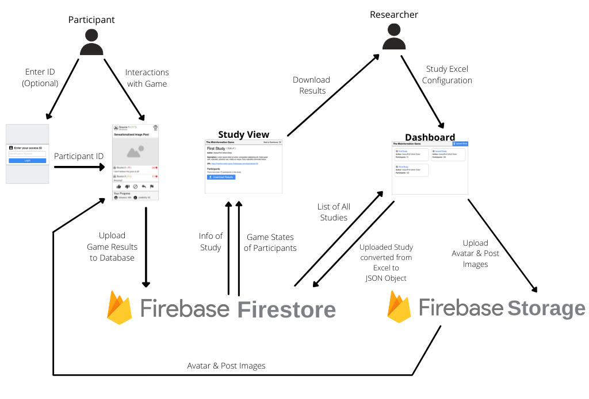

# Technical Overview
{:#intro .no_toc}

This document provides an overview of the technical
implementation of this project. This mainly focuses
on outlining the different tools and libraries that
we use and why.

The Misinformation Game was built using
[Create React App](https://create-react-app.dev/), with
[Google Firebase](https://firebase.google.com/) to provide
its hosting and backend. The diagram in [Figure 1](#fig1) gives
a broad overview of our system architecture by displaying the
major data flows through the application.

<figure id="fig1">
    
    <figcaption>
        <a href="#fig1">Figure 1.</a> Diagram showing the major data flows
        between systems in The Misinformation Game.
    </figcaption>
</figure>

## Table of Contents
{:#toc .no_toc}
* toc
{:toc}

## 1. Frontend
{:#frontend}

The frontend of The Misinformation Game is implemented as
a single-page application (SPA). Under the hood this is
powered using [React Router](https://reactrouter.com/),
which outputs different HTML using
[React](https://reactjs.org/) whenever the URL changes.
Therefore, all pages in our application are generated
by React through the use of
[JSX](https://reactjs.org/docs/introducing-jsx.html).
We also make heavy use of
[Tailwind CSS](https://tailwindcss.com/) for styling,
and [MUI](https://mui.com/) for its icons.

The games are also simulated on the frontend. The client
downloads the settings of the study from
[Firestore](https://firebase.google.com/docs/firestore).
The client will then simulate all the sources and posts
to display to the participant using the process described
in the [Simulation documentation](/Simulation). The
simulated source/post pairs will then be displayed to
the participant as they play the game. The source avatars
and post images will be downloaded as they are needed from
[Firebase Storage](https://firebase.google.com/docs/storage).

## 2. Backend
{:#backend}

The backend of The Misinformation Game is powered by
[Firebase](https://firebase.google.com/), which provides
a lot of the functionality we need out of the box.

### 2.1. Firebase Firestore
{:#firebase-firestore}

We use
[Firebase Firestore](https://firebase.google.com/docs/firestore)
to store all study settings and results. Firestore is
a NoSQL document database that can be accessed directly
from the frontend code. This direct access is secured
using Firestore security rules that stop unauthorised
users from reading or changing data that they don't have
access to.

### 2.2. Firebase Storage
{:#firebase-storage}

We use
[Firebase Storage](https://firebase.google.com/docs/storage)
to store all the images that are required for the studies.
This includes images for the avatars of sources, and images
for the content of posts. Firebase Storage uses a similar
security rules mechanism as Firestore to secure the reads
and writes to the images that are stored.

### 2.3. Firebase Authentication
{:#firebase-auth}

Firebase provides in-built
[Firebase Authentication](https://firebase.google.com/docs/auth)
that we use to secure the admin interface of the application.
This authentication allows us to authenticate users by their
Google accounts, which allows us to avoid having to manage
user accounts, emails, and passwords ourselves.

## 3. Study Configuration Spreadsheet
{:#study-config-spreadsheet}

Studies are configured by editing a template
spreadsheet that was created using
[Google Sheets](https://www.google.com.au/sheets/about/).
This choice was made to ease the development of the user
interface for configuring complex studies, as most
researchers are already familiar with the use of
spreadsheets. Additionally, Google Sheets allows users
to embed images directly into cells. This allows the
avatars of sources and the images of posts to be embedded
within the spreadsheet, so that the whole study can
be configured in one place. Excel does not provide this
functionality.

Once the spreadsheet is uploaded to The Misinformation
Game website, we use the library
[ExcelJS](https://github.com/exceljs/exceljs)
to read all settings from the configuration
spreadsheet. We then convert the settings into our own
JSON format to be stored in Firestore. This stage also
allows us to run a final pass of validation over the
spreadsheet to make sure that all settings are entered
correctly. The source avatar images and the post content
images from the spreadsheet will then be uploaded to
Firebase Storage so that they can be downloaded by
participants.

## 4. Generation of Results
{:#results}

The results of The Misinformation Game are downloaded from
[Firestore](https://firebase.google.com/docs/firestore)
as JSON, and converted to an Excel document using
[ExcelJS](https://github.com/exceljs/exceljs). This allows
us to provide a lot of information in the results that
we could not otherwise fit into a single CSV file. The
results spreadsheet can be opened using any spreadsheet
application.
