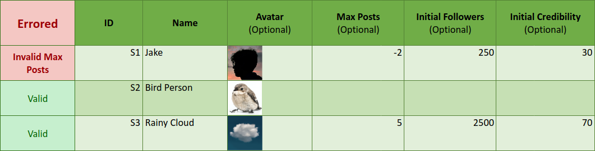

# Google Sheets: An Unlikely Hero for Complex Configuration
{:#intro}

    Written 
        8th June, 2023
    
    by
    <a class="author" href="https://paddy-lamont.com/">
        Padraig X. Lamont
    </a>

In this thrill-ride of an article, brace yourself for a trifecta of
misinformation, a quest to engineer a research tool, and the
unlikely hero of the tale – good ol' Google Sheets.

If you've surfed the internet, chances are that you have swallowed a dose of misinformation
or two. It is so common, and so widespread, that misinformation will find you even if all
you view online is cooking recipes, cute puppies, and Irish dancing videos. Therefore, to
combat the misinformation, we have all developed robust BS detectors to filter out the crap.
However, regrettably, our BS detectors often have bugs, and I know personally I still have
to catch myself every now and then.

* Did I fall for the urban legend of spiders climbing into people's mouths while they sleep? Yes.
* Did I think American Vandal was real? This one was so obvious, and yet, also _yes_... (Only for a brief time, I swear.)
* 
    Did I believe AI would subjugate humanity? Thankfully, I didn't fall for that one.
    (Let's be real, the will-they won't-they is what keeps it interesting!)

<figure id="irish_jig">
    
    <figcaption>
        Who doesn't love a good Irish jig?
    </figcaption>
</figure>

**Unfortunately, it is unlikely that misinformation is going anywhere any time soon, even with AI to help.** Therefore,
in order to maintain public health, uphold the integrity of our political systems, and prevent radicalism, we must
research how misinformation spreads and how we can combat it. This is a _really hard_ problem.

Thankfully, our group of 3rd and 4th-year university students weren't tasked with fighting misinformation, but
instead we were tasked with developing a tool that the experts can use to research how to fight misinformation.
With this goal in mind, we set out on our quest to develop [The Misinformation Game](/)! This article details
the unlikely advantages we got in our development by making a generally poor decision - using Google Sheets
for configuration!

<figure id="spider">
    
    <figcaption>
        A cute spider that would never climb into your mouth.
    </figcaption>
</figure>

## So... what is it?

The Misinformation Game is a [free and open-source](https://github.com/TheMisinformationGame/MisinformationGame) social-media simulator
to help run controlled social-media experiments. In short, it lets researchers set up social-media feeds where they made all
the posts, so that they can observe how participants interact with them. If you'd like to try it out, we have a
[live demo](/link/ExampleGame) that you can try!

<figure id="example_game">
    
    <figcaption>
        Screenshot from a game.
    </figcaption>
</figure>

## The Stack 🥞

We chose to build The Misinformation Game using Firebase, Tailwind, React, and _Google Sheets_ (the star of the show!).
The first three, Firebase, Tailwind, and React, are all pretty standard choices. They have a free tier, are quick,
and are good for UI, respectively. If you'd like to read more about those choices,
[you can read more here](/TechnicalOverview).

However, if you're a software engineer reading through this post, you may have just groaned at the mention
of _choosing_ to put spreadsheets in a tech stack. Stories from my friends and lecturers who've had the,
ahem, pleasure of wrestling with Excel databases or yanking companies out of the suffocating clutches of
Excel sheets, make the nightmares that spreadsheets can cause pretty clear.

But, let me just say, _I think using Google Sheets for this project was one of the best tech choices we made_.

<figure id="study_config">
    
    <figcaption>
        Screenshot of a configuration for a study in Google Sheets.
    </figcaption>
</figure>

## Google Sheets, huh, yeah. What is it good for?

_Absolutely everything!_

Well, not everything. Actually, **configuration!**

All configuration for studies in the Misinformation Game is done in big spreadsheets on Google Sheets.
These spreadsheets may then be downloaded from Google Sheets and uploaded to The Misinformation Game
for presentation to research participants.

    You: That seems overcomplicated...

Maybe, but let me tell you about all of Google Sheets' quirks and features!

* **_UX for Free._** Researchers understand spreadsheets! The user experience of navigating and entering information
  into a spreadsheet is familiar territory. To me, this is the biggest advantage, as we didn't have to worry about
  nearly as many user-experience headaches when building our backend user interface.

* **_Spreadsheets can be Shared._** It is now common in many fields for researchers to share the source code of
  their projects to aid in reproducing results. This is great! However, for tools that require complex
  configuration, this can still be difficult to achieve and is often not possible. Our use of spreadsheets is
  one example that does allow the sharing of complex configurations, as all the configuration can be shared
  as a single file.

* **_Images in the Config._** Social-media is full of images. Therefore, it was crucial that our platform had
  to support them as well. Google Sheets allows users to easily place images right into spreadsheet cells.
  This makes it really easy and intuitive to add post and avatar images right in your config!

<figure id="images_in_config">
    
</figure>

* **_Built-In Rich Text Editor._** It is very common that research studies need to present pages of instructions
  to their participants before they start the study and after they finish it. Text formatting is very desirable for
  these pages, and Google Sheets has it built-in! We just need to do a simple conversion of their rich text to HTML.

<figure id="rich_text">
    
</figure>

* **_Live Error Checking._** The bread and butter of spreadsheets is updating cells based on the values of other
  cells. We can use this to provide live error-checking of all values that researchers enter into their
  spreadsheets. This reduces a lot of friction when setting up studies using the Misinformation Game.

<figure id="live_error_checking">
    
</figure>

## Google Sheets for All Configuration! 🌈

So you're saying, we can **_just use spreadsheets_** instead of configuration files or bespoke configuration user interfaces!

<figure id="celebration">
    
    <figcaption>
        The world when configuration has been solved.
    </figcaption>
</figure>

Nope! No. No no no!

Whilst spreadsheets were great for our project, they're definitely not all sunshine and rainbows! 🌈 They have several
significant drawbacks.

## The Downsides 😬

Google Sheets may have reduced the time required to develop our tool, but it has also led to _significant maintenance
and update overheads_. So, while our tool is more feature-rich and robust thanks to Google Sheets, **_keeping it that
way may be difficult_**.

* **_Google Sheets will Change._** Our documentation is all based upon a snapshot of Google Sheets at one point in time.
  It is very likely that Google Sheets will change in the future, and with those changes, our documentation will become
  outdated. This is acceptable for a research tool that may not live for more than a few years, but it is definitely
  undesirable for larger commerical pieces of software.

* **_We can't update people's configurations in-place._** If we make changes to our spreadsheet template,
  users must manually copy their configuration to the new template. This makes small updates to the configuration
  spreadsheet much more costly, and it destroys any thought of live updates and bugfixes for the configuration.

* **_We can't add our own bespoke features._** There are several features, such as live previews, that are simply not
  possible when using this configuration system. While we use spreadsheets, there will always be friction when users must
  download their spreadsheets to upload them into the Misinformation Game, where we can provide those features.

## The Wise Man's Use of Spreadsheets 🦉

Sure, spreadsheets have their fare share of hurdles. We don't control the hosting of Google Sheets,
it's difficult to update people's configurations, and it makes it hard for us to add bespoke features.

But guess what? Sometimes the path that gets a few side-eyes and raised brows is the one that gives
you the edge. Google Sheets, for all its quirks, allowed us to make our project more feature-rich
and robust under the limited time and budget that we had available.

And let's face it, in a world where misinformation is as easy to spread as a cute puppy video, we need all the help we can get.
And if that help comes in the form of a spreadsheet... well, bring it on.

<figure id="puppy">
    
    <figcaption>
        A loyal pupper fighting to improve technology.
    </figcaption>
</figure>

## Final Thoughts

So, there you have it, folks. I probably won't be using Google Sheets for any future projects any time soon,
but I'm sure glad we had it in the arsenal for this one. If you're interested to learn more about the Misinformation
Game, we have written extensive documentation for it on [this very website](/) (it's more serious than this post,
I promise). We also have a preprint paper available [on PsyArXiv](https://psyarxiv.com/628wc/), and hopefully the
full peer-reviewed version will be available soon.

This is the first software article that I've written, but I hope to write more. If you'd like to find out about
those when I do, you can find me (Padraig Lamont) on [Twitter](https://twitter.com/paddy_lamont) or
[Mastodon](https://sigmoid.social/@paddy)!
