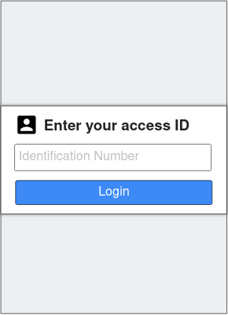
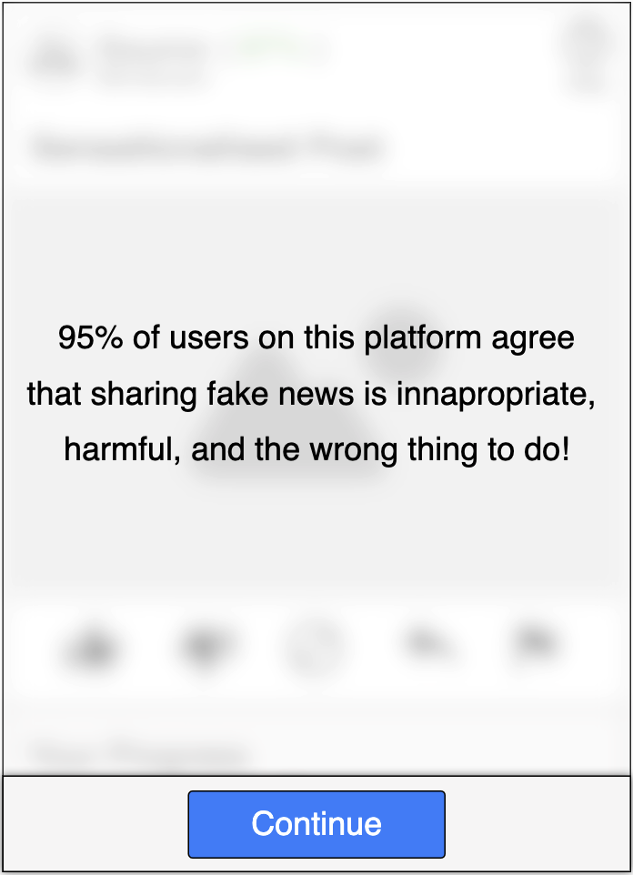
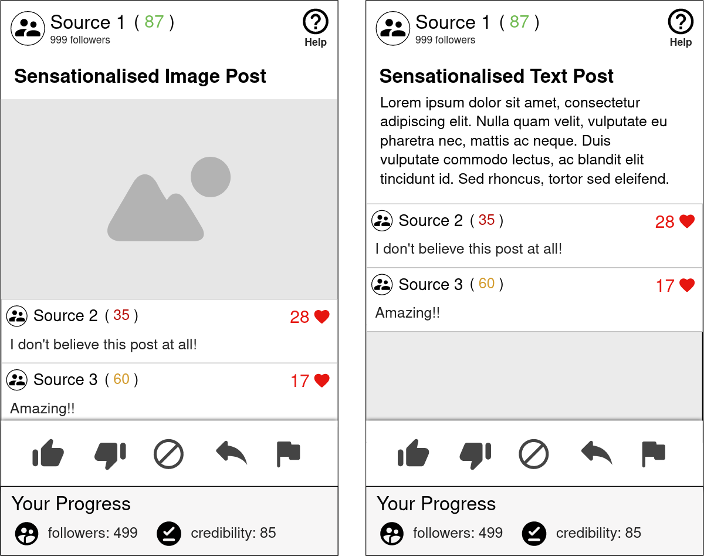
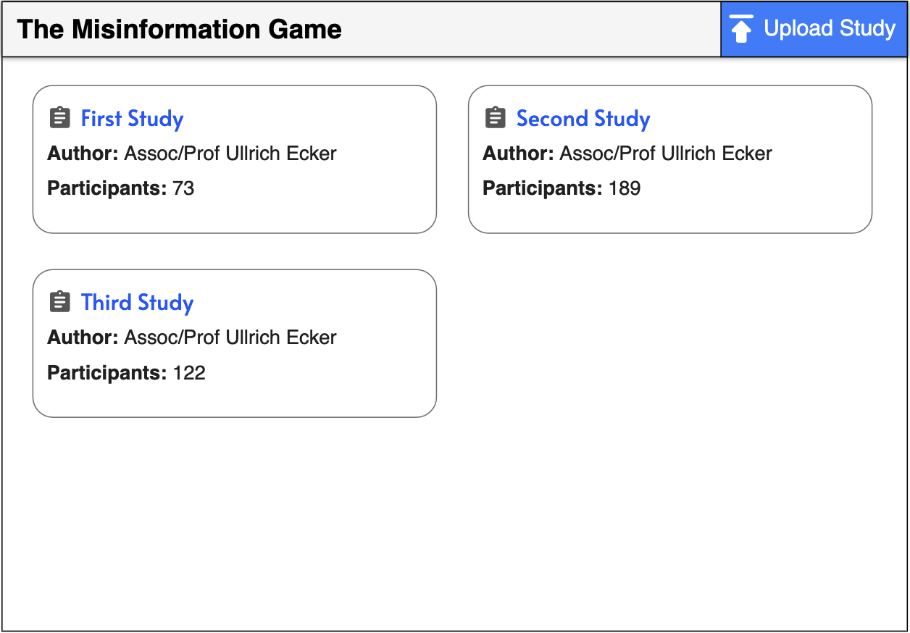
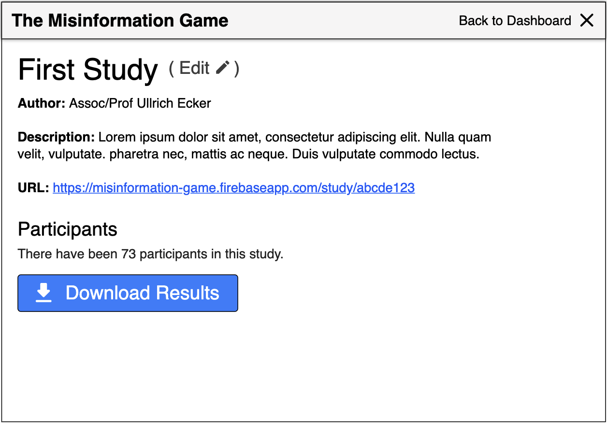

**This information is out of date.** This document is kept as
the original design document for the application.

# Table of contents

- [🎮 Gameplay](#-gameplay)
- [📊 Results](#-results)
- [🧑 Participant Identification](#-participant-identification)
- [📋 Admin Interface](#-admin-interface)
- [✏️ Editing and Creating Studies](#%EF%B8%8F-editing-and-creating-studies)
- [🧮 Post and Source Sampling Mechanics](#-post-and-source-sampling-mechanics)
- [🎨 UI Design](#-ui-design)
- [🖥️ Technical Considerations](#%EF%B8%8F-technical-considerations)

# 🎮 Gameplay

The Misinformation Game will be built as a web app so that it can be
accessed from desktop and mobile devices. Users will access a game URL
where they will be prompted with instructions for participating in a
social media simulation game. The game will show the users a mixture
of true and false social media posts, and the users will be prompted
to like, share, skip, dislike, or flag each post. Every interaction
of the user with these posts (except skipping) will influence their
own followers and credibility rating. For example, sharing true
posts may slowly grow the users followers and improve their
credibility, whereas sharing false posts may grow the users
followers very quickly, but reduce their credibility. The changes to
user's followers and credibility when they like, share, dislike, or
flag each post can be controlled by the researchers. Similarly, the
sources of each social media post will be randomised, and their
followers and credibility rating will also be changed throughout
the experiment. The posts that users have already seen will be
tracked throughout the experiment so that users are not shown
the same posts more than once.

# 📊 Results

Every game that is played by users is independent, and therefore users
interactions with the game will not affect one another. As users play
the game, their progress will be saved so that it can be later
downloaded as a CSV file by the researchers. This CSV file will
include the following information for every post that the user is
shown:
- The action that the user chose.
- The post that the user was shown, including its source, headline,
  text, and image.
- The current followers and credibility rating of the source.
- The current followers and credibility rating of the user before
  they interacted with the post.

# 🧑 Participant Identification

Researchers will be able to optionally enable a screen where
participants can enter an ID to identify themselves. This ID
will have no internal validation to check that it is valid,
and no authentication will be done to ensure the participant
entered their own ID. Therefore, participants could enter
an incorrect ID, and it will still be passed through to the
results. However, the hope is that participants will enter
their correct ID, so that later researchers can match their
results to them. To help with this, a mechanism will be
added so that the participant's IDs can be included in the
URL that they are sent to open. This will help to avoid
error by identifying users without them needing to enter
their ID manually.

# 📋 Admin Interface

The researchers will access these CSV files through an admin
interface. There will need to be a method of authenticating
researchers to restrict access to the admin page, and another
way to grant new researchers access. The admin page will display a
list of all studies that have been uploaded to the system. The
researchers will then be able to open any study, which will take
them to a separate page where they can download the results
from participants in the study. These results will be formatted
as a ZIP archive containing a folder with a CSV file for every
participant.

# ✏️ Editing and Creating Studies

The admin page will also provide functionality for researchers to
upload new studies, and update existing studies. This will be
achieved through an Excel template that researchers can edit with
the details of the study, which can then be uploaded through the
admin page. This Excel template will contain the following
information:
- A name for the study.
- A description for the study.
- The prompt that the user will be shown before they start the game.
- An overall true:false post ratio to use for post selection instead
  of source-specific ratios.
- The linear bias and slope to relate source's credibility rating to
  a true:false post ratio when one is not supplied.
- The sources to be included in the game, including:
  - Unique source ID.
  - Name.
  - Avatar Image.
  - Ratio of true:false posts.
  - Initial followers mean and std. deviation.
  - Initial credibility rating mean and std. deviation.
  - Maximum number of posts to display using this source.
- The posts to be included in the game, including:
  - Unique post ID.
  - Headline.
  - Content image _or_ text.
  - Whether the post is true or false.
  - Changes to followers for liking, disliking, sharing, or
    flagging the post.
  - Changes to credibility for liking, disliking, sharing, or
    flagging the post.
  - Three optional comments, including their:
    - Source ID.
    - Comment text.
    - Number of likes.
- Whether an exact order of sources and posts should be used.
- The exact order of source/post pairs to display to the user,
  defined by a list of pairs of source and post IDs.

# 🧮 Post and Source Sampling Mechanics
The application will be designed to allow a lot of flexibility in
setting up the sampling of source/post pairs.

Sources may be given a pre-defined maximum number of posts to
be paired with. Once a source has been displayed this many times,
it will not be sampled to be displayed again. These maximums
will also be used to determine the weight of each source for
selection, so that sources with a high max number of posts
will be selected more often.

### Method 1: Pre-defined source/post pairs.
The most simple of the sampling method is pre-defined pairs.
This sampling method will read from a list of source/post pairs
in order, with no randomness.

### Method 2: Random source/post selection based on source ratios.
First, a random source will be selected. The true:false ratio of
this source will then be used to randomly select a post to pair
the source with.

### Method 3: Random source/post selection based on credibility.
First, a random source will be selected. The true:false ratio to
use to select the post will then be calculated using the linear
relationship defined in the spreadsheet. This true:false ratio
will then be used to randomly select a post to pair the source
with.

### Method 4: Overall true:false ratio source/post selection.
This method will select both its source and post randomly,
with posts selected to match an overall true:false ratio of
posts shown to the user.

# 🎨 UI Design

The web app must be designed to be accessible from both desktop and
mobile devices, and therefore it should follow a responsive design.

### Optional User Identification Screen Mockup
This screen allows users to identify themselves by entering an
identification number that will be saved in their results CSV.
This page can be enabled or disabled for each study.

### Help / Introduction Screen Mockup
This screen is used to introduce the study, and teach users how to
participate and interact with the game.

### Prompt Screen Mockup
This screen is used to present the researcher's prompt to the users
participating in the study.

### Game Screen Mockup
This screen is where users are able to actually participate in the
social media game and view their progress.

### Admin Dashboard Mockup
This screen allows researchers to view all studies that have been
uploaded, along with some information about each of them. It also
allows them to upload a new study, and go to a page with more
information about each study.

### Admin Study Screen Mockup
This screen presents the information about the selected study, and
allows researchers to download all results from the participants in
the study.

# 🖥️ Technical Considerations

This section outlines ideas and considerations for the
implementation of the web app, and is subject to change
during development.

### Languages and Frameworks
We will use the languages most standard for building websites
today. This includes JavaScript, HTML, and CSS. Due to the
simplicity of the web app, we will not include any large
UI frameworks to begin with. This is because we do not have
any team members with experience with any of these frameworks
(e.g. react). Therefore, we do not know if their inclusion
will be worth the time we would all have to spend learning
them. Instead, we will begin the project using vanilla
JavaScript, and only adopt a framework later if we find
that one would give us a lot of benefit.

-----

### Firebase
The current plan is to use Firebase for the backend of our
web app. This means that we will need to setup a firebase
application, and sort out some way to get it hosted. To
begin with we will definitely fall into the free tier of
Firebase, but in the future a paid plan may be required.

-----

### Study URLs
Each study should have their own URL that the researchers can
share with participants for them to access. To achieve this,
each study should be given a unique ID, and then the URLs can
just include this ID.

e.g. _game.firebaseapp.com/study?id=abcde123_ or
_game.firebaseapp.com/study/abcde123_

-----

### Data Storage

**Storing the studies:**

To begin with, I think we will be able to get away with just
uploading the whole study as a single object in the database.
This way the client can just load the whole study at once
and then never worry about loading data from the database
again for the duration of the game.

This is simple, however if the studies get large this may
become too slow. In that case, we may have to split the
sources and posts in the studies into their own
sub-collections in Firestore, and then only load them as
they are needed.

**Storing the participant results:**

I think it will be simplest if we construct the CSV for
user's results on the client-side as they play the game.
This CSV file could then be uploaded to the database every
few posts that the user interacts with, replacing the
previous CSV for their current session. This means that
we will still save user's progress even if they randomly
close their tab.

It would also be really nice if we didn't lose participant's
progress when they reloaded the game. This could be achieved
by storing some ID for the sessions in the URL or session
storage in the browser, and then downloading their current
progress when they reload the tab.

-----

### Reading Excel Spreadsheets
The JavaScript library
[ExcelJS](https://www.npmjs.com/package/exceljs)
can be used to read Excel spreadsheets from within the client's
browser. I believe this will be a good approach for us to read
the study spreadsheets, as it will allow us to perform validation
of the spreadsheets before uploading them to Firebase. After
parsing, the information for the study can then be uploaded
to the database.

Additionally, it appears as though that library will support
reading images from within cells. Therefore, we can also embed
the avatar and post images directly into the spreadsheet which
I think will be easier to use.

-----

### Testing
We will need to write tests for our web app as part of this
project. I think a good option for this will be to write
integration tests. The [Selenium](https://www.selenium.dev/)
library works well for automating these types of website
tests. It would also be good to write some unit tests.
